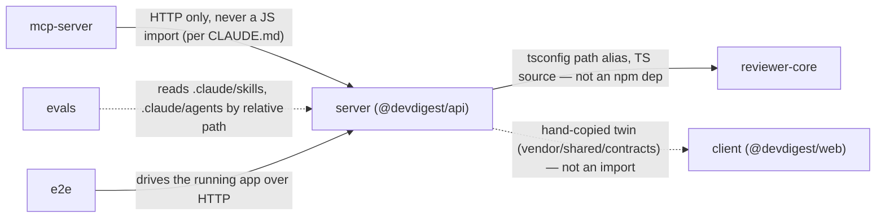

# Worked Example

A real run against this repo's actual shape (numbers measured, not invented
— re-measure before trusting them on a future run, sizes especially drift
fast). This is the shape every report should follow — same 5 sections, same
citation discipline.

---

## Scope

Six standalone packages, no workspace tool (root `CLAUDE.md`):

| Package | Directory | Package manager |
|---|---|---|
| `@devdigest/api` | `server/` | pnpm |
| `@devdigest/web` | `client/` | pnpm |
| `@devdigest/reviewer-core` | `reviewer-core/` | npm |
| `@devdigest/e2e` | `e2e/` | npm |
| `@devdigest/mcp-server` | `mcp-server/` | npm |
| `@devdigest/evals` | `evals/` | pnpm |

`server/clones/*` excluded — git-ignored working checkouts of indexed repos,
not part of this repo's own graph.

## Dependency Graph

## Size Breakdown

*(pnpm-managed packages measured with `du -shL` — see SKILL.md's symlink
gotcha; npm-managed packages needed no `-L`.)*

| Package | Dependency | Installed size | Type |
|---|---|---|---|
| client | `next` | 152M | prod |
| client | `mermaid` | 75M | prod |
| reviewer-core | `typescript` | 23M | dev |
| client | `recharts` | 5.2M | prod |
| server | `openai` | 7.4M | prod |
| server | `@ast-grep/napi` + `@ast-grep/lang-go` | 3.4M | prod |
| mcp-server | `vitest` | 2.1M | dev |
| server | `vitest` | 1.9M | dev |

(top 8 by size shown; every other dependency across the 6 packages was
under 2M and omitted)

## Findings & Priorities

**P0**
- None found this run — no package imports another package's `src/` by
  relative path, and `mcp-server/` has no direct import of `server/src/**`
  (confirmed by grep; it only reaches `server/` over HTTP, as documented).

**P1**
- `vitest` is `^2.1.8` in `server/`, `client/`, `reviewer-core/`, and
  `evals/`, but `^4.1.10` in `mcp-server/` — a 2-major-version gap on a test
  runner whose config/API shape changed across majors. Worth deliberately
  deciding rather than leaving as an artifact of `mcp-server/` being added
  or updated independently.

**P2**
- `typescript`, `@types/node`, and a test runner are declared independently
  in all 6 `package.json` files (expected, given no workspace to hoist them
  — but it means 6 separate installs of each, e.g. `typescript` alone at
  ~23M × 6 ≈ 138M across the repo). Not a bug, just the disk-cost side of
  this repo's explicit no-workspace choice — worth knowing before assuming
  "add it once" is possible here.
- `client/`'s `mermaid` (75M) is the single heaviest dependency after
  `next` itself — confirm it's still used for report-diagram rendering
  before adding another diagramming/visualization library on top of it.

**Info**
- `zod` is `^3.24.1` in `server/`, `client/`, `reviewer-core/`, and
  `mcp-server/` — no drift found on the one package whose version matters
  most here (it shapes the cross-ring contracts in `vendor/shared`).

## Summary

1. **(P1)** Decide deliberately whether `mcp-server/`'s `vitest@^4.x` should
   be aligned to the rest of the repo's `^2.x`, or whether the split is
   intentional — confirm with whoever added it before changing either side.
2. **(P2)** No action needed on the per-package `typescript`/`@types/node`
   duplication — it's the expected cost of this repo's no-workspace
   convention, not a defect — but keep it in mind when estimating a fresh
   `pnpm install`'s disk footprint.
3. **(P2)** Confirm `mermaid` (75M) is still actively used in `client/`
   before adding a second charting/diagramming dependency; if usage is
   thin, consider whether a lighter alternative covers the same need.
4. **(Info)** No `zod` version drift today — worth re-checking this
   specific dependency on every future run, since a mismatch here would
   silently break the `server/` ↔ `client/` contract shape.
