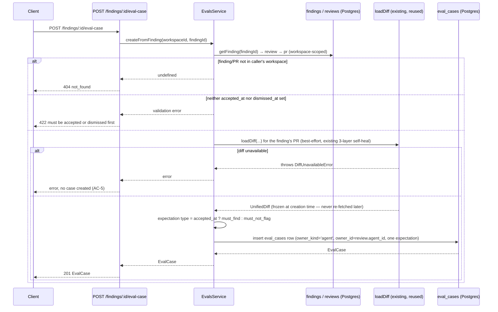

# Specification: Eval Pipeline (Reviewer Agents)

## 0. Metadata
- Spec ID: SPEC-2026-08-29-eval-pipeline
- Status: draft — every blocking-shaped question below was resolved with a
  documented default (see §13); no interactive `AskUserQuestion` channel was
  available in this invocation, so each is recorded as a resolved decision
  with rationale rather than left open. No unresolved `[NEEDS CLARIFICATION]`
  markers remain.
- Version: 0.1
- Owner: okolomoiets@competo.io
- Supersedes: none
- Related: `server/src/db/schema/eval.ts` (`eval_cases`/`eval_runs`, already
  migrated empty — this spec fills them, builds nothing new there),
  `server/src/vendor/shared/contracts/eval-ci.ts` (`EvalCaseInput`,
  `EvalRunRecord`, `EvalRunResult`, `EvalTrendPoint`, `EvalDashboard` —
  already defined, reused as-is),
  `server/src/vendor/shared/contracts/knowledge.ts:64-98` (`EvalPerTrace`,
  `EvalRun`, `EvalOwnerKind`, `EvalCase` — already defined, reused as-is;
  `AgentVersion` at `:386-392`, reused for the compare-runs prompt diff),
  `reviewer-core/src/review/run.ts` (`reviewPullRequest` — the exact pure
  engine this spec reuses to execute a case, unmodified),
  `reviewer-core/src/grounding.ts` (`groundFindings` — the mechanical gate
  `citation_accuracy` is derived from, unmodified),
  `server/src/modules/agents/{routes,service,repository,helpers}.ts`
  (existing agent CRUD + the `agent_versions` immutable-snapshot-on-config-
  change mechanism this spec's "old vs new prompt" comparison relies on,
  unmodified),
  `server/src/modules/reviews/run-executor.ts` (existing single-PR review
  execution — NOT reused directly, since it's DB/PR/runBus-coupled; this
  spec calls `reviewPullRequest` directly instead, see §5),
  `client/src/app/repos/[repoId]/pulls/[number]/_components/FindingCard/FindingCard.tsx`
  (existing Accept/Dismiss actions — this spec adds an additive "Turn into
  eval case" action),
  `client/src/app/agents/[id]/_components/AgentEditor/AgentEditor.tsx`
  (existing tab shell — already comments "Later lessons add Evals/Stats/CI
  tabs"; this spec adds the Evals tab),
  six local mockup screenshots (FindingCard action, Eval Dashboard list
  page, per-agent Eval Dashboard drilldown, Eval case edit modal, Agent
  Editor Evals tab, Compare-runs modal) — see §0a for where they're copied,
  treated as UI reference, not literal pixel spec (§13 rows document every
  deliberate deviation), no implementation plan yet
  (`implementation-planner` consumes this spec next).

### 0a. Mockups

The six screenshots this spec was drafted against are worth copying into
`specs/cross-cutting/eval-pipeline/mockups/` (mirroring
`specs/cross-cutting/pr-why-risk-brief/mockups/`'s convention) the next time
this directory is touched with write access to arbitrary paths — this agent's
own tool access could technically write there, but doing so wasn't requested
and isn't this agent's call to make unprompted; flagging it here as a
concrete, cheap follow-up rather than silently doing it.

## 1. Overview & Problem

Today, judging whether a reviewer agent's config (system prompt, model,
skills) is getting better or worse after an edit is entirely subjective —
open the Agent Editor, change the prompt, run it against a PR by hand, and
eyeball the findings. There is no repeatable regression harness: no fixed
set of "known-good" and "known-bad" cases to re-run after every prompt
change, and no mechanical, LLM-free way to score whether a change helped or
hurt.

This feature closes that gap using data the workspace already has: every
finding a user has explicitly **accepted** or **dismissed** on a real PR
review is itself a labeled data point — "the agent was right to flag this
exact spot" or "the agent was wrong to flag this exact spot." This spec lets
a user promote either kind of finding into a persistent **eval case** in one
click, run an agent against its whole eval set on demand, score the result
with pure code (zero LLM calls in the scoring step), and compare two runs —
typically "before this prompt edit" vs "after" — side by side.

The DB schema (`eval_cases`/`eval_runs`) and the core Zod contracts
(`EvalCaseInput`, `EvalRun`, `EvalRunRecord`, `EvalTrendPoint`,
`EvalDashboard`, `EvalPerTrace`) already exist, shipped empty/unused per this
repo's "DB schema ships every future-lesson table" convention. This spec is
the first feature to fill them — it does not add new tables and adds
exactly one new shared contract (`EvalExpectation`, §10).

## 2. Glossary

| Term | Definition |
|---|---|
| Eval case | One persisted, frozen test scenario for one agent (or, per the existing schema's `owner_kind` enum, one skill — out of scope here, see §12): a diff + optional file/PR-meta context, plus one or more **expectations**. Row in `eval_cases`. |
| Expectation | One location-scoped assertion inside a case's `expected_output`: `must_find` ("an agent finding must land on this file:line range") or `must_not_flag` ("no agent finding may land on this file:line range"). New documented shape, §10. Deliberately **location-scoped, never case-wide** — a `must_not_flag` expectation asserts nothing about any OTHER location in the same diff (§4 rationale). |
| Trace | This spec's (and the existing `EvalPerTrace`/`EvalRun.traces_total` contract's) name for one case's execution within one run — i.e., one row this spec inserts into `eval_runs`. |
| Eval run (batch) | The result of one `POST /agents/:id/eval-runs` call: N `eval_runs` rows (one per case, i.e. N traces), inserted in one DB transaction so they share an identical `ran_at` — the mechanism this spec uses to group traces back into "one comparable run event" without adding a batch-id column (§5, §9). |
| Recall | Share of `must_find` expectations (across a run's cases) matched by an actual finding. |
| Precision | Share of actual findings (across a run's cases) that don't land on a `must_not_flag` location ("noise"). |
| Citation accuracy | Share of an agent's raw findings that survive `reviewer-core`'s existing citation-grounding gate (`groundFindings`) — reused as-is, not reimplemented. |
| Pass (case-level) | A case's `eval_runs.pass`: true iff every `must_find` expectation in that case was matched AND zero of the run's findings landed on any of that case's `must_not_flag` locations. |
| Agent version (for a run) | Not stored per-run (no new column, §9) — resolved on demand from the already-existing `agent_versions` table by finding the highest version whose `created_at` ≤ the run's `ran_at` (versions are monotonically increasing and immutable, so this reconstruction is exact). |
| Owner (`owner_kind`/`owner_id`) | Already-existing `eval_cases` columns. This spec only ever writes `owner_kind: 'agent'` — skill-owned eval cases are schema-supported but out of scope (§12). |

## 3. User Scenarios

### Scenario: Turning an accepted finding into a "must find" case
A reviewer has just clicked Accept on a `FindingCard` ("Hardcoded Stripe
secret key in commit", `src/config.ts:12`). A new "Turn into eval case"
action becomes available on that card. Clicking it, with no further input
required, creates one eval case for the agent that produced the finding: a
frozen copy of that PR's diff, and one `must_find` expectation pinned to
`src/config.ts:12`.

### Scenario: Turning a dismissed finding into a "must not flag" case
A different finding ("Retry-After header omitted on 429") was a false
positive; the reviewer clicked Dismiss. The same "Turn into eval case"
action, now available because the finding has a dismissal decision, creates
a case whose one expectation is `must_not_flag` at that exact file:line —
"never raise a finding here again."

### Scenario: Iterating on a system prompt
A user opens the Agent Editor's new Evals tab for "Security Reviewer",
already showing 12 cases built up from weeks of accept/dismiss decisions.
They click "Run all evals"; the agent's *current* config runs against every
case, live LLM calls only for cases whose diff produces a genuine review,
zero LLM calls in scoring. The tab now shows recall 78% / precision 93% /
citation 94%, 16/20 traces passed. They edit the system prompt in the
Config tab (which bumps the agent's version, per the already-existing
`agent_versions` mechanism), save, and click "Run all evals" again — recall
rises to 82%, precision dips to 91%. They open the Eval Dashboard's
drilldown for this agent and click Compare on the two most recent runs;
the modal shows the metric deltas and a system-prompt diff between the two
versions the runs actually used.

### Scenario: A degraded prompt visibly drops precision
After a deliberately worse prompt edit (e.g. instructing the agent to
"flag unused imports as suggestions", inflating noise on cases that dismiss
exactly that kind of finding), a third run shows precision dropping several
points while recall/citation stay flat — demonstrating the harness actually
detects a regression, not just noise.

### Scenario: One case's LLM call fails mid-batch
While running all 20 cases, the provider errors on case #14 (rate limit,
timeout, malformed structured output). The batch does not abort — case #14
is recorded as a failed trace (`pass: false`, no recall/precision/citation
contribution) and the remaining 19 cases still run and score normally; the
aggregate reflects 19 contributing traces plus one visible failure.

## 4. Assumptions & Constraints

**Assumptions:**
- `must_not_flag` is **location-scoped**, never "this whole diff must
  produce zero findings." A dismissed finding only tells us the user
  reviewed *that one* flagged spot — it says nothing about whether some
  other, never-reviewed part of the same diff might contain a genuine,
  still-undiscovered issue. A case-wide "zero findings" assertion would
  wrongly fail a future run that correctly finds something new and
  unrelated in the same diff. (This deliberately diverges from the
  mockup's `clean-refactor-no-flags` example, which reads as case-wide —
  see §13 row 1 for why the location-scoped model was chosen instead, and
  why it still reproduces that example's observed behavior.)
- An eval run always executes the agent's **current, live** config
  (system prompt, model, provider, strategy, enabled+enabled linked
  skills) — never a frozen snapshot taken at case-creation time. This is
  precisely what makes "old prompt vs new prompt" comparisons possible:
  the case's diff is frozen, the agent's config is not (§5).
- An eval case has no bound "live" repo the way a real PR review does —
  repo-intel enrichment (callers digest, repo skeleton, file-rank note),
  Project Context Folder documents, and Intent-Layer derivation are never
  part of an eval run's prompt (§12). Only system prompt + resolved skill
  bodies + the case's own frozen diff/meta feed the call — the same
  inputs a real review's prompt would carry *minus* repo-bound enrichment.
- Reaching "≥8 eval cases" for a given agent is a **manual, post-ship user
  action** (clicking "Turn into eval case" on enough real findings, and/or
  authoring cases by hand) — not a migration/seed-script requirement of
  this feature. This spec makes that trivially achievable (one click per
  finding); it does not itself populate any case.
- The eval-run scoring step performs **zero LLM calls** — it is pure
  file+line-range arithmetic over already-produced, already-grounded
  findings (§6.4). The only LLM calls in this entire feature are the
  agent's own review calls, one per case, identical in shape to a normal
  PR review's LLM call.

**Constraints:**
- **Non-default convention** (root `CLAUDE.md`): `@devdigest/shared` is
  hand-copied into both `server/src/vendor/shared` and
  `client/src/vendor/shared`. The one new type this spec adds
  (`EvalExpectation`, §10) must be added to **both** copies together.
- No new database table or column (§9) — `eval_cases`/`eval_runs` are
  already migrated exactly as this spec needs them, including for the
  "which agent version did this run use" question (§5/§9 resolve it
  without a column).
- No new top-level API response shape beyond the one addition above —
  `EvalCaseInput`, `EvalCase`, `EvalRun`, `EvalPerTrace`, `EvalRunRecord`,
  `EvalTrendPoint`, `EvalDashboard` are reused byte-for-byte as already
  defined in `eval-ci.ts`/`knowledge.ts`.
- `POST /agents/:id/eval-runs` and `POST /agents/:id/eval-cases/:id/run`
  execute **synchronously** and return the full result in the response —
  no async job + polling (§13 row 2 documents why).
- "Promote v7" (seen in the compare-runs mockup) is **out of scope** for
  this spec (§12, §13 row 3).

## 5. Cross-Module Interactions

This feature's only LLM-calling path is `POST /agents/:id/eval-runs`
(and its single-case sibling, `POST /agents/:id/eval-cases/:id/run`, which
is the same flow with N=1). It reuses `reviewer-core`'s `reviewPullRequest`
directly — **not** the server's `ReviewRunExecutor`/`runOneAgent`, which is
tightly coupled to a real `PullRow`/`repo`/`runBus`/SSE streaming that an
eval case (no bound live PR) doesn't have. This keeps the eval path a thin
service that assembles inputs and persists results; all prompt assembly,
grounding, and structured-output parsing stay inside `reviewer-core`,
unmodified.

```mermaid
sequenceDiagram
    participant Client
    participant Route as POST /agents/:id/eval-runs
    participant Svc as EvalsService
    participant CasesRepo as eval_cases (Postgres)
    participant AgentsRepo as agents / agent_skills (Postgres)
    participant Core as reviewer-core.reviewPullRequest
    participant LLM as agent's own LLM provider/model
    participant RunsRepo as eval_runs (Postgres)

    Client->>Route: POST /agents/:id/eval-runs
    Route->>Svc: runAll(workspaceId, agentId)
    Svc->>AgentsRepo: getById(workspaceId, agentId)
    alt agent not in workspace
        AgentsRepo-->>Svc: undefined
        Svc-->>Route: undefined
        Route-->>Client: 404 not_found
    else agent found
        Svc->>CasesRepo: list cases where owner_kind='agent' AND owner_id=agentId
        CasesRepo-->>Svc: EvalCase[] (frozen input_diff/input_files/input_meta/expected_output)
        Svc->>AgentsRepo: linkedSkills(agentId) — same enabled&&enabled filter runOneAgent uses
        AgentsRepo-->>Svc: resolved skill bodies
        loop each case (isolated try/catch — one failure never aborts the batch)
            Svc->>Svc: parse input_diff → UnifiedDiff; parse expected_output → EvalExpectations
            Svc->>Core: reviewPullRequest({systemPrompt: agent.system_prompt, model, diff, llm, skills, strategy, task})
            Core->>LLM: completeStructured(Review schema)
            LLM-->>Core: raw findings
            Core->>Core: groundFindings() — mechanical file+line gate (existing, unmodified)
            Core-->>Svc: {review.findings, grounding, dropped, tokensIn/Out, costUsd}
            Svc->>Svc: score case (recall/precision/citation_accuracy/pass) — pure, zero LLM calls (§6.4)
            Svc->>RunsRepo: insert one eval_runs row (same transaction ⇒ identical ran_at across the whole batch)
        end
        Svc->>Svc: aggregate all succeeded traces (micro-average, §6.4) into one EvalRun
        Svc-->>Route: EvalRun {recall, precision, citation_accuracy, traces_passed, traces_total, duration_ms, cost_usd, per_trace[]}
        Route-->>Client: 200 EvalRun
    end
```

**Failure contract at each boundary:**
- Agent id doesn't resolve in the caller's workspace → `404 not_found`,
  no cases read, no LLM calls (AC-24).
- A case's `input_diff` fails to parse into a usable `UnifiedDiff` (e.g.
  malformed text) → that one case's trace fails in isolation (AC-14),
  never a 5xx for the whole batch.
- The agent's LLM provider/model errors, times out, or returns
  schema-invalid output for one case → same per-case isolation (AC-14);
  `reviewPullRequest`'s own structured-output retry budget is exhausted
  first, exactly as it already is for a real PR review.
- Zero cases exist for the agent → `200` with a degenerate `EvalRun`
  (`traces_total: 0`, `recall`/`precision`/`citation_accuracy: 1`,
  `per_trace: []`) rather than an error (AC-15).
- Postgres unavailable mid-batch → the whole transaction rolls back
  (partial batches are never persisted — a batch's shared-`ran_at`
  grouping guarantee, §9, would otherwise be violated by a half-committed
  set of traces); the route surfaces the existing platform-level 5xx
  error-handling convention, no new error type introduced.

For the one-click "Turn into eval case" flow (`POST /findings/:id/eval-case`):



## 6. Functional Requirements

### 6.1 Eval case creation
- AC-1 (Event-driven): WHEN a user calls `POST /findings/:id/eval-case` for a finding whose `accepted_at` is set, the system shall create one `eval_cases` row owned by that finding's review's agent, with `expected_output = { expectations: [{ type: 'must_find', file: f.file, start_line: f.start_line, end_line: f.end_line, description: f.title }] }` and `input_diff` frozen from that finding's PR's diff at creation time. Verify: POST against an accepted finding returns `201` with an `EvalCase` whose one expectation has `type: 'must_find'` and the finding's exact file/line range.
- AC-2 (Event-driven): WHEN a user calls `POST /findings/:id/eval-case` for a finding whose `dismissed_at` is set, the system shall create the same shape of case with `expected_output.expectations[0].type = 'must_not_flag'`. Verify: POST against a dismissed finding returns `201` with one `must_not_flag` expectation at that finding's file/line range.
- AC-3 (Unwanted behavior): IF a finding has neither `accepted_at` nor `dismissed_at` set, THEN `POST /findings/:id/eval-case` shall respond `422` and create no case. Verify: POST against a fresh, undecided finding returns `422`; no new `eval_cases` row exists afterward.
- AC-4 (Unwanted behavior): IF `:id` does not resolve to a finding whose owning PR is in the caller's workspace, THEN the system shall respond `404 not_found`. Verify: request with an unknown or foreign-workspace finding id returns 404.
- AC-5 (Unwanted behavior): IF the finding's PR diff cannot be loaded (the existing 3-layer `loadDiff` self-heal all fail), THEN the system shall respond with an error and create no `eval_cases` row. Verify: mock `loadDiff` to throw; POST responds with an error and the `eval_cases` table gains no row.
- AC-6 (Ubiquitous): The system shall let a user manually create an eval case via `POST /agents/:id/eval-cases`, accepting `name`, `input_diff`, `input_files`, `input_meta`, `expected_output`, `notes` — deriving `owner_kind`/`owner_id` from the route's `:id`, never trusting a client-supplied owner in the body. Verify: POST with a body containing a different `owner_id` still persists the route's `:id` as `owner_id`.
- AC-7 (Ubiquitous): The system shall let a user update an existing case's editable fields via `PUT /agents/:id/eval-cases/:caseId`. Verify: PUT changing `name` and `expected_output` persists both; a follow-up GET reflects the change.
- AC-8 (Ubiquitous): The system shall let a user delete an eval case via `DELETE /agents/:id/eval-cases/:caseId`, cascading its `eval_runs` history (already-existing `ON DELETE CASCADE` on `eval_runs.case_id`, no new behavior needed). Verify: DELETE removes the case; a subsequent case-list GET no longer includes it, and no orphaned `eval_runs` rows remain for that `case_id`.

### 6.2 Eval case validation & listing
- AC-9 (Ubiquitous): The system shall scope `GET /agents/:id/eval-cases` to the caller's workspace and to `owner_kind: 'agent', owner_id: :id`, returning `EvalCase[]`. Verify: two workspaces each with their own agent's cases — GET for one never returns the other's cases.
- AC-10 (Unwanted behavior): IF a case's `expected_output` on create/update does not parse as `{ expectations: EvalExpectation[] }` (§10), THEN the system shall respond `422` with the validation detail, persisting nothing. Verify: POST/PUT with `expected_output: { expectations: [{ type: 'bogus', file: 'x' }] }` (missing `start_line`/`end_line`, invalid `type`) returns `422`; the case table is unchanged.

### 6.3 Eval run execution (single case + whole set)
- AC-11 (Event-driven): WHEN a user calls `POST /agents/:id/eval-cases/:caseId/run`, the system shall execute that one case's frozen `input_diff` against the agent's **current** config (system prompt, model, provider, strategy, enabled-and-enabled linked skills — the identical resolution `ReviewRunExecutor.runOneAgent` already applies, minus repo-bound enrichment per §4) via `reviewer-core`'s `reviewPullRequest`, persist one `eval_runs` row, and return `EvalRunResult`. Verify: run a `must_find` case whose diff genuinely contains the expected issue with a mocked LLM adapter returning a matching finding — the persisted row has `pass: true`.
- AC-12 (Event-driven): WHEN a user calls `POST /agents/:id/eval-runs`, the system shall execute every case owned by that agent in one batch, inserting all resulting `eval_runs` rows in one database transaction (so they share one `ran_at`), and return an aggregate `EvalRun` whose `per_trace[]` has one entry per case. Verify: an agent with 3 cases — POST results in exactly 3 new `eval_runs` rows all sharing the same `ran_at` (down to the second), and the response's `per_trace` has 3 entries.
- AC-13 (Event-driven): WHEN a system prompt change is saved (an existing `agent_versions` config-change bump, unmodified by this spec) between two `POST /agents/:id/eval-runs` calls against the same case set, the system shall reflect the new prompt in the second call's LLM inputs — never replaying or reusing the first call's results. Verify: two consecutive `POST /agents/:id/eval-runs` calls with a system-prompt change in between each trigger their own fresh `reviewPullRequest`/LLM adapter call per case (mocked adapter call count = 2× case count, not case count).
- AC-14 (Unwanted behavior): IF one case's `reviewPullRequest` call throws (provider error, timeout, exhausted structured-output retries) or its `input_diff` fails to parse, THEN the system shall persist that one trace with `pass: false`, `recall`/`precision`/`citation_accuracy: null`, `actual_output: { error: <message> }`, continue executing the remaining cases in the same batch, and still return `200` for the whole request. Verify: mock the LLM adapter to throw for case #2 of 3 — the response's `traces_total` is 3, `traces_passed` counts only the 2 that succeeded, and case #2's persisted row has `pass: false` with an `error` in `actual_output`; cases #1 and #3 score normally.
- AC-15 (Unwanted behavior): IF an agent has zero eval cases, THEN `POST /agents/:id/eval-runs` shall respond `200` with `traces_total: 0`, `recall`/`precision`/`citation_accuracy: 1`, `per_trace: []`, inserting no `eval_runs` rows. Verify: POST for a freshly created agent with no cases returns this degenerate shape; the `eval_runs` table gains no rows.

### 6.4 Scoring (pure, zero LLM calls)
- AC-16 (Ubiquitous): For one case, the system shall compute `recall` as (number of `must_find` expectations matched by at least one actual finding sharing the expectation's `file` and an overlapping `[start_line, end_line]` range) divided by (total `must_find` expectations in that case), using the identical range-overlap check `reviewer-core`'s `groundFindings`/`rangeIntersects` already applies — and shall define `recall = 1` when a case has zero `must_find` expectations. Verify: a case with 2 `must_find` expectations where the actual findings match only 1 persists `recall: 0.5`; a case with 0 `must_find` expectations (pure `must_not_flag`) persists `recall: 1` regardless of actual findings.
- AC-17 (Ubiquitous): For one case, the system shall compute `precision` as (total actual findings minus "noise" findings — an actual finding is noise iff its `file` and line range overlap any `must_not_flag` expectation in that case) divided by (total actual findings), and shall define `precision = 1` when a case produces zero actual findings. Verify: a case with 1 `must_not_flag` expectation where the agent returns 2 findings, 1 of which overlaps that location, persists `precision: 0.5`; a case producing zero findings persists `precision: 1`.
- AC-18 (Ubiquitous): For one case, the system shall compute `citation_accuracy` as `reviewPullRequest`'s own grounded-finding count divided by (grounded + dropped) count for that call, and shall define `citation_accuracy = 1` when both counts are zero. Verify: mock a `reviewPullRequest` outcome with 3 kept + 1 dropped finding — the persisted `citation_accuracy` is `0.75`.
- AC-19 (Ubiquitous): For one case, the system shall set `pass = true` iff `recall === 1` (every `must_find` expectation matched) AND zero actual findings are noise (as defined in AC-17) — regardless of whether the case also happens to produce findings unrelated to any expectation. Verify: a case with 0 `must_find` expectations, 1 `must_not_flag` expectation, and 2 actual findings — one overlapping an unrelated file, none overlapping the `must_not_flag` location — persists `pass: true` (the unrelated finding is not penalized, matching §4's location-scoped `must_not_flag` semantics).
- AC-20 (Ubiquitous): The system shall perform the entire scoring computation (AC-16–AC-19) with zero calls to any LLM provider — scoring reads only already-produced `Finding[]` and already-parsed `EvalExpectation[]`. Verify: a unit test injects a mocked `LLMProvider` whose `completeStructured` throws if called during the scoring step itself (as opposed to the one, already-counted `reviewPullRequest` call per case) — scoring completes without invoking it.
- AC-21 (Ubiquitous): The system shall aggregate a batch's traces into one `EvalRun` via a **micro-average** (weighted by each case's own raw counts, recomputed from each trace's persisted `actual_output`, not a plain mean of per-case ratios), excluding any failed trace (AC-14) from the aggregate's numerator/denominator while still counting it in `traces_total`. Verify: a batch of 2 succeeded cases — one with 1/1 `must_find` matched, one with 3/5 matched — persists an aggregate `recall` of `4/6` (≈0.667), not `(1 + 0.6)/2` (0.8).

### 6.5 Run history & agent-version resolution
- AC-22 (Ubiquitous): The system shall make it possible to determine, for any past batch, which `agent_versions` snapshot was live at that time by comparing the batch's `ran_at` against `agent_versions.created_at` (already-existing `GET /agents/:id/versions`) — the highest version whose `created_at ≤ ran_at` — without persisting a version number on `eval_runs` itself. Verify: seed two `agent_versions` rows (v1 at T0, v2 at T1 > T0) and one batch of `eval_runs` with `ran_at` between T0 and T1 — resolving that batch's version yields `v1`; a second batch with `ran_at` after T1 resolves to `v2`.

### 6.6 Eval Dashboard (aggregate + trend + alert)
- AC-23 (Ubiquitous): The system shall expose `GET /agents/:id/eval-dashboard` returning an `EvalDashboard` scoped to `owner_kind: 'agent', owner_id: :id`: `cases_total` (current case count), `current` (the most recent batch's micro-averaged metrics), `delta` (current batch minus the immediately preceding batch, per metric), `trend` (one `EvalTrendPoint` per historical batch, chronological), and `recent_runs` (the flat, per-case `EvalRunRecord[]` rows backing those batches). Verify: seed 2 batches (batch A older, batch B newer) for one agent — `current` reflects batch B's aggregate, `delta` reflects B minus A, `trend` has exactly 2 points in chronological order.
- AC-24 (Ubiquitous): The system shall scope every new route in this feature (`eval-cases`, `eval-runs`, `eval-dashboard`, and the finding-originated `eval-case` route) to the caller's workspace via the same `getById(workspaceId, id)` ownership check the existing `agents`/`findings` routes already use, responding `404` when the target agent/finding/case isn't in that workspace. Verify: covered by AC-4's cross-workspace finding-id check; an analogous test for `eval-cases`/`eval-runs`/`eval-dashboard` with a foreign-workspace agent id returns 404 on each.
- AC-25 (Event-driven): WHEN a new batch's precision, recall, or citation_accuracy differs from the immediately preceding batch's by at least 2 percentage points in either direction, the system shall set `EvalDashboard.alert` to a deterministic, template-generated sentence naming the metric, the direction, and the magnitude (e.g. `"Precision dipped 2pts on v7 — recall and citation both up."`), composed from the already-computed `delta` values with zero LLM calls; otherwise `alert` shall be `null`. Verify: a batch pair with precision −0.02, recall +0.04, citation +0.01 produces a non-null alert naming precision's drop; a batch pair with all deltas under 2pts produces `alert: null`.

### 6.7 Compare two runs
- AC-26 (Ubiquitous): The client shall let a user select exactly two rows from a per-agent Eval Dashboard's Recent Runs table and open a Compare view showing, for each selected batch: its resolved agent version (AC-22), its micro-averaged recall/precision/citation_accuracy/cost, and the numeric delta between the two — composed entirely from data already returned by `GET /agents/:id/eval-dashboard` and `GET /agents/:id/versions`/`GET /agents/:id/versions/:version`, requiring no new backend endpoint. Verify: component test selecting two `recent_runs`-derived batch rows renders both versions' recall/precision/citation/cost and each metric's signed delta.
- AC-27 (Ubiquitous): The Compare view shall render a line-level diff of the two resolved versions' `config.system_prompt` (fetched via the existing `GET /agents/:id/versions/:version`), highlighting only what changed between them. Verify: two version snapshots differing by one added sentence render that sentence visually distinguished from the unchanged lines.

### 6.8 Client — FindingCard "Turn into eval case"
- AC-28 (State-driven): WHILE a `FindingRecord` has neither `accepted_at` nor `dismissed_at` set, the "Turn into eval case" action on its `FindingCard` shall render disabled (or be omitted), since its expectation type cannot yet be derived. Verify: component test with `f.accepted_at: null, f.dismissed_at: null` asserts the action is disabled/absent; setting either field enables/renders it.
- AC-29 (Event-driven): WHEN a user clicks an enabled "Turn into eval case" action, the client shall call `POST /findings/:id/eval-case` and, on success, show a confirmation (e.g. a toast naming the created case) without navigating away from the PR page. Verify: component test asserts the mutation fires on click and a success indicator renders on resolution.

### 6.9 Client — Agent Editor Evals tab
- AC-30 (Event-driven): WHEN the Agent Editor's Evals tab is opened, the client shall fetch and render `GET /agents/:id/eval-dashboard`'s current metrics (recall/precision/citation_accuracy/traces_passed of traces_total) as summary cards, plus `GET /agents/:id/eval-cases` as a list — each row showing the case name, a pass/fail/never-run icon (from that case's own most recent `eval_runs` row), the count of `must_find` expectations ("expected N") alongside the most recent run's raw finding count ("got M" — a friendly annotation, not the pass/fail source of truth, per AC-19's note that these two numbers can validly disagree), and inline Run/Edit/Delete actions. Verify: component test with a mocked dashboard + case list renders the summary cards and one row per case with the correct icon per case's latest run state.
- AC-31 (Event-driven): WHEN a user clicks "Run all evals" in the Evals tab, the client shall call `POST /agents/:id/eval-runs` and, on completion, refetch both the dashboard summary and the case list so every row's pass/fail icon and the summary cards reflect the just-completed batch. Verify: component test asserts both queries are invalidated/refetched after the mutation resolves.
- AC-32 (Ubiquitous): The eval-case create/edit modal shall show the case's `input_diff`/`input_files`/`input_meta` in separate Diff/Files/PR-meta tabs, an editable `expected_output` JSON editor that validates against `EvalExpectation`'s shape client-side before enabling Save (surfacing the same validation detail AC-10 would return server-side), and, when a most-recent run exists for that case, a one-line status ("Last run passed/failed · expected N, got M · duration · cost"). Verify: component test with a case that has no prior run renders no status line; one with a prior run renders the status line with that run's own values.

### 6.10 Client — Eval Dashboard (new sidebar page)
- AC-33 (Event-driven): WHEN the new "Eval Dashboard" sidebar page loads, the client shall fetch `GET /agents/:id/eval-dashboard` for every agent returned by the existing `GET /agents` list and render one summary row/card per agent (last-run version, recall/precision/citation_accuracy, traces passed of total) — composed client-side from N existing per-agent calls, with no new bulk/all-agents backend endpoint introduced. Verify: component test with a mocked 3-agent list and 3 mocked per-agent dashboards renders exactly 3 summary rows.
- AC-34 (Event-driven): WHEN a user clicks one agent's row on the Eval Dashboard page, the client shall navigate to that agent's drilldown view, showing the same alert banner, metric cards with sparkline+delta, a chronological metric-trend chart, and the Recent Runs table with row-selection + Compare (§6.7). Verify: component/integration test simulates the click and asserts the drilldown route renders with that agent's `trend`/`recent_runs` data.

### 6.11 `pnpm verify:l06`
- AC-35 (Ubiquitous): The system shall add a root `package.json` containing exactly one script, `"verify:l06": "bash scripts/verify-l06.sh"` — a thin manifest whose sole purpose is giving `pnpm run`/`pnpm verify:l06` somewhere to dispatch from at the repo root; it declares no `workspaces` field and does not turn this repo into a pnpm workspace (root `AGENTS.md`'s "no workspace tool" convention is preserved). Verify: `pnpm verify:l06` from the repo root resolves and executes the script (rather than pnpm's "no such script" error it would hit today with no root `package.json`).
- AC-36 (Ubiquitous): `scripts/verify-l06.sh` shall run, in order, and fail fast on the first non-zero exit: `server`'s `pnpm typecheck`, `server`'s unit test command (`pnpm exec vitest run --exclude '**/*.it.test.ts'`, per `server/CLAUDE.md` — integration tests requiring Docker/testcontainers are explicitly excluded from this fast local/CI gate), `client`'s `pnpm typecheck`, and `client`'s `pnpm test`. Verify: run the script against a clean checkout — it exits `0`; introduce one deliberate TypeScript error in a file this feature touches — the script exits non-zero at that package's typecheck step, without running later steps.

## 7. Non-Functional Requirements

**Performance:**
- AC-37 (Ubiquitous): The system shall bound each case's `reviewPullRequest` LLM call by the platform's existing default LLM call timeout (mirroring the same reused constant the risk-brief feature already cites — `DEFAULT_TIMEOUT`, `server/src/adapters/llm/{openai,anthropic}.ts`), applied per case, not once for the whole batch. Verify: unit test confirms no batch-level timeout override is introduced; each case's call either omits `timeoutMs` (adapter default) or passes an explicit value.
- N/A (batch-size cap): no enforced maximum case count per agent is introduced — a large eval set simply costs proportionally more LLM calls/time per `POST /agents/:id/eval-runs` call; this is an accepted, documented trade-off of the synchronous-execution decision (§13 row 2), not a gap needing separate handling at course-homework scale.

**Security:**
- AC-38 (Ubiquitous): The system shall scope every new route to the caller's workspace (AC-24) — a case, run, or dashboard from another workspace never resolves.
- Covered by §4/AC-20: the scoring step never calls an LLM, so `expected_output`'s user-authored JSON is never routed through a prompt — no new prompt-injection surface is introduced by this feature (§11 elaborates).

**Availability:**
- Covered by AC-14/AC-15: a single case's LLM failure, or an agent with zero cases, degrades to an explicit partial/degenerate result rather than a failed request — this feature never makes an existing endpoint's baseline availability worse.

**Accessibility / localization:**
- AC-39 (Ubiquitous): The new Evals tab, Eval Dashboard page/drilldown, Compare modal, and eval-case edit modal shall use real `next-intl` message keys (a new namespace or an extension of an existing one, implementer's choice) rather than hardcoded English, and their interactive elements (Run/Edit/Delete per case, tab navigation, row-selection checkboxes, Compare/Promote-adjacent buttons) shall be keyboard-operable with accessible names, matching the bar already set by `BlastRadiusCard`'s existing caller-click buttons. Verify: component tests locate each new interactive element by accessible role/name; a hardcoded-English-string lint/grep check finds none in the new files.

## 8. Edge Cases (index)

| AC-ID or `accepted: no handling` | Trigger/condition | Category (1–6) |
|---|---|---|
| AC-3 | Finding neither accepted nor dismissed when "Turn into eval case" is invoked | 2 (Domain & Data Model — lifecycle precondition) |
| AC-4 | Finding/agent/case id from another workspace | 5 (Integration & Access) |
| AC-5 | PR diff unavailable at case-creation time | 6 (Edge Cases — dependency failure) |
| AC-10 | Malformed `expected_output` JSON on save | 6 (Edge Cases — malformed input) |
| AC-14 | One case's LLM call fails mid-batch | 6 (Edge Cases — failure isolation) |
| AC-15 | Agent with zero eval cases runs `POST /agents/:id/eval-runs` | 3 (Interaction/UX — empty state) |
| AC-19 | A case's raw findings include one unrelated to any expectation | 2 (Domain & Data Model — scoring semantics, documented so it's not mistaken for a bug) |
| `accepted: no handling` | A user clicks "Turn into eval case" twice on the same finding | 6 — creates two near-duplicate cases; no de-duplication is built, cleanup is a manual Delete. |
| `accepted: no handling` | A manually-authored case has an empty `input_diff` | 6 — runs against a zero-file diff; already covered by AC-16/AC-17's zero-denominator rules, no special-case code needed. |
| `accepted: no handling` | Two browser tabs trigger `POST /agents/:id/eval-runs` for the same agent concurrently | 6 — each call is its own independent transaction producing its own batch (own `ran_at`); no cross-request locking is introduced, matching this codebase's existing no-run-locking convention elsewhere. |

## 9. Data Model

**No new tables or columns.** Reuses the existing, already-migrated
`eval_cases`/`eval_runs` tables (`server/src/db/schema/eval.ts`) exactly as
shipped:

| Table | Field | Notes (this spec's usage) |
|---|---|---|
| `eval_cases` | `owner_kind` | Always `'agent'` for rows this spec writes (§12 — `'skill'` is schema-supported, out of scope). |
| `eval_cases` | `owner_id` | The agent's id. |
| `eval_cases` | `input_diff` | Raw unified-diff text, frozen at creation time — the only field required to reconstruct a `UnifiedDiff` via the existing diff parser for a `reviewPullRequest` call. |
| `eval_cases` | `input_files` | Optional `PrFile[]`-shaped snapshot (path/additions/deletions/patch), for the case-editor's "Files" tab only — not consumed by scoring. |
| `eval_cases` | `input_meta` | Optional `{ repo, pr_number, title, head_sha }`-shaped snapshot, for the case-editor's "PR meta" tab and the run's task-framing line — never a live repo/PR binding (§4). |
| `eval_cases` | `expected_output` | Parsed as `{ expectations: EvalExpectation[] }` (§10) at every read/write boundary this feature owns. |
| `eval_runs` | `case_id` | FK, `ON DELETE CASCADE` — already covers AC-8's case-delete cascade. |
| `eval_runs` | `ran_at` | Populated by `defaultNow()`; this spec's batch-grouping mechanism relies on every row inserted by one `POST /agents/:id/eval-runs` call sharing an identical value (one DB transaction, one transaction-scoped `now()` — Postgres semantics, not application-level synchronization). |
| `eval_runs` | `actual_output` | Structured as `{ findings: Finding[], must_find_matched, must_find_total, noise_count, kept, dropped }` — the raw counts AC-21's micro-average aggregation recomputes from, plus `{ error: string }` on a failed trace (AC-14). Still `jsonb`/`z.unknown()` at the existing contract boundary — this shape is documented convention, not a new zod export. |
| `eval_runs` | `pass`, `recall`, `precision`, `citation_accuracy`, `duration_ms`, `cost_usd` | Populated exactly as named, per case (§6.4) — `null` on a failed trace. |

**Agent version resolution (no new column, §5/AC-22):** a batch's live
config version is reconstructed on read from the already-existing
`agent_versions` table (`agentId`, `version`, `configJson`, `createdAt`) —
the highest `version` whose `createdAt ≤` the batch's `ran_at`. This works
because `agent_versions` rows are immutable and strictly increasing
(`AgentsRepository.update`/`bumpVersionAfterSkillChange`, unmodified by this
spec).

**Lifecycle:** an `eval_cases` row is created by AC-1/AC-2/AC-6, updated by
AC-7, deleted (cascading its runs) by AC-8. An `eval_runs` row is created
only by AC-11/AC-12, never updated, deleted only via its case's cascade.

## 10. Interfaces (API / UI contracts)

Shapes only — fields, direction, optionality. No schema-library code.

**New shared contract — `EvalExpectation`** (added to both
`server/src/vendor/shared/contracts/` and `client/src/vendor/shared/contracts/`,
alongside the existing `eval-ci.ts`, per this repo's hand-copied-twin
convention):

| Field | Type | Optionality | Notes |
|---|---|---|---|
| `type` | `"must_find" \| "must_not_flag"` | required | §2/§4. |
| `file` | string | required | Matched against an actual finding's `file` exactly. |
| `start_line` / `end_line` | integer | required | Overlap-checked against an actual finding's own range, same rule `groundFindings` already uses. |
| `description` | string | optional/nullable | Shown in the case editor; defaults to the source finding's `title` for auto-created cases. |

`eval_cases.expected_output`'s documented shape: `{ expectations: EvalExpectation[] }`.

**`POST /findings/:id/eval-case`**
- Request: path param `id` (finding uuid); no body.
- Response `201`: `EvalCase` (existing shape, `eval-ci.ts`/`knowledge.ts`).
- Response `404`: finding/PR not in caller's workspace.
- Response `422`: finding not yet accepted or dismissed (AC-3).

**`GET /agents/:id/eval-cases`** → `200`: `EvalCase[]`.
**`POST /agents/:id/eval-cases`** → body: `EvalCaseInput` (existing shape, minus trusting client-supplied `owner_kind`/`owner_id`) → `201`: `EvalCase`.
**`PUT /agents/:id/eval-cases/:caseId`** → body: partial `EvalCaseInput` → `200`: `EvalCase`.
**`DELETE /agents/:id/eval-cases/:caseId`** → `200`: `{ ok: true }`.

**`POST /agents/:id/eval-cases/:caseId/run`** → `200`: `EvalRunResult` (existing shape).
**`POST /agents/:id/eval-runs`** → `200`: `EvalRun` (existing shape — `per_trace[]` uses the existing `EvalPerTrace` shape, `actual` populated per §9's `actual_output` documented convention).
**`GET /agents/:id/eval-dashboard`** → `200`: `EvalDashboard` (existing shape).

**Client component contracts (shape only, additive):**

| Component | New/changed prop | Notes |
|---|---|---|
| `FindingCard` | none new (self-derives from existing `accepted_at`/`dismissed_at`) | AC-28/AC-29 — a new action alongside Accept/Dismiss/Learn/Reply. |
| `AgentEditor` | new `"evals"` tab, same `TABS`/`?tab=` convention already documented in the component's own header comment | AC-30–AC-32. |
| New Eval Dashboard page/drilldown | route-level, self-fetching (`GET /agents`, `GET /agents/:id/eval-dashboard` × N) | AC-33/AC-34. |
| New Compare-runs view | `versionA`/`versionB` (resolved batch summaries), self-fetching each version's `config.system_prompt` via existing `GET /agents/:id/versions/:version` | AC-26/AC-27. |

## 11. Untrusted Inputs

The feature's only LLM call (one `reviewPullRequest` invocation per case) reads
the case's frozen `input_diff`/`input_meta` text — the exact same trust
level as any real PR diff a normal review already sends through this same
function, which already applies `assemblePrompt`/`wrapUntrusted` isolation
internally. No new isolation mechanism is introduced or needed, because no
new untrusted-input surface is introduced: this spec doesn't add a new kind
of text that reaches an LLM, it only freezes an already-reviewed PR's
existing diff text into a case.

`expected_output` (the user-authored `EvalExpectation[]` JSON) is **never**
read by any LLM call — it is consumed exclusively by the pure scoring step
(§6.4, zero LLM calls, AC-20) — so a user hand-editing that JSON has no
prompt-injection surface to exploit even in principle.

## 12. Out of Scope

- Skill-owned eval cases (`owner_kind: 'skill'`) — schema-supported, not
  built by this spec; every route here only ever operates on
  `owner_kind: 'agent'`.
- "Promote v7" / any action that changes which `agent_versions` snapshot is
  "live" — every config-affecting `PUT /agents/:id` already IS the
  promotion mechanism (it becomes the new current version the instant it's
  saved); there is no separate "revert/activate an old version" capability
  in this codebase today, and building one is a distinct feature from this
  eval pipeline (§13 row 3).
- Async/job-queue execution of `POST /agents/:id/eval-runs` with client
  polling — synchronous request/response only (§13 row 2).
- A new bulk "run every agent's eval set" backend endpoint, or a "run all
  agents" server-side fan-out — the Eval Dashboard's client composes N
  existing per-agent calls instead (AC-33); a "Run all agents" UI button,
  if built, issues N sequential/parallel client calls to the existing
  per-agent endpoint.
- Repo-intel enrichment (callers digest, repo skeleton, file-rank note),
  Project Context Folder documents, or Intent-Layer derivation inside an
  eval run's prompt — an eval case has no bound live repo (§4).
- CI/`export-ci` integration — gating a CI export on eval pass rate, or
  surfacing eval metrics inside `.devdigest/agents/<slug>.yaml`, is not
  built here.
- Any migration/seed script populating eval cases — reaching ≥8 cases for
  a given agent is a manual, post-ship user action (§4).
- The screenshot/screencast submission artifacts mentioned in the
  assignment — these are deliverables of implementing this spec, not
  requirements this spec.md itself defines acceptance criteria for.

## 13. Clarifications Log

| # | Category (1–6) | Question | Answer / [NEEDS CLARIFICATION] | Impacted AC-ID(s) |
|---|---|---|---|---|
| 1 | 2 (Domain & Data Model) | Should `must_not_flag` assert "nothing at this exact location" (location-scoped) or "this whole diff must produce zero findings" (case-wide), given the mockup's `clean-refactor-no-flags` example reads as case-wide ("expected 0 findings, got 0")? | Resolved with a documented default (no interactive channel available this invocation): **location-scoped**. A case-wide interpretation would wrongly fail a future run that correctly finds a genuinely different, never-reviewed issue in the same diff — the dismissal only vouches for the one location the user actually looked at. The mockup's example is still reproduced correctly under this model: for a case whose only expectation is `must_not_flag` at one location, "expected N findings" (§6.9's UI convention) reports `must_find_total = 0`, and "got M" reports that run's raw finding count — both read as 0 whenever the agent's only historical finding on that diff was the one now-suppressed location. | AC-16, AC-17, AC-19, §4 |
| 2 | 3 (Interaction & UX Flow) | Should `POST /agents/:id/eval-runs` execute synchronously (one request/response) or kick off an async job the dashboard polls, given a large case set could take a while? | Resolved with a documented default: **synchronous**. At course-homework scale (the assignment's own bar is ≥8 cases) a request/response round trip is simpler to build, test, and reason about than adding job-queue infra, and it directly satisfies the assignment's own acceptance bar ("a pair of runs... shows metrics visibly moving") without an extra polling layer. Flagged as a real trade-off, not a free lunch: no per-batch timeout cap is added beyond each case's own existing LLM-call timeout (§7's Performance N/A row) — a very large eval set would mean a very long-running single request. | AC-12, AC-35 (informs the constraint recorded in §4) |
| 3 | 3 (Interaction & UX Flow) | Is the "Promote v7" action shown in the compare-runs mockup in scope for this feature? | Resolved with a documented default: **out of scope**. This codebase's `agent_versions` mechanism already makes every config-affecting save the new "live" version the instant it's saved (`AgentsRepository.update`) — there is no existing "revert to an older version" capability for a promote action to invoke, and building one is a distinct feature (agent-config version control) from this eval pipeline. The mockup's button is treated as inspirational future UI, not a requirement of this spec. | §12 |
| 4 | 4 (Non-Functional) | Does `pnpm verify:l06` already exist anywhere in this repo (no root `package.json`, no prior `verify:lXX` precedent found in `scripts/`, README, or TESTING.md)? What should it check, and where does it live? | Resolved, defined concretely rather than left open: a new, minimal root `package.json` (scripts-only, no `workspaces` field — does not turn this repo into a pnpm workspace) exposing `"verify:l06": "bash scripts/verify-l06.sh"`; the script runs `server`'s typecheck + unit tests (excluding `.it.test.ts`, per `server/CLAUDE.md`'s own documented split) and `client`'s typecheck + tests, in that order, failing fast on the first non-zero exit. `reviewer-core` is not included in this script because this spec's design touches zero `reviewer-core` files (it consumes `reviewPullRequest`/`groundFindings` exactly as they already exist). | AC-35, AC-36 |
| 5 | 2 (Domain & Data Model) | `eval_runs` has no column recording which agent config version produced a given run — how does "old prompt vs new prompt" comparison know which version each historical run used? | Resolved without a schema change: reconstruct it on read from the already-existing, immutable, monotonically-increasing `agent_versions` table by comparing each batch's shared `ran_at` against each version's `created_at` (§5/§9/AC-22) — the highest version whose `created_at ≤ ran_at`. | AC-22, AC-26, AC-27 |
| 6 | 2 (Domain & Data Model) | `eval_runs` also has no batch/run-group id — how are the N per-case rows from one `POST /agents/:id/eval-runs` call identified later as "one comparable run event" (for the dashboard's trend/recent-runs grouping and the compare view)? | Resolved without a schema change: insert every trace from one call inside a single database transaction, so they share one transaction-scoped `now()` value for `ran_at` — an exact, Postgres-native grouping key (§5/§9/AC-12/AC-21), not an application-level convention that could drift. | AC-12, AC-21, AC-23 |

## 14. Acceptance Criteria Summary (Definition of Done)

- [ ] AC-1 — Accepted finding → one-click case with a `must_find` expectation.
- [ ] AC-2 — Dismissed finding → one-click case with a `must_not_flag` expectation.
- [ ] AC-3 — Undecided finding → 422, no case created.
- [ ] AC-4 — Cross-workspace finding/case id → 404.
- [ ] AC-5 — Diff unavailable at case-creation → error, no case created.
- [ ] AC-6 — Manual case create via `POST /agents/:id/eval-cases`, owner derived from route.
- [ ] AC-7 — Manual case update via `PUT /agents/:id/eval-cases/:caseId`.
- [ ] AC-8 — Case delete cascades its run history.
- [ ] AC-9 — Case list scoped to workspace + owning agent.
- [ ] AC-10 — Malformed `expected_output` → 422 on save.
- [ ] AC-11 — Single-case run executes current agent config, persists one `eval_runs` row.
- [ ] AC-12 — Whole-set run inserts N rows in one transaction sharing one `ran_at`.
- [ ] AC-13 — A prompt change between two runs is reflected, never replayed/stale.
- [ ] AC-14 — One case's LLM failure is isolated; batch continues, still 200.
- [ ] AC-15 — Zero-case agent → degenerate but valid 200 `EvalRun`.
- [ ] AC-16 — Recall formula, with zero-`must_find` vacuous-true rule.
- [ ] AC-17 — Precision formula, with zero-findings vacuous-true rule.
- [ ] AC-18 — Citation accuracy derived from `reviewPullRequest`'s own grounding gate.
- [ ] AC-19 — Case-level pass rule; unrelated findings never penalized.
- [ ] AC-20 — Scoring step makes zero LLM calls.
- [ ] AC-21 — Batch aggregate is a micro-average over raw counts, excluding failed traces from the ratio.
- [ ] AC-22 — Agent version resolvable per batch without a new column.
- [ ] AC-23 — `GET /agents/:id/eval-dashboard` returns `current`/`delta`/`trend`/`recent_runs`.
- [ ] AC-24 — Workspace scoping enforced on every new route.
- [ ] AC-25 — Deterministic, template-generated alert on a ≥2pt metric swing.
- [ ] AC-26 — Compare view composes two batches' resolved version + metrics client-side.
- [ ] AC-27 — Compare view renders a system-prompt diff between the two resolved versions.
- [ ] AC-28 — "Turn into eval case" disabled/absent until accepted/dismissed.
- [ ] AC-29 — Clicking it calls the route and confirms success in place.
- [ ] AC-30 — Evals tab renders dashboard summary + case list with per-case pass/fail + Run/Edit/Delete.
- [ ] AC-31 — "Run all evals" refetches both the summary and the case list.
- [ ] AC-32 — Case editor's Diff/Files/PR-meta tabs + validated JSON editor + last-run status line.
- [ ] AC-33 — Eval Dashboard page composes per-agent dashboards client-side, no new bulk endpoint.
- [ ] AC-34 — Per-agent drilldown with alert/metric cards/trend chart/Recent Runs + Compare.
- [ ] AC-35 — Root `package.json` exposes `verify:l06` without becoming a pnpm workspace.
- [ ] AC-36 — `scripts/verify-l06.sh` runs server+client typecheck/tests, fails fast.
- [ ] AC-37 — Each case's LLM call bounded by the existing default timeout.
- [ ] AC-38 — Workspace scoping (restated under Security, same mechanism as AC-24).
- [ ] AC-39 — New UI surfaces use real i18n keys and are keyboard/accessible-name operable.
</content>
