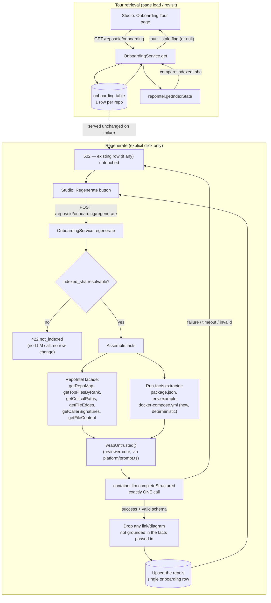

# Specification: Onboarding Generator

## 0. Metadata
- Spec ID: SPEC-2026-08-20-onboarding-generator
- Status: draft — all 3 blocking clarifications resolved (§13).
- Version: 0.2 — revision closing two review gaps found after v0.1: (a) very
  large repo behavior was under-specified (no Edge Cases row, no stated
  degradation-visibility contract, no facts-assembly-time bound independent of
  the LLM timeout) — added AC-37 (§6.3) and AC-38 (§7); (b) the "always
  operates on a full synced working tree, never a partial clone" precondition
  for run-facts extraction was implicit, not stated — added an explicit note
  under AC-12 and a new Assumption in §4. No existing AC-1..AC-36 renumbered
  or reworded in meaning.
- Owner: okolomoiets@competo.io
- Supersedes: none
- Related: 2 mockup screenshots ("Onboarding Tour" sidebar item + page —
  Architecture overview/Critical paths/How to run locally sections; second
  screenshot — How to run locally + Guided reading path), the request's own
  5-section description (First tasks not shown in either screenshot),
  `server/src/db/schema/context.ts:122-128` (existing `onboarding` table,
  extended here), `server/src/prompts/onboarding.system.md` (existing
  system prompt, reused), `server/src/vendor/shared/contracts/knowledge.ts:28-47`
  (existing `Onboarding`/`OnboardingSection`/`OnboardingLink` contracts,
  reused), `server/src/vendor/shared/contracts/platform.ts:16,46-48` +
  `client/src/lib/feature-models.ts` (existing `onboarding` `FeatureModelId`
  registry entry, reused unchanged), `server/src/modules/repo-intel/service.ts`
  (existing `getRepoMap`/`getTopFilesByRank`/`getCriticalPaths`/`getFileEdges`/
  `getCallerSignatures`/`getFileContent`, reused unchanged), `server/src/modules/intent/service.ts`
  (this repo's precedent for a non-review system feature importing
  `wrapUntrusted`/`estimateTokens` from `@devdigest/reviewer-core` directly),
  `server/src/modules/blast/service.ts` (precedent for a thin composition
  service over the repo-intel facade), `specs/server/blast-radius-llm-summary/spec.md`
  (precedent for an explicit-trigger, at-most-one-LLM-call generation pass
  with a provider/model/token/cost audit row), `specs/cross-cutting/project-context-folder/spec.md`
  (adjacent, independent feature — see §4 on why this spec does not depend
  on it), `client/src/vendor/ui/nav.ts` (sidebar nav registry, gains one new
  item), `client/src/components/app-shell/helpers.ts:29` (pre-existing
  `activeKeyFor` routing defect this spec fixes, §4/§6.6). **v0.2 additions:**
  `server/src/modules/repo-intel/service.ts:449-465` (`getRepoMap`'s
  `DEFAULT_REPO_MAP_TOKEN_BUDGET` cap), `server/src/modules/repo-intel/pipeline/repo-map.ts:28-57`
  (`renderRepoMap`'s binary-search truncation — confirms no total-vs-shown
  count is returned, only a static "partial view" header string),
  `server/src/modules/repo-intel/service.ts:726-743,750-789` (`getTopFilesByRank`/
  `getCriticalPaths` — confirms both are hard-count-capped, not
  size-of-repo-proportional, and return no truncation signal), `server/src/adapters/git/simple-git.ts:16`
  + `server/src/modules/repo-intel/pipeline/rank.ts:5` (`CLONE_DEPTH = 1` —
  shallow *history* only; working tree is always fully present once synced),
  `server/src/modules/intent/service.ts:38,437-449`
  (`SPEC_BODY_READ_TIMEOUT_MS` — this repo's existing precedent for bounding
  a non-LLM read step's own wall-clock time, independent of any LLM call
  timeout). No implementation plan yet (`implementation-planner` consumes
  this spec next).

## 1. Overview & Problem

A newcomer to an unfamiliar repository has no fast way to answer the
questions that matter most on day one: what is this codebase, structurally?
Which files actually carry the weight ("critical paths")? How do I even run
it locally? Where should I start reading, in what order? What's a safe first
change to attempt? Today a person answers these by grepping around, reading
a possibly-stale README, and asking a teammate — DevDigest already computes
most of the underlying structural facts (`repo-intel`'s import graph, file
rank, symbol/caller data) for its own review prompts, but none of that is
ever surfaced to a human.

**Onboarding Generator** turns that already-computed index into a
human-facing, five-section **Onboarding Tour** page per repo — Architecture
overview, Critical paths, How to run locally, Guided reading path, and First
tasks — generated on demand (never automatically) from the repo's existing
index, explicitly regenerable, and shareable via a workspace-scoped link.
This is largely **wiring, not new invention**: an `onboarding` DB table, a
matching `Onboarding`/`OnboardingSection` contract, a system prompt with the
right grounding/formatting rules, and an `onboarding` `FeatureModelId`
registry entry already exist as starter infrastructure (§0's Related list);
no module, route, or client page consumes them yet.

## 2. Glossary

| Term | Definition |
|---|---|
| Onboarding tour / tour | The generated `Onboarding` document (5 ordered `OnboardingSection`s) for one repo — persisted 1:1 with `repos.id` in the existing `onboarding` table. |
| Section kind | One of the 5 fixed values this feature emits, in fixed order: `architecture`, `critical_paths`, `how_to_run`, `reading_path`, `first_tasks`. |
| Run facts | New, deterministic (non-LLM) extraction of "how to run this repo" signals: `package.json`'s package manager + `scripts`, presence of `.env.example`/`.env.sample`, presence of `Dockerfile`/`docker-compose.yml`. Computed at generation time only, never persisted as its own table. |
| Regenerate | The explicit, user-triggered action that always performs exactly one fresh LLM generation call and replaces the repo's persisted tour, regardless of whether the repo's index changed since the last generation. |
| `indexed_sha` | The commit `repo-intel`'s index was last (re)computed from — same field/semantics as `BlastRadiusResponse.indexed_sha`; stamped onto a generated tour. |
| Stale | A persisted tour whose stored `indexed_sha` no longer matches the repo's *current* `repo-intel` index state — informational only, never auto-triggers regeneration. |
| Share link | Copies the studio's own authenticated URL for the tour page to the clipboard — not a new public/unauthenticated access path. |

## 3. User Scenarios

### Scenario: First visit, no tour generated yet
A user opens a repo's new "Onboarding Tour" sidebar item for the first time.
No tour has ever been generated for this repo. The page shows an empty state
with a "Generate onboarding tour" call-to-action — nothing is auto-generated
on page load.

### Scenario: Generate the first tour
The user clicks "Generate." The repo has a resolvable `repo-intel` index. The
system assembles facts entirely from already-computed data plus new
deterministic run-facts, makes exactly one LLM call, and persists the
resulting 5-section tour. The page renders the header ("Onboarding for
{repoName}"), the "Generated from index of {N} files · last refreshed just
now" subtitle, an in-page nav with 5 anchors, and each section's body,
(architecture-only) diagram, and file links.

### Scenario: Revisit an already-generated tour
The user reopens the same repo's tour page later. The system serves the
persisted tour with zero LLM calls; the subtitle reads "last refreshed 2h
ago."

### Scenario: Regenerate an existing tour
The user clicks "Regenerate" (same repo, no new commits since the last
generation). The system still makes exactly one new LLM call — Regenerate
never short-circuits on a cache hit — persists the fresh result in place of
the old one, and the page updates its content and "last refreshed" label.

### Scenario: A newer index exists than the displayed tour
The repo was reindexed (a resync advanced `indexed_sha`) after the tour was
last generated. The next page view still serves the existing tour instantly
(no auto-regeneration) but shows a non-blocking "this tour may be out of
date" banner with a shortcut to Regenerate.

### Scenario: Regenerate on a never-indexed repo
A user clicks Regenerate (or Generate) for a repo whose `repo-intel` index
has never completed (`indexed_sha` unset). The system rejects the request
with an explicit "index this repo first" error — no LLM call is made, and no
half-baked tour built from empty facts is ever persisted.

### Scenario: Regenerate fails
The user clicks Regenerate; the LLM call errors, times out, or returns
output that fails schema validation. The system shows an error message and
leaves whatever tour was previously persisted (if any) fully intact and
still visible — regeneration failure never blanks or corrupts existing
content.

### Scenario: Share a tour
A user clicks "Share link." The system copies the current tour page's own
studio URL to the clipboard. A recipient who opens that URL must still
authenticate into the same workspace, exactly like any other studio page —
no new public/anonymous surface is created.

## 4. Assumptions & Constraints

**Assumptions:**
- This feature **reuses, rather than builds from scratch**: the `onboarding`
  table (`server/src/db/schema/context.ts:122-128`, extended in §9), the
  `Onboarding`/`OnboardingSection`/`OnboardingLink` contracts
  (`knowledge.ts:28-47`, unchanged), the existing `onboarding.system.md`
  prompt (unchanged — its `{{sections}}`/grounding/mermaid-formatting rules
  already fit this feature's needs), and the existing `onboarding`
  `FeatureModelId` registry entry (`openrouter`/`deepseek-v4-flash` default,
  unchanged). This spec's job is the module/routes/client page that wires
  these together, plus the two genuinely new pieces: deterministic run-facts
  extraction (§6.3) and a grounding filter on model-returned file links
  (§6.4).
- Facts assembly draws **exclusively from already-computed `repo-intel`
  reads** (`getRepoMap`, `getTopFilesByRank`, `getCriticalPaths`,
  `getFileEdges`, `getCallerSignatures`, `getFileContent` for a bounded set
  of key-file excerpts) plus the new run-facts extraction (§6.3) — Regenerate
  never triggers a fresh index/reindex as a side effect.
- **Independent of Project Context Folder** (`specs/cross-cutting/project-context-folder/spec.md`):
  that feature's `context_documents` discovery/attachment mechanism serves a
  different concern (human-curated docs manually attached for *review-prompt*
  injection). This spec does not read from or write to `context_documents`,
  `agent_context_docs`, or `skill_context_docs` in this phase. A future
  enhancement could feed an attached `docs/ARCHITECTURE.md` as extra
  grounding input; not built here (§12).
- Trigger/staleness/first-tasks/share-link decisions are per the
  Clarifications Log (§13) — all three original blocking questions were
  resolved before this draft.
- **(v0.2) Run-facts extraction (AC-12) always operates on the same synced
  working tree `repo-intel` already maintains for indexing, never a
  partial/sparse checkout of its own.** `repo-intel`'s clone is shallow only
  in *git history* (`CLONE_DEPTH = 1`, `server/src/adapters/git/simple-git.ts:16`,
  `server/src/modules/repo-intel/pipeline/rank.ts:5`) — the working tree
  (the actual files `getFileContent`/`readClone` read) is always fully
  present once a repo has synced. This architecture has no "partial file
  set" state to design around: every clone-dependent `repo-intel` read
  (`getFileContent`, `getCallerSignatures`, run-facts' own `package.json`/
  `.env*`/compose-file reads) already gates on `repo.clonePath` being set
  and degrades to empty otherwise (`server/src/modules/repo-intel/service.ts:513,715-718`).
  This feature never attempts its own clone or checkout. AC-6 (§6.2) is the
  actual mechanism preventing any facts read from ever running against a
  missing/unsynced clone: it rejects Regenerate with `422 not_indexed`
  whenever `indexed_sha` is unresolved, which is exactly the state a repo is
  in before its first successful sync/index. There is no separate "degraded
  mode without a clone" for this feature to define — AC-6 already covers it.

**Constraints:**
- **Hard constraint (mirrors `blast-radius-llm-summary`'s carried-over
  constraint): at most one LLM call per Regenerate request.** One
  `completeStructured` call producing all 5 sections' JSON in a single
  response — never one call per section.
- **`@devdigest/shared` hand-copy convention** (root `CLAUDE.md`): the new
  `OnboardingTourResponse` contract (§10) must be added to **both**
  `server/src/vendor/shared` and `client/src/vendor/shared`, or the two
  packages silently drift (`server/INSIGHTS.md`'s documented drift risk).
  The existing `Onboarding`/`OnboardingSection`/`OnboardingLink` contracts
  themselves need no change.
- Migrations for the new `onboarding` columns (§9) are applied manually via
  `pnpm db:migrate` — this repo's server does not migrate on boot.
- **No new isolation/injection-guard mechanism.** Every piece of
  repository-derived content reaching the prompt (file tree, key-file
  excerpts, script names, paths) is wrapped exclusively through
  `platform/prompt.ts`'s re-exported `wrapUntrusted()`/`INJECTION_GUARD`
  (`@devdigest/reviewer-core`) — the **same mechanism
  `server/src/modules/intent/service.ts` already imports directly today**
  for a non-review system feature, not something new invented for this
  spec (§11).
- **Pre-existing routing/nav defect this feature must fix, found during
  design analysis (not introduced by this spec):**
  `client/src/components/app-shell/helpers.ts:29`'s `activeKeyFor` already
  contains `if (pathname.includes("/onboarding")) return "onboarding-tour";`
  — apparently written anticipating this exact feature, but today it only
  matches the existing top-level add-a-repo flow's own route
  (`useShellContext.ts`'s `onAddRepo` → `router.push("/onboarding")`), which
  is an unrelated flow with no repo-scoped sidebar to highlight. To avoid
  ever colliding with that route (and to make the fix robust for any future
  path), this feature's own page route deliberately does **not** contain the
  substring `onboarding` at all — see §6.6/§10 (`/repos/:repoId/tour`) — and
  the existing substring check is tightened to an exact match. This is a
  requirement of this spec (AC-27), not an incidental note.

## 5. Cross-Module Interactions

Two independent flows, both routed through a new `onboarding/` server module
that composes the already-persistent `repo-intel` facade (no new
AST/graph/DB read pattern) and the platform's existing LLM port — mirroring
`blast/service.ts`'s own thin-composition shape:

**Failure contract at each boundary:**
- `repo-intel`'s index state degraded/never computed (`indexed_sha` unset) →
  Regenerate is rejected outright (`422 not_indexed`), never attempting a
  low-quality generation over empty facts (AC-6).
- LLM provider unreachable, rate-limited, times out, or returns
  schema-invalid output → caught, logged, `502` returned; the previously
  persisted tour (if any) is left completely unmodified and remains
  servable via `GET` (AC-9).
- A model-returned section link references a path never present in the
  facts assembled for that section → dropped before persisting, never
  shown to the user as an "Open" affordance for a file that doesn't exist
  (AC-19).
- Postgres unavailable at persist time → the generated tour is not
  returned as if successful; the request fails and the client shows the
  same error state as an LLM failure (no partial "looks-succeeded" response).
- **(v0.2)** Facts assembly itself (the `repo-intel` reads, not the LLM call)
  stalls past its own 20,000 ms bound — e.g. a very large repo's DB/clone
  reads run slow — → aborted and treated identically to an LLM failure
  (`502`, existing tour untouched, zero LLM calls made; AC-38).

## 6. Functional Requirements

### 6.1 Retrieval & empty/stale state
- AC-1 (Event-driven): WHEN a client sends `GET /repos/:repoId/onboarding` for a repo with no persisted tour, the system shall respond `200` with `tour: null`, without calling the LLM. Verify: `GET` against a repo with an empty `onboarding` table returns `{ tour: null, ... }` and the mocked LLM adapter records zero calls.
- AC-2 (Event-driven): WHEN a client sends `GET /repos/:repoId/onboarding` for a repo with a persisted tour, the system shall respond `200` with that tour's sections plus its `indexed_sha`/`file_count`/`generated_at`/`provider`/`model`, without calling the LLM. Verify: seed an `onboarding` row, `GET` returns it verbatim; zero LLM adapter calls.
- AC-3 (Unwanted behavior): IF `:repoId` on either route does not resolve to a repo in the caller's workspace, THEN the system shall respond `404 not_found`. Verify: a cross-workspace or unknown repo id on `GET`/`POST` returns 404 on both routes.
- AC-4 (Event-driven): WHEN a client sends `GET /repos/:repoId/onboarding` for a repo whose *current* `repo-intel` `indexed_sha` differs from the persisted tour's stored `indexed_sha`, the system shall include `stale: true` in the response while still serving the existing tour content unchanged — never blocking the read or auto-regenerating. Verify: seed a tour at sha A, mock the repo's current index state to sha B, `GET` returns the same tour content with `stale: true`; a matching-sha case returns `stale: false`.

### 6.2 Regenerate (explicit trigger, always exactly one LLM call)
- AC-5 (Event-driven): WHEN a client sends `POST /repos/:repoId/onboarding/regenerate` for a repo whose `repo-intel` index has a resolvable `indexed_sha`, the system shall assemble facts (§6.3) and make exactly one `completeStructured` call producing all 5 sections in a single response. Verify: unit test with a mocked non-empty index state and a mocked LLM adapter confirms exactly one adapter invocation.
- AC-6 (Unwanted behavior): IF the repo's `repo-intel` index state has no resolvable `indexed_sha` (never indexed) at Regenerate time, THEN the system shall reject with `422 not_indexed`, call the LLM zero times, and leave any existing persisted tour completely unmodified. Verify: mock `getIndexState` to return an unset `lastIndexedSha` → `POST` responds 422; the mocked LLM adapter records zero calls; a previously seeded tour row is unchanged.
- AC-7 (Ubiquitous): The system shall always attempt exactly one fresh generation on Regenerate regardless of whether the repo's `indexed_sha` has changed since the last persisted tour — there is no cache-hit short-circuit on this route. Verify: two consecutive `POST`s against an unchanged `indexed_sha` each independently invoke the mocked LLM adapter once (two calls total across two requests).
- AC-8 (Event-driven): WHEN a Regenerate call's LLM generation succeeds and validates against the `Onboarding` schema, the system shall replace (upsert) the repo's single persisted tour row with the new sections plus updated `indexed_sha`/`file_count`/`generated_at`/`provider`/`model`, and respond `200` with the new tour. Verify: `POST` against an empty `onboarding` table with a mocked successful completion results in exactly one row for that `repoId`, matching the mocked output.
- AC-9 (Unwanted behavior): IF the LLM call fails, times out, or returns output that fails schema validation, THEN the system shall respond `502`, leaving any existing persisted tour row unmodified. Verify: mock the LLM adapter to throw; seed an existing tour row first; confirm the response is 502 and the seeded row is byte-identical afterward.
- AC-10 (Ubiquitous): The system shall not de-duplicate concurrent Regenerate requests for the same repo — two racing requests may each independently perform their own LLM call, bounded only by the rate limit (AC-31), which is an accepted cost tradeoff rather than a correctness bug (§8). Verify: N/A — accepted, no test required; covered by AC-31's rate-limit test instead.

### 6.3 Facts assembly (deterministic input to the one LLM call)
- AC-11 (Ubiquitous): The system shall assemble the LLM prompt's facts exclusively from already-computed `repo-intel` facade reads (`getRepoMap`, `getTopFilesByRank`, `getCriticalPaths`, `getFileEdges`, `getCallerSignatures`) plus the new run-facts extraction (AC-12), never triggering a fresh index or reindex as a side effect of Regenerate. Verify: a unit test spies on `repoIntel.indexRepo`/`refreshIndex`/`resyncRepo` and asserts zero calls during a Regenerate invocation.
- AC-12 (Event-driven): WHEN facts are assembled for a repo, the system shall deterministically detect "how to run locally" signals by reading the repo clone's `package.json` (package manager + `scripts`), the presence of `.env.example`/`.env.sample`, and the presence of `Dockerfile`/`docker-compose.yml` — never inferring or inventing a command not backed by one of these sources. Verify: a fixture clone with a `package.json` containing `scripts: { dev: "..." }` and a `docker-compose.yml` produces run-facts naming exactly those two sources; a unit test asserts no other script/file is invented.
  - *(v0.2 note, precondition made explicit — see §4)*: this read always
    targets the same fully-synced working tree `repo-intel` maintains for
    indexing (shallow git *history* only, never a partial file set); AC-6
    is what already guarantees this read never runs against a
    missing/unsynced clone, by rejecting Regenerate before facts assembly
    starts whenever `indexed_sha` is unresolved.
- AC-13 (Unwanted behavior): IF none of AC-12's run-fact sources are present or parseable, THEN the system shall pass an explicit "no run facts detected" signal into the prompt, so the model states this honestly in the `how_to_run` section rather than inventing commands. Verify: a fixture clone with no `package.json`/env-file/compose-file produces run-facts flagged empty; the resulting `how_to_run` section's body does not contain any command not present in the facts (grounding check mirrors AC-19's link filter, applied here as a facts-shape assertion).
- AC-14 (Ubiquitous): The system shall bound the assembled facts payload so no single Regenerate attempt produces an unbounded prompt regardless of repo size, reusing `getRepoMap`'s own existing token-budget cap and `getTopFilesByRank`/`getCriticalPaths`'s existing count-capped reads — no new unbounded read is added by this feature. Verify: a unit test against a large synthetic file-rank fixture confirms the assembled facts payload's estimated token count (via `estimateTokens`) stays within the same budget `getRepoMap` itself already enforces.
- AC-37 (Unwanted behavior) *(v0.2, closes a review gap — very large repo)*: IF a repo's total indexed file count exceeds the fixed sizes `getRepoMap` (token-budget binary search, `renderRepoMap`), `getTopFilesByRank` (caller-supplied `n`, hard-capped), and `getCriticalPaths` (fixed `CRITICAL_PATH_ROOTS = 5` root chains) each already bound their own reads to, THEN the system shall still generate all 5 sections from the resulting bounded facts without blocking, erroring, or degrading the response differently than for a small repo — and shall never present any section's file/path list as exhaustive, since none of these three reads returns a truncated-vs-total count for this feature to surface per-section. The only repo-size signal shown to the user remains the already-existing "Generated from index of {file_count} files" subtitle (AC-21); no new "showing top N of M" per-section affordance is added in this phase — an explicit, accepted limitation of the current `repo-intel` read shapes, not an oversight (§8). Verify: a fixture repo with 50,000+ ranked files still produces a full 5-section tour in one LLM call; the response's `file_count` reflects the true total; a unit test asserts no section body/links payload includes a fabricated per-section "of N total" count.

### 6.4 LLM generation & output shape
- AC-15 (Ubiquitous): The system shall request from the model exactly 5 sections — kinds `architecture`, `critical_paths`, `how_to_run`, `reading_path`, `first_tasks`, in that fixed order — matching the existing `OnboardingSection` contract (`kind`/`title`/`body`/`diagram`/`links`), reusing `onboarding.system.md`'s existing grounding/formatting/mermaid rules unmodified. Verify: a unit test on the rendered `{{sections}}` prompt variable lists exactly these 5 kinds in this order.
- AC-16 (Ubiquitous): The system shall persist a non-null `diagram` only for the `architecture` section — any `diagram` value returned for another section is dropped (set to `null`) server-side before persisting, as defense-in-depth beyond the prompt's own instruction. Verify: a mocked LLM response with a non-null `diagram` on the `how_to_run` section is persisted with that field `null`; the `architecture` section's own `diagram` is preserved.
- AC-17 (Unwanted behavior): IF a persisted section's `diagram` field fails to parse as valid mermaid syntax on the client, THEN the client shall render that section's body/links normally and hide only the diagram block — never crash the page. Verify: a fixture tour with a malformed `diagram` string on the `architecture` section renders that section's body and links; the diagram region is empty/absent rather than throwing.
- AC-18 (Ubiquitous): The system shall cap each section's persisted `body` at 6,000 characters, truncating with a trailing `"...[truncated]"` marker, guarding against a runaway completion — mirrors this codebase's existing `MAX_INTENT_CHARS`-style truncation convention (`intent/service.ts`). Verify: a mocked LLM response with an 8,000-character body for one section persists that section's `body` at exactly 6,000 characters plus the marker.
- AC-19 (Unwanted behavior): IF a section's `links[]` entry (from `critical_paths` or `reading_path`) references a path that was not present in the facts assembled for that section, THEN the system shall drop that link before persisting — closing the gap where the prompt's own "never invent a path" instruction alone is not structurally guaranteed. Verify: a mocked LLM response for `critical_paths` returning one real path (present in the input facts) and one fabricated path persists only the real one; a unit test asserts the surviving `links` array's length and identity.

### 6.5 Client page & UI states
- AC-20 (Event-driven): WHEN a user opens a repo's Onboarding Tour page and no tour has been generated yet, the system shall render an empty state with a "Generate onboarding tour" call-to-action, never auto-triggering generation on page load. Verify: page mount with `tour: null` renders the empty state; a spy on the regenerate mutation records zero calls at mount.
- AC-21 (Event-driven): WHEN a user opens a repo's Onboarding Tour page with a persisted tour, the system shall render the header ("Onboarding for {repoName}"), a "Generated from index of {file_count} files · last refreshed {relative generated_at}" subtitle, an in-page nav with 5 anchors in fixed order, and each section's body/diagram/links. Verify: the page renders 5 anchors matching AC-15's fixed order; the subtitle interpolates `file_count`/`generated_at` from the `GET` response.
- AC-22 (Event-driven): WHEN a user clicks "Regenerate," the system shall call the regenerate endpoint, disable the button with a loading indicator for the call's duration, and on success replace the rendered tour content in place. Verify: clicking Regenerate disables the button until the mutation settles; on success the subtitle's "last refreshed" resets to "just now."
- AC-23 (Unwanted behavior): IF a Regenerate call fails, THEN the system shall show a dismissible error message and continue displaying whatever tour content was previously rendered, unchanged — never blanking the page. Verify: a mocked `502` from the regenerate call leaves the previously rendered sections' content in the DOM and shows an error banner/toast.
- AC-24 (State-driven): WHILE the `GET` response's `stale` flag is `true`, the page shall show a non-blocking "this tour may be out of date" banner alongside the existing content, with a shortcut to Regenerate. Verify: a `GET` response with `stale: true` renders the banner; `stale: false` does not.
- AC-25 (Event-driven): WHEN a user clicks "Share link," the system shall copy the current tour page's own studio URL to the clipboard and show a confirmation toast — no new unauthenticated/public endpoint or token is requested from the server. Verify: clicking Share link invokes the clipboard API with the current page's own URL; no new network request beyond the already-loaded `GET` is made.

### 6.6 Nav / routing (includes the pre-existing defect fix, §4)
- AC-26 (Ubiquitous): The system shall add a new "Onboarding Tour" sidebar item to the WORKSPACE nav group (`client/src/vendor/ui/nav.ts`'s `NAV`), alongside "Pull Requests"/"Project Context", routed at `/repos/:repoId/tour` — a path that deliberately does not contain the substring `onboarding`, avoiding any collision with the existing top-level add-a-repo route. Verify: `NAV`'s WORKSPACE group gains one entry with `href: "/repos/:repoId/tour"`.
- AC-27 (Unwanted behavior): IF `activeKeyFor` is evaluated for the existing add-a-repo path `/onboarding`, THEN the system shall return an empty active key (highlighting no workspace sidebar item) — fixing the existing substring check (`pathname.includes("/onboarding")`) to an exact match, since that check was seemingly written anticipating this feature but does not actually fire for this feature's real `/tour` route. Verify: `activeKeyFor("/onboarding")` returns `""`; `activeKeyFor("/repos/abc/tour")` returns the new nav item's key.

### 6.7 Model selection & audit
- AC-28 (Ubiquitous): The system shall resolve the LLM provider/model for generation via the existing `onboarding` `FeatureModelId`, using the workspace's Settings override when present and the registry default (`openrouter`/`deepseek/deepseek-v4-flash`) otherwise — no new registry entry required. Verify: a unit test with a workspace override set to a non-default provider confirms that provider is the one invoked by Regenerate.
- AC-29 (Ubiquitous): The system shall record, on each successful Regenerate, which provider/model produced the tour plus its token usage (`tokens_in`/`tokens_out`) and estimated cost, using the same fields/nullability convention as the blast-summary cache row (`cost_usd` nullable). Verify: after a successful Regenerate, the persisted row's `provider`/`model`/`tokens_in`/`tokens_out` are non-null.

## 7. Non-Functional Requirements

**Performance:**
- AC-30 (Ubiquitous): The system shall bound the Regenerate LLM call by the platform's existing default LLM call timeout (300000 ms) unless a tighter `timeoutMs` is explicitly configured for this feature. Verify: a unit test confirms the `completeStructured` call either omits `timeoutMs` (defers to the adapter default) or passes an explicitly configured value.
- AC-38 (Unwanted behavior) *(v0.2, closes a review gap — very large repo)*: IF facts assembly (the `repo-intel` reads of AC-11 plus run-facts extraction, AC-12) does not complete within 20,000 ms wall-clock time, THEN the system shall abort the Regenerate request and respond `502`, exactly as for an LLM failure (AC-9) — including leaving any existing persisted tour row unmodified — without ever making the LLM call, bounding facts-assembly latency independently of the LLM call's own timeout (AC-30). This mirrors this codebase's existing precedent for bounding a non-LLM read step's own duration (`server/src/modules/intent/service.ts`'s `SPEC_BODY_READ_TIMEOUT_MS`), applied here to a slower, multi-read assembly step rather than a single fetch. Verify: a unit test with a mocked `repo-intel` facade whose reads stall past 20,000 ms confirms Regenerate responds 502, the mocked LLM adapter records zero calls, and a previously seeded tour row is byte-identical afterward.
- AC-31 (Ubiquitous): The system shall rate-limit `POST /repos/:repoId/onboarding/regenerate` to at most 10 requests per minute per workspace, mirroring the existing `blast_summary`/`intent/derive` per-route rate-limit config. Verify: an 11th `POST` within 60 seconds from the same workspace returns `429`.
- AC-32 (Ubiquitous): The system shall apply the default (unrestricted) rate limit to `GET /repos/:repoId/onboarding`, since it only reads already-persisted data. Verify: repeated `GET`s within the default global limit window all succeed.

**Security:**
- AC-33 (Ubiquitous): The system shall scope every `GET`/`POST` onboarding route to the requesting workspace's own repos, mirroring `GET /pulls/:id/blast`'s existing ownership-check pattern. Verify: covered by AC-3 (a cross-workspace repo id returns 404 on both routes, never another workspace's tour).
- AC-34 (Ubiquitous): The system shall never include repository secrets, environment-variable *values*, or `.env`/`.env.example` file *contents* in the LLM prompt — run-facts (AC-12) carry only file presence and script *names*, never file bodies. Verify: the prompt-assembly log lists only path/script-name/fact fields for the run-facts section, never an `.env*` file's actual content.
- AC-35 (Ubiquitous): The system shall treat every piece of repository-derived content reaching the prompt (file tree, key-file excerpts, script names, paths) as untrusted input, wrapped exclusively via `platform/prompt.ts`'s re-exported `wrapUntrusted()`/`INJECTION_GUARD` (`@devdigest/reviewer-core`) — the same mechanism `intent/service.ts` already uses directly — never as trusted framing text. Verify: a unit test on the assembled prompt confirms every facts/file-content section is produced via a `wrapUntrusted(...)` call, matching `intent/service.ts`'s existing usage shape.

**Availability:**
- Covered by AC-9 (an LLM failure never corrupts or removes an existing persisted tour) and AC-6 (an unindexed repo is rejected explicitly rather than attempting a degraded generation) — this feature never makes `GET`'s own availability worse than serving whatever was last successfully persisted.

**Accessibility / localization:**
- AC-36 (Ubiquitous): The Onboarding Tour page shall provide keyboard-operable anchor links for each of the 5 sections (reachable via Tab, activating on Enter/Space) and an `aria-live` region announcing "tour regenerated" or the Regenerate error message on completion. Verify: each section anchor is a focusable, keyboard-activatable element; a successful/failed Regenerate call is announced via an `aria-live` region in a component test.

## 8. Edge Cases (index)

| AC-ID or `accepted: no handling` | Trigger/condition | Category (1–6) |
|---|---|---|
| AC-3 | Cross-workspace or unknown repo id | 5 (Integration/Access) |
| AC-4 | Repo reindexed after the tour was generated (staleness) | 2 (Domain & Data Model — lifecycle) |
| AC-6 | Regenerate attempted on a never-indexed repo | 6 (Edge Cases — absent precondition) |
| AC-9 | LLM call fails/times out/invalid output | 6 (Edge Cases — failure handling) |
| `accepted: no handling` (AC-10) | Concurrent Regenerate requests for the same repo race, each independently calling the LLM | 6 (Edge Cases — concurrency, accepted; bounded only by the rate limit AC-31) |
| AC-13 | No run-fact sources detected in the repo | 6 (Edge Cases — empty input) |
| AC-16 / AC-17 | Model returns a diagram on a non-architecture section / a malformed diagram string | 6 (Edge Cases — malformed model output) |
| AC-19 | Model-returned link references a path absent from the facts | 6 (Edge Cases — ungrounded model output) |
| AC-23 | Regenerate fails while a previous tour already exists | 3 (Interaction & UX) |
| AC-24 | Displayed tour is stale relative to the current index | 3 (Interaction & UX) |
| AC-27 | Pre-existing nav routing collision between `/onboarding` (add-repo) and this feature | 3 (Interaction & UX) |
| AC-34 | Run-facts must never leak `.env*` file contents/secrets into the prompt | 5 (Security) |
| AC-37 | Very large repo — bounded `repo-intel` reads (`getRepoMap`/`getTopFilesByRank`/`getCriticalPaths`) truncate silently, with no per-call total-vs-shown count to surface | 4 (Non-Functional — volume) / 3 (Interaction & UX — transparency) |
| AC-38 | Very large repo — facts-assembly step itself (not the LLM call) stalls past its own bound | 4 (Non-Functional — latency) / 6 (Edge Cases — failure handling) |

## 9. Data Model

**Extended entity: `onboarding`** (`server/src/db/schema/context.ts:122-128`,
already migrated — one row per repo, upserted in place, never versioned).

| Field | Type | Notes |
|---|---|---|
| `repo_id` | uuid, PK, FK → `repos.id`, `ON DELETE CASCADE` | Existing. |
| `json` | jsonb | Existing — holds the `Onboarding` document (`{ sections: OnboardingSection[] }`), unchanged shape. |
| `generated_at` | timestamp, default now | Existing. |
| `indexed_sha` | text, nullable | **New.** The `repo-intel` `indexed_sha` this tour was generated against — drives the `stale` flag (AC-4). |
| `file_count` | integer, nullable | **New.** File count at generation time, for the "Generated from index of N files" subtitle. |
| `provider` | text, nullable | **New.** Which provider produced this tour (audit). |
| `model` | text, nullable | **New.** Which model produced it. |
| `tokens_in` / `tokens_out` | integer, nullable | **New.** Usage from the one `completeStructured` call — same convention as the blast-summary cache row. |
| `cost_usd` | numeric, nullable | **New.** Estimated cost, null when unknown — same nullability convention as `blast_summaries.cost_usd`/`reviews.cost_usd`. |

**Lifecycle (deliberately different from `blast_summaries`'s
append-per-key convention):** a successful Regenerate **replaces the
repo's single row in place** (upsert on `repo_id`, the existing PK) — there
is exactly one "current" tour per repo, never a history of past
generations. A failed Regenerate never touches this row (AC-9). Deleted only
via the repo's own existing cascade delete.

**Not persisted as its own table:** run-facts (AC-12) are computed fresh
from the repo's clone at each Regenerate call and fed directly into the
prompt — they are derived, ephemeral input, not a cached fact the way
`context_documents`/`code_chunks` are for Project Context Folder.

## 10. Interfaces (API / UI contracts)

Shapes only — fields, direction, optionality. No schema-library code.

**`OnboardingTourResponse`** (returned by `GET`, and by `POST /regenerate`
on success):

| Field | Type | Optionality |
|---|---|---|
| `tour` | `Onboarding \| null` | required — `null` when never generated |
| `indexed_sha` | string \| null | required |
| `file_count` | number \| null | required |
| `generated_at` | string (ISO datetime) \| null | required |
| `provider` / `model` | string \| null | required |
| `stale` | boolean | required — always `false` when `tour` is `null` |

**`GET /repos/:repoId/onboarding`** → `200 OnboardingTourResponse`
(`tour: null` when none exists); `404` when the repo id doesn't resolve in
the caller's workspace. Never triggers an LLM call.

**`POST /repos/:repoId/onboarding/regenerate`** → `200 OnboardingTourResponse`
(`tour` always populated on success); `404` repo not found/foreign
workspace; `422 not_indexed` when the repo's index has no resolvable
`indexed_sha` (AC-6); `502` on LLM failure/invalid output (existing tour, if
any, still fetchable via `GET`); `429` rate limit exceeded. At most one LLM
call per invocation (§4's hard constraint).

**`OnboardingSection`/`OnboardingLink`** — **no shape change**; the existing
`kind`/`title`/`body`/`diagram`/`links` contract (`knowledge.ts:28-47`) is
reused verbatim. This spec's only obligation is which 5 `kind` values are
requested, in what order (AC-15), and the two new server-side filters
applied before persisting (AC-16 diagram gating, AC-19 link grounding).

**UI states** (Onboarding Tour page): loading (skeleton sections), empty (no
tour yet — "Generate onboarding tour" CTA), generating (Regenerate button
disabled + spinner), error (Regenerate failed — banner, previous content, if
any, retained; a full error/empty state only when no tour has ever
succeeded), populated (header + subtitle + 5-section nav + content), stale
(populated + non-blocking banner, AC-24).

## 11. Untrusted Inputs

Yes — facts assembly includes real repository file content (key-file
excerpts via `getFileContent`, `package.json` content, file/path names) that
is repository-supplied and potentially attacker-influenced: a malicious
contributor could shape file/path names or file content to attempt prompt
injection, the same threat model this codebase already treats for diffs, PR
descriptions, and (per `specs/cross-cutting/project-context-folder/spec.md`)
attached context documents. This content is isolated **exclusively** through
`platform/prompt.ts`'s re-exported `wrapUntrusted()`/`INJECTION_GUARD`
(`@devdigest/reviewer-core`) — the **same mechanism
`server/src/modules/intent/service.ts` already imports and uses directly
today** for a non-review "system feature" LLM call. This spec introduces
**no new isolation mechanism**. Separately, model *output* (not input) gets
its own grounding safeguard beyond isolation: AC-19's link-filtering step
drops any file path the model returns that wasn't actually present in the
facts it was given, so a hallucinated path never becomes a clickable "Open"
affordance shown to the user.

## 12. Out of Scope

- **Public/unauthenticated share links** (token-based anonymous access) —
  Share link is workspace-scoped only, per the resolved clarification (§13).
  A real public link is a separately-scoped future feature needing its own
  security review (new anonymous read surface, token expiry/revocation).
- **Pulling real GitHub "good first issue"/"help wanted" issues** into First
  tasks — grounded-in-facts LLM suggestions only, per the resolved
  clarification (§13); no new Octokit-backed data source is added here.
- **Reusing Project Context Folder's `context_documents` discovery/
  attachment mechanism** as an input to facts assembly — independent in this
  phase (§4); feeding an attached spec/doc as extra grounding is a possible
  future enhancement, not built here.
- **A dedicated MCP tool** exposing the tour — mirrors
  `blast-radius-llm-summary`'s own precedent of not extending the MCP
  surface; the existing 5 `mcp-server` tools are unchanged.
- **Historical/versioned tours.** Regenerate replaces the repo's single
  persisted tour in place (§9); there is no "compare to last week's tour"
  browsing or retention of superseded generations.
- **Async/background generation via `JobRunner`.** Regenerate is a
  synchronous request/response bounded by the platform's existing LLM call
  timeout (AC-30), matching `blast-radius-llm-summary`'s precedent; a
  queued/background generation model is not built here.
- **A `routes_and_apis` section kind.** `onboarding.system.md`'s existing
  diagram-allowance for a `routes_and_apis` kind is unused by this
  feature's fixed 5-section list (§6.4); not requested or rendered here.

## 13. Clarifications Log

| # | Category (1–6) | Question | Answer / Resolution | Impacted AC-ID(s) |
|---|---|---|---|---|
| 1 | 1 (Functional Scope) | What does the "First tasks" section (present in the sidebar nav but not shown in either screenshot) actually contain? | Requester approved the agent's recommended default: LLM-generated tasks grounded strictly in real repo-intel facts — same one-call, no-external-dependency shape as the other 4 sections, using `onboarding.system.md`'s existing grounding discipline (never invent paths/facts). Not pulled from GitHub issues; not deferred. | AC-15, §12 |
| 2 | 1 (Functional Scope) / 5 (Integration) | Does "Regenerate" always force a fresh LLM call, or is it cache-aware like `blast_summary`'s POST? Does a first page view auto-generate a tour? | Requester approved the agent's recommended default: no auto-generation on first page view (empty/CTA state requiring an explicit click, matching Conventions' own explicit-scan pattern); Regenerate always forces exactly one fresh LLM call, never short-circuiting on a cache hit. | AC-5, AC-6, AC-7, AC-8, AC-20, §9 |
| 3 | 4 (Non-Functional) / 5 (Integration) | Is "Share link" a real public/unauthenticated link, or workspace-scoped? | Requester approved the agent's recommended default: workspace-scoped only — the button copies the studio URL; opening it still requires the same auth as every other page. No new public/unauthenticated surface, no token-based sharing. | AC-25, §12 |

## 14. Acceptance Criteria Summary (Definition of Done)

- [ ] AC-1 — `GET` with no persisted tour returns `tour: null`, zero LLM calls.
- [ ] AC-2 — `GET` with a persisted tour returns it verbatim, zero LLM calls.
- [ ] AC-3 — Cross-workspace/unknown repo id returns 404 on both routes.
- [ ] AC-4 — `GET` flags `stale: true` when the repo's current `indexed_sha` differs from the tour's.
- [ ] AC-5 — Regenerate makes exactly one LLM call when the index is resolvable.
- [ ] AC-6 — Regenerate on a never-indexed repo is rejected (422), zero LLM calls, no row change.
- [ ] AC-7 — Regenerate never cache-hit short-circuits; always attempts a fresh generation.
- [ ] AC-8 — A successful Regenerate upserts the repo's single tour row with full metadata.
- [ ] AC-9 — A failed Regenerate returns 502 and never modifies an existing persisted row.
- [ ] AC-10 — Concurrent Regenerate requests are not de-duplicated (accepted, bounded by rate limit).
- [ ] AC-11 — Facts assembly never triggers a fresh index/reindex.
- [ ] AC-12 — Run-facts extraction is deterministic (package manager/scripts, env-file presence, compose/Dockerfile presence).
- [ ] AC-13 — Absent run-fact sources produce an honest "no run facts detected" signal, never invented commands.
- [ ] AC-14 — Facts payload stays within the same token budget `getRepoMap` itself enforces.
- [ ] AC-15 — Exactly 5 sections requested, fixed kinds and order.
- [ ] AC-16 — Non-architecture sections' `diagram` is nulled server-side.
- [ ] AC-17 — A malformed diagram string degrades gracefully client-side.
- [ ] AC-18 — Each section's `body` is capped at 6,000 chars with a truncation marker.
- [ ] AC-19 — Model-returned links not grounded in the input facts are dropped before persisting.
- [ ] AC-20 — No tour yet → empty state, no auto-generation on page load.
- [ ] AC-21 — A persisted tour renders header/subtitle/5-anchor nav/section content.
- [ ] AC-22 — Regenerate click shows a loading state and swaps content in place on success.
- [ ] AC-23 — A failed Regenerate preserves previously rendered content and shows an error.
- [ ] AC-24 — A `stale: true` response shows a non-blocking banner.
- [ ] AC-25 — Share link copies the studio URL; no new public endpoint/token.
- [ ] AC-26 — New "Onboarding Tour" nav item routed at `/repos/:repoId/tour`.
- [ ] AC-27 — `activeKeyFor("/onboarding")` no longer false-positives onto this feature.
- [ ] AC-28 — Model/provider resolved via the existing `onboarding` `FeatureModelId`.
- [ ] AC-29 — Successful Regenerate records provider/model/token usage.
- [ ] AC-30 — LLM call bounded by the platform's default timeout unless overridden.
- [ ] AC-31 — Regenerate rate-limited to 10/min/workspace.
- [ ] AC-32 — `GET` uses the default (unrestricted) rate limit.
- [ ] AC-33 — Both routes are workspace-scoped (404 cross-workspace).
- [ ] AC-34 — No secrets/env values/file contents ever enter the prompt via run-facts.
- [ ] AC-35 — All repo-derived prompt content is wrapped via `wrapUntrusted`.
- [ ] AC-36 — Section anchors are keyboard-operable; Regenerate outcome is announced via `aria-live`.
- [ ] AC-37 — A very large repo still yields a full 5-section tour from bounded facts; no section falsely claims to be exhaustive; `file_count` reflects the true total.
- [ ] AC-38 — Facts assembly exceeding 20,000 ms aborts Regenerate with 502, zero LLM calls, existing tour row unmodified.
