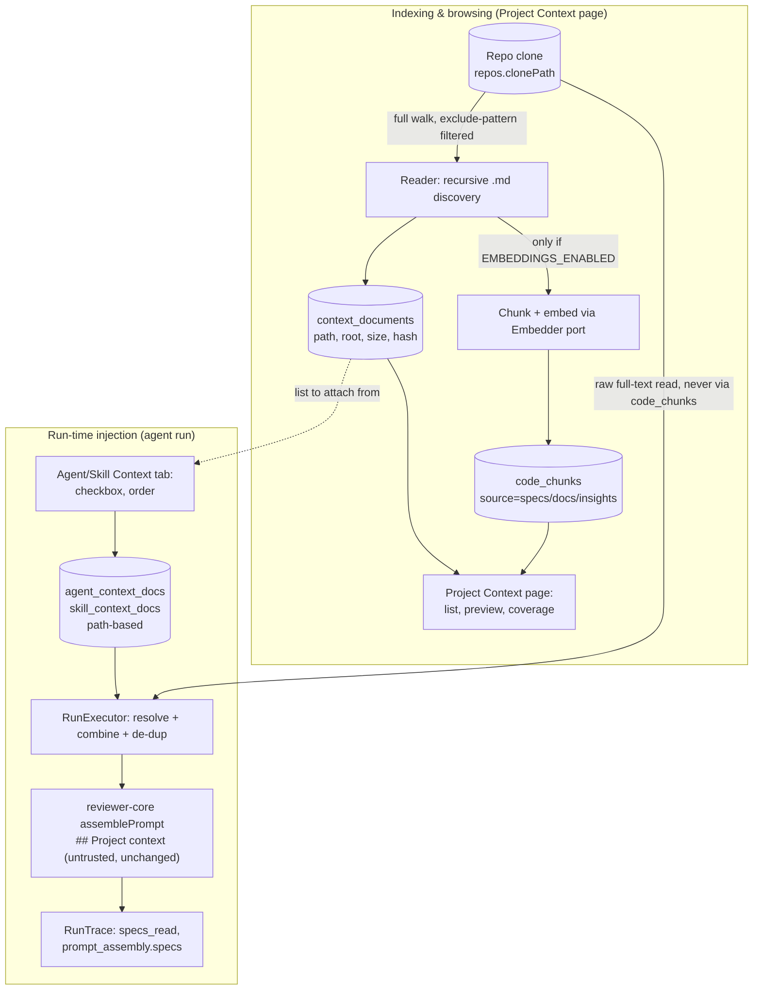

# Specification: Project Context Folder

## 0. Metadata
- Spec ID: SPEC-2026-08-19-project-context-folder
- Status: draft — all `[NEEDS CLARIFICATION]` items resolved (chunking strategy in §9, indexing/injection size caps in §7); v0.2's exclude-list flip (Clarifications Log #7) resolved without a blocking question — see §13.
- Version: 0.2
- Owner: redfoxius@gmail.com
- Supersedes: none
- Related: 4 mockup screenshots (Project Context page, Agent Editor Context tab,
  Skill Editor Context tab, PR Agent-run trace panel — sources for this spec,
  not implementation), `reviewer-core/src/prompt.ts` (existing `wrapUntrusted`/
  `INJECTION_GUARD`/`estimateTokens`, reused unchanged), `reviewer-core/src/review/run.ts`
  (existing `ReviewInput.specs`, reused unchanged), `server/src/modules/reviews/run-executor.ts`
  (the `specs_read: []` / `specs: null` stubs this spec fills in),
  `server/src/db/schema/context.ts` (existing `code_chunks` table, reused for
  chunk/embedding storage), `server/src/modules/agents/repository.ts`'s
  `linkedSkills`/`agent_skills` (the structural precedent this spec's
  `agent_context_docs`/`skill_context_docs` mirror), `client/src/app/agents/[id]/_components/AgentEditor/_components/SkillsTab`
  (the UI precedent the new Context tabs mirror), `client/src/app/repos/[repoId]/conventions`
  (the UI precedent the new Project Context page mirrors), implemented v0.1
  code read for this v0.2 revision: `server/src/modules/context-docs/reader.ts`
  (`DEFAULT_CONTEXT_GLOBS`, `discoverContextDocs`, `classifyRoot`),
  `server/src/modules/context-docs/glob-safety.ts` (`isGlobEscaping`,
  `resolveWithinClone`, `verifyRealpathWithinClone` — note `isGlobEscaping` has
  a SECOND call site outside this revision's scope: `agents/service.ts` and
  `skills/service.ts`'s `assertPathsAttachable`, validating manually-attached
  file paths, untouched by this revision, see AC-41), `server/src/modules/context-docs/routes.ts`,
  `server/src/modules/context-docs/service.ts`, `server/src/db/schema/repos.ts:19`,
  no implementation plan yet for this revision (`implementation-planner`
  consumes this spec next).

## 1. Overview & Problem

Agents and skills today have no way to see a repo's own hand-written
documentation — architecture invariants, security baselines, API contracts,
onboarding notes — during a review. A reviewer can flag a violation of a rule
that's written down in `specs/architecture-invariants.md` only by accident,
never by design, because nothing in the prompt ever shows it that document.

**Project Context Folder** lets a user manually attach specific markdown
documents — discovered anywhere in a repo's clone, minus whatever the repo's
configured exclude patterns rule out (default: agent/assistant-instruction
files, §6.2, revised v0.2) — to specific agents and skills.
At run time, every attached document's full text is injected verbatim into
the existing `## Project context` prompt block (already shipped in
`reviewer-core/src/prompt.ts`, currently always empty) as untrusted,
delimiter-wrapped content — so a reviewer can cite a real project rule by
name in its findings, and a human can see exactly which documents fed which
run in the existing Trace panel.

This is Phase 1: **manual selection only.** An automatic selector that picks
relevant documents from a PR's diff content is a deliberately separate,
future feature (§12).

## 2. Glossary

| Term | Definition |
|---|---|
| Search exclude *(renamed v0.2, was "Search root")* | A gitignore-style exclude pattern checked against every `.md` file found while walking a repo's clone; a matching path is dropped from the discovery result. Configurable per repo (`repos.context_search_excludes`); default (unconfigured) is the agent-instruction-file set `**/AGENTS.md`, `**/CLAUDE.md`, `**/.claude/**` (AC-43); an explicitly persisted empty list means zero exclusions (AC-6). Supports gitignore negation (`!pattern`) to re-include a path an earlier pattern excluded (AC-44). Replaces v0.1's include-glob allow-list model (§13 #7). |
| Root *(unchanged by v0.2)* | The `specs`/`docs`/`insights` classification tag on a discovered document, derived purely from whether its path contains one of those three segment names (AC-3) — unrelated to, and unaffected by, the Search exclude mechanism above; a document can be excluded from discovery regardless of what its `root` would have been. |
| Discovered document | One markdown file found by the most recent scan of a repo's clone and not dropped by its active Search exclude patterns — tracked in `context_documents`, identified by its repo-relative path. |
| Reindex | The recursive filesystem scan (+ optional chunk/embed pass) that refreshes a repo's discovered-document catalog. Explicitly triggered or run on repo sync. |
| Attached document | A discovered document a user has checked "on" for a specific agent or skill — stored as a path, not as copied text. |
| Chunk | A sub-document text segment persisted (with an embedding) in `code_chunks` for the Project Context browser's indexing stat — **indexing/browsing concern only**, never used for run-time injection (§6.3, §6.7). |
| `## Project context` block | The existing, already-shipped prompt section (`reviewer-core/src/prompt.ts:158`) where every attached document's full text is injected, wrapped via `wrapUntrusted`. |
| `specs_read` | The existing `RunTrace` field (`shared/contracts/trace.ts:92`), currently always `[]` — this spec is what populates it. |
| Active repo | The single repo currently selected via the client's existing global repo picker (`useActiveRepo()`) — the repo whose discovered documents an agent/skill Context tab shows. |
| Coverage | % of a repo's discovered documents currently attached (enabled) to at least one agent or skill in the workspace. |

## 3. User Scenarios

### Scenario: Discover a repo's documents
A user opens the repo's Project Context page. The system shows every markdown
file found anywhere in the repo's clone except paths matching the repo's
configured exclude patterns — by default, agent/assistant-instruction files
(`AGENTS.md`, `CLAUDE.md`, `.claude/**`, AC-43) — grouped by `root`, with an
"Indexed: N files · M chunks · last refreshed …" status line and a manual
"Reindex" action. Selecting a document shows its rendered content in a
read-only Preview pane. *(v0.2: before this revision, discovery was an
include-glob allow-list scoped to `specs/`, `docs/`, `insights/`; a user who
wants that narrower scope back can configure it as an exclude list, e.g.
`["**/*.md", "!specs/**", "!docs/**", "!insights/**"]`, using AC-44's
negation support.)*

### Scenario: Attach a document to an agent
A user opens an agent's editor, goes to the new Context tab, and sees the
same discovered-document list with a checkbox per row. Checking
`security-baseline.md` attaches it; the row moves into the "attached" group in
its assigned order; the footer's "≈ N tokens" estimate grows to reflect it.
Unchecking it disables the attachment without losing its saved position.

### Scenario: Attach a document to a skill, then run an agent using that skill
A user attaches `public-api.md` to a skill via the skill editor's "Project
context to use" section. An agent that has this skill enabled runs a review;
the run's assembled prompt contains `public-api.md`'s text in
`## Project context`, injected alongside anything the agent itself has
attached directly (§6.7 defines the combined order and de-dup rule).

### Scenario: Verify an attached invariant is actually cited
A user attaches `specs/architecture-invariants.md` (containing the rule
"module `api/` must not import `db/` directly") to Security Reviewer, then
opens a PR whose diff adds such an import. Running Security Reviewer on that
PR produces a finding whose rationale text references
`architecture-invariants.md` by filename — and the PR's Trace panel's
"Configuration → Specs read" row and the expandable "Project context —
attached specs (untrusted)" prompt block both show that document was the
source (§6.9).

### Scenario: An attached document's file was deleted or renamed
A user previously attached `webhooks.md`; it's since been deleted from the
repo. The next run silently skips it (with a trace warning naming the
missing path) rather than failing; the agent/skill Context tab visually flags
that row as "missing" so the user can re-attach the renamed file or remove
the stale entry.

## 4. Assumptions & Constraints

**Assumptions:**
- **Single active-repo scoping.** `agents`/`skills` are workspace-scoped (not
  repo-scoped — `server/src/db/schema/agents.ts`, `skills.ts`), while
  discovered documents are inherently repo-scoped (read from `repos.clonePath`).
  This spec scopes both discovery and attachment to the client's existing
  single **active repo** (`useActiveRepo()`, already the global picker every
  non-repo-URL page relies on) — an agent/skill's Context tab shows and
  attaches documents from whichever repo is active when editing. Pooling
  attachments across multiple repos in one workspace is out of scope (§12).
- **Documents are read from the repo's synced default-branch clone
  (`repos.clonePath`), not from the reviewed PR's own branch** — same
  source skill bodies and agent instructions already come from. A PR that
  itself edits an attached document will not see its own edit reflected in
  that same run; this mirrors existing skill/agent-instruction behavior, not
  a new limitation this feature introduces.
- Migrations for the new tables/columns (§9) are applied manually via
  `pnpm db:migrate` — this repo's server does not migrate on boot (root
  `CLAUDE.md`).
- The existing `code_chunks` table (`server/src/db/schema/context.ts:31-47`,
  already migrated, currently unused) is available for chunk/embedding
  storage — no new vector-search infrastructure is introduced.

**Constraints:**
- **Reader/discovery, browsing, and chunk/embedding indexing are one
  mechanism; manual attachment and run-time injection are a second, wholly
  independent mechanism.** Attachment always stores a **path**, never
  document text or a `code_chunks` foreign key (§6.7, §9) — this is a direct,
  literal requirement from the original request ("у метаданих зберігаємо
  шляхи, не текст"). A run never depends on a document having been chunked or
  embedded (AC-8).
- **No new isolation/injection-guard mechanism.** Attached-document text is
  injected exclusively through `reviewer-core`'s already-shipped
  `wrapUntrusted()`/`INJECTION_GUARD` (`reviewer-core/src/prompt.ts:16-34`),
  via the existing `ReviewInput.specs` parameter — this spec adds zero new
  code to `reviewer-core` itself (§6.7, §11).
- **`@devdigest/shared` hand-copy convention** (root `CLAUDE.md`): every new
  contract this spec adds (`ContextDocument`, `AgentContextDocLink`,
  `SkillContextDocLink`, `ContextSearchConfig` — §10) must be added to
  **both** `server/src/vendor/shared` and `client/src/vendor/shared`, or the
  two packages silently drift (already-documented drift risk in
  `server/INSIGHTS.md`). `RunTrace`/`PromptAssembly` themselves need no
  contract change — both fields (`specs_read`, `prompt_assembly.specs`)
  already exist in both copies; this spec only changes what populates them.
- Chunk/embedding generation reuses the existing `Embedder` port
  (`server/src/adapters/embedder/openai.ts`), gated by the existing
  `EMBEDDINGS_ENABLED` config flag and `container.embedder()`'s existing
  throw-before-any-OpenAI-call/catch-and-degrade contract
  (`server/src/platform/container.ts:264-277`) — this spec does not change
  that flag's default (still off) or add a new one.
- **v0.2 (§6.2): the discovery model flips from an include-glob allow-list to
  a gitignore-style exclude-list**, per the repo owner's explicit request
  (§13 #7). Default (unconfigured) excludes agent/assistant-instruction files
  (`**/AGENTS.md`, `**/CLAUDE.md`, `**/.claude/**`, AC-43) rather than
  scoping to `specs/`/`docs/`/`insights/` — a repo relies on this feature's
  original narrower default only if it explicitly configures an equivalent
  exclude list (see the Discover scenario's negation example, §3). This is a
  deliberate scope expansion, not a regression: it's what "no exclusions
  configured → scan everything" (the request's own words) requires taken
  together with "add agent files to the default exclude list."
- **Gitignore-pattern matching, not a real `.gitignore`-file consumer.** This
  feature's exclude list reuses gitignore pattern *syntax* for its own
  app-level config field; it does not read, discover, or apply any
  `.gitignore` file actually committed in the target repo (§12).

## 5. Cross-Module Interactions

Two independent flows share only the attachment metadata (`agent_context_docs`
/ `skill_context_docs`) and the discovered-document catalog
(`context_documents`) — never the chunk/embedding store, and never the raw
document text at rest:

**Failure contract at each boundary:**
- Repo not yet cloned/indexed (`clonePath` null) → Project Context page and
  reindex both degrade to an explicit "not yet indexed" empty state, never a
  500 (AC-37).
- `EMBEDDINGS_ENABLED` off, or on but no OpenAI key configured → file
  discovery still completes; chunking/embedding is skipped with a distinct
  "disabled" vs. "misconfigured" status; browsing/attaching is unaffected
  (AC-7, AC-7b).
- An attached path's file missing/unreadable at run time → that document is
  skipped, a trace warning names it, the run continues with the rest — never
  a failed run (AC-24).
- Same path attached at both agent and skill level → injected once, not
  duplicated (AC-21).

## 6. Functional Requirements

### 6.1 Reader — recursive document discovery
- AC-1 (Event-driven): WHEN a reindex is triggered for a repo, the system shall recursively scan every `.md` file in the repo's cloned working tree, remove any path matching one of the repo's active exclude patterns (§6.2), and upsert one `context_documents` row per remaining matched markdown file (path, root, size, content hash). *(Revised v0.2 — was: scan against configured search-root include-globs; the walk itself already visited the whole tree even under v0.1, so this changes only the post-walk filtering semantics, not scan cost, AC-38.)* Verify: `POST /repos/:repoId/context-docs/reindex` against a fixture clone with 6 markdown files across `specs/`, `docs/`, `insights/` plus 1 root-level `README.md` and 1 `AGENTS.md`, under the default (unconfigured) exclude set, returns a document list of 7 (the 6 plus `README.md`) with correct `root` values and `AGENTS.md` absent (AC-43).
- AC-2 (Unwanted behavior): IF a previously discovered file no longer exists in the repo on a rescan, THEN the system shall remove its `context_documents` row while leaving any existing `agent_context_docs`/`skill_context_docs` rows referencing that path untouched. Verify: seed a document + an agent attachment to it, delete the file from the fixture clone, reindex, confirm the `context_documents` row is gone but the attachment row survives (with `enabled` unchanged).
- AC-3 (Ubiquitous): The system shall derive a document's `root` classification (`specs`/`docs`/`insights`) solely from whether its repo-relative path contains a `specs`, `docs`, or `insights` path segment — defaulting to `docs` when none of the three segment names appear anywhere in the path — never a content-based classification step, and independent of which exclude patterns are configured. *(Revised v0.2 — was worded around "which configured search-root glob matched," a phrase the exclude-list model makes inapplicable; wording now matches the reader's actual segment-based classification, unchanged by this revision.)* Verify: a file at `docs/architecture.md` is tagged `root: "docs"` regardless of its content; a file with no matching segment (e.g. `README.md`) is also tagged `root: "docs"` by default.
- AC-4 (Ubiquitous): The system shall exclude paths under a fixed set of infrastructure-noise directories (`node_modules`, `dist`, `build`, `coverage`, `.next`, `out`, `vendor`, `.git`) from discovery, mirroring repo-intel's existing scan exclusions — this is a separate, independent exclusion layer from §6.2's user-configurable exclude-pattern list: this layer prunes noise directories structurally during the walk itself and is never user-configurable, while §6.2's layer is a pattern-based filter applied afterward to already-discovered candidate paths. Neither layer is a real recursive `.gitignore`-file parser (§12). Verify: reindex against a fixture repo with a `node_modules/pkg/README.md` file confirms it is absent from `context_documents` even when the repo's configured excludes (§6.2) are `[]` (zero user-configured exclusions).

### 6.2 Search-exclude configuration (gitignore-style, per repo, user-configurable) *(v0.2: renamed from "Search-root configuration"; model flipped from an include-glob allow-list to an exclude-list — §13 #7)*
- AC-5 (Where-optional): WHERE a repo has no explicit exclude patterns configured (`repos.context_search_excludes` is `null`), the system shall apply the default exclude pattern set — `**/AGENTS.md`, `**/CLAUDE.md`, `**/.claude/**` (AC-43) — when discovering documents. *(Revised v0.2 — was: default glob `**/{specs,docs,insights}/**/*.md` scoping discovery IN; now a default pattern set scoping agent-instruction files OUT, everything else in scope.)* Verify: `GET /repos/:repoId/context-config` for a freshly onboarded repo returns `{ excludes: ["**/AGENTS.md", "**/CLAUDE.md", "**/.claude/**"] }`; reindex against a fixture clone containing a root-level `AGENTS.md` and `README.md` discovers `README.md` but not `AGENTS.md`.
- AC-6 (Event-driven): WHEN a user updates a repo's exclude-pattern config via `PUT /repos/:repoId/context-config` with a non-null `excludes` array — including an explicitly submitted empty array `[]` — the system shall persist that array verbatim, scoped to that repo only, replacing the default set entirely, and apply it on the next reindex; an empty array means zero exclusions, so every discovered `.md` file is in scope ("no exclusions configured → scan everything," the literal original request). *(Revised v0.2 — was: persist a replacement include-glob list; now persists a replacement exclude-pattern list, and explicitly documents the empty-array case, which the v0.1 model never distinguished from `null`.)* Verify: `PUT { excludes: [] }`, then reindex a fixture clone containing `AGENTS.md` — it is now discovered (previously excluded by default); `PUT` a custom exclude pattern, reindex, confirm discovered documents omit only files matching that pattern; a second repo's config and documents are unaffected.
- AC-7 (Unwanted behavior): IF a submitted exclude pattern string is empty or consists solely of whitespace, THEN the system shall reject the whole `PUT /repos/:repoId/context-config` request with a `422` rather than persisting it — this is the only validation an exclude pattern requires. *(Revised v0.2 — was: reject a glob that could resolve outside `clonePath` (`../`, absolute path, drive letter). That escape check no longer applies here: unlike the retired include-glob model, an exclude pattern can only narrow the set of paths the walk already found inside `clonePath` (AC-1) — it can never cause a file outside `clonePath` to be read, so a path-escaping pattern is harmless, not a security concern, and is now accepted as a literal (if practically no-op) exclude pattern. This does not affect §6.5/§6.6's separate attach-path escape validation, which is unrelated and unchanged — see AC-41.)* Verify: `PUT { excludes: ["   "] }` returns `422`; `PUT { excludes: ["../../etc/**"] }` (rejected with 422 under the pre-v0.2 model) now returns `200` and is persisted, and no file outside `clonePath` appears in `context_documents` as a result (AC-41).
- AC-43 (Ubiquitous) *(new v0.2)*: The system shall define the default exclude-pattern set applied when a repo has no configured excludes (AC-5) as exactly `**/AGENTS.md`, `**/CLAUDE.md`, `**/.claude/**` — agent/assistant-instruction files — and no other path, never additionally excluding `README.md`, `.github/**`, or any path the repo owner's request did not name. Verify: a fixture clone containing `README.md`, `.github/workflows/notes.md`, `docs/AGENTS.md` (nested, not just root), and `.claude/skills/foo.md`, scanned under the default (unconfigured) exclude set, discovers `README.md` and `.github/workflows/notes.md` but not `docs/AGENTS.md` or `.claude/skills/foo.md`.
- AC-44 (Ubiquitous) *(new v0.2)*: The system shall evaluate configured exclude patterns using real gitignore matching semantics — glob wildcards, `**` for arbitrary depth, directory-anchoring behavior for a pattern containing an interior `/`, and `!pattern` negation to re-include a path an earlier pattern excluded — rather than a flat, order-independent glob match against each pattern individually. Verify: a configured exclude list `["docs/**", "!docs/keep.md"]` excludes every file under `docs/` except `docs/keep.md`, which remains discovered.

### 6.3 Chunking + embedding (indexing/browsing — independent of attachment)
- AC-8 (Event-driven): WHEN `EMBEDDINGS_ENABLED` is true, a valid embedder API key is configured, and a reindex discovers a new or content-changed document, the system shall chunk its text and persist embeddings via the existing `Embedder` port into `code_chunks` (`source: 'docs' | 'spec' | 'insights'`), and reflect the resulting chunk count against that document. Verify: reindex with embeddings enabled + a mocked `Embedder` confirms `code_chunks` rows inserted and the response's per-document `chunk_count` reflects them.
- AC-9 (Unwanted behavior): IF `EMBEDDINGS_ENABLED` is false, THEN the system shall skip chunking/embedding entirely, still complete file discovery (AC-1) normally, and report the repo's aggregate chunk status as `"disabled"` (each document's `chunk_count: null`) rather than erroring. Verify: reindex with the flag off completes with `200`; response documents show `chunk_count: null` and the index-status field reads `"disabled"`.
- AC-10 (Unwanted behavior): IF `EMBEDDINGS_ENABLED` is true but no embedder API key is configured (`container.embedder()` throws `ConfigError`), THEN the system shall catch that error, still complete file discovery, skip chunking/embedding for that reindex, and report the aggregate chunk status as `"misconfigured"` — distinct from `"disabled"` — so the user can tell "off on purpose" from "on but broken." Verify: reindex with the flag on and no secret configured completes with `200`; status reads `"misconfigured"`.
- AC-11 (Unwanted behavior): IF a discovered file's size exceeds **1 MB** (`size_bytes > 1_048_576`), THEN the system shall still record it in `context_documents` (visible and attachable) but skip chunking/embedding for it and flag it `"too_large_to_index"` in the browser rather than failing the reindex. Verify: a fixture document above 1 MB is discovered but has `chunk_count: null` and `index_status: "too_large_to_index"`; a document at exactly 1 MB is indexed normally.
- AC-12 (Ubiquitous): The system shall never invoke chunking/embedding as part of run-time prompt assembly (§6.7) — indexing-time embedding (AC-8) is entirely independent of, and never a precondition for, attaching or injecting a document into a review run. Verify: a run against an agent with attached documents that have never been indexed (embeddings disabled, or reindex never run) still succeeds and injects their full text, with zero calls to the `Embedder` port (assert via a spy/mock with call count 0).

### 6.4 Project Context browser page
- AC-13 (Event-driven): WHEN a user opens a repo's Project Context page, the system shall display every currently discovered document for that repo, grouped by root, each showing its attached-agent count and attached-skill count. Verify: page load calls `GET /repos/:repoId/context-docs` and renders one row per returned document with its `used_by_agents`/`used_by_skills` counts.
- AC-14 (Event-driven): WHEN a user selects a document in the Project Context page, the system shall render its current file content read-only in a Preview pane — no edit/save affordance is offered by this feature. Verify: selecting a document renders its raw markdown read-only; no `PUT`/`PATCH` endpoint accepts document content anywhere in this spec's interface (§10). *(Read-only decision: `server/clones/` is a git-ignored working checkout silently overwritten on the next repo sync — root `CLAUDE.md`'s do-not-touch convention — so an in-app edit could be clobbered without warning. Editing is deferred to a future "edit + open a PR back to the repo" feature, §12.)*
- AC-15 (Ubiquitous): The system shall compute each repo's "coverage" indicator as the percentage of that repo's discovered documents attached (`enabled: true`) to at least one agent or skill in the workspace. Verify: attach 3 of 12 discovered documents to at least one agent/skill each; the coverage indicator reads `25`.
- AC-16 (Unwanted behavior): IF the repo has no `clonePath` (never cloned/indexed), THEN the Project Context page and reindex endpoint shall respond with an explicit "not yet indexed" empty state rather than a `500`. Verify: `GET /repos/:repoId/context-docs` for a repo with a null `clonePath` returns `200` with an empty `documents` array and `index_status: "not_indexed"`.

### 6.5 Agent Editor — Context tab (manual attachment)
- AC-17 (Event-driven): WHEN a user opens an agent's Context tab, the system shall list every document currently discovered for the active repo, each with a checkbox (attached state), its root-derived type badge, and a Preview action, with attached documents first in their configured order. Verify: the tab's merged list (discovered documents + `GET /agents/:id/context-docs`) renders attached-first, ordered.
- AC-18 (Event-driven): WHEN a user checks a document's checkbox in the agent Context tab, the system shall create or re-enable an `agent_context_docs` row for that `(agent, repo, path)`, appended at the end of the current attachment order. Verify: the attach call creates/enables the row; a re-fetch shows it `enabled: true` with a defined `order`.
- AC-19 (Event-driven): WHEN a user unchecks an attached document, the system shall set its `agent_context_docs` row's `enabled` to `false` while preserving its stored `order`, never deleting the row — mirroring `agent_skills`' existing uncheck-preserves-row contract. Verify: uncheck, re-fetch — row still present with `enabled: false` and unchanged `order`.
- AC-20 (Event-driven): WHEN a user drag-reorders the agent Context tab's document list, the system shall persist the new order for the full list (attached and unattached rows alike), mirroring the existing agent Skills tab's bulk-reorder contract. Verify: a reorder call with a new path sequence persists and is reflected on the next `GET`.
- AC-21 (Ubiquitous): The system shall display a live, aggregate "≈ N tokens" estimate for an agent's currently enabled attached documents, computed via `reviewer-core`'s existing chars/4 `estimateTokens` heuristic over each document's current file content length — never a separate LLM/embedding call. Verify: attach 2 documents of known character length; the displayed estimate equals `estimateTokens(sum of their lengths)`.
- AC-22 (State-driven): WHILE an attached document's path no longer resolves in the latest `context_documents` scan (deleted/renamed), the agent Context tab shall visually flag that row as missing, without removing the underlying attachment row. Verify: delete a fixture file + reindex, re-load the Context tab — the previously attached row renders a "missing" indicator.

### 6.6 Skill Editor — Context tab (manual attachment)
- AC-23 (Event-driven): WHEN a user opens a skill's Context tab, the system shall list every document discovered for the active repo with the same checkbox/order/preview UI as the agent Context tab, labeled "Project context to use." Verify: the skill editor's Context tab renders from `GET /skills/:id/context-docs` with the same row shape as AC-17.
- AC-24 (Event-driven): WHEN a user checks/unchecks/reorders a document in the skill Context tab, the system shall persist it in `skill_context_docs`, following the same create-enable / disable-preserve / full-list-reorder contract as AC-18–AC-20. Verify: mirrors AC-18–AC-20's tests against the skill-scoped endpoints.
- AC-25 (Ubiquitous): The system shall render a live "SERIALIZES AS" preview showing the exact heading and body the skill's currently attached documents will contribute once resolved into a run — using the real `## Project context` heading `reviewer-core`'s `assemblePrompt` actually emits (`reviewer-core/src/prompt.ts:158`), not illustrative mockup text. Verify: attaching `specs/public-api.md` renders the preview panel text beginning `## Project context`, matching what a resolved run's `prompt_assembly.specs` field would contain for that one document.

### 6.7 Run-time resolution & injection (full-text, untrusted, no embeddings)
- AC-26 (Event-driven): WHEN an agent run begins, the system shall resolve the agent's own enabled attached documents (in the agent's configured order) followed by each of the agent's enabled linked skills' own enabled attached documents (in the agent's skill order, then each skill's own document order), reading each document's current full text directly from the repo's working tree — never from `code_chunks`/embeddings. Verify: unit test with an agent having 2 own attached documents plus 1 linked skill with 1 attached document confirms the resolved order and that resolution performs raw file reads, not `code_chunks` queries.
- AC-27 (Unwanted behavior): IF the same `(repo, path)` is attached at both the agent level and a linked skill's level, THEN the system shall inject it only once, at its first (agent-level) occurrence — never duplicated. Verify: attach the same path at both levels; the resolved `specs` array has exactly one entry for that path, positioned per the agent's own order.
- AC-28 (Ubiquitous): The system shall prefix each resolved document's injected text with a `### {repo-relative path}` heading before adding it to `reviewPullRequest`'s `specs` array, so the model and the persisted trace can identify each attached document by its real filename. Verify: a unit test on the resolved `specs` array shows each entry beginning with `### <path>\n\n`.
- AC-29 (Ubiquitous): The system shall inject every resolved document verbatim into the existing `## Project context` prompt block via `reviewer-core`'s already-shipped `wrapUntrusted`/`INJECTION_GUARD` mechanism, unchanged — this feature adds no new isolation code to `reviewer-core`. Verify: code review confirms `reviewPullRequest({ specs: resolvedSpecs, ... })` is the only touched integration point; `reviewer-core/src/prompt.ts` has no diff.
- AC-30 (Unwanted behavior): IF an attached document's path no longer resolves to a readable file in the repo's working tree at run time, THEN the system shall skip that document, log a trace warning line naming the missing path, and continue the run with the remaining attached documents rather than failing the run. Verify: attach a path, delete the file from the fixture clone, run — the trace log contains a warning citing the path; the run still completes with the other documents injected.
- AC-31 (Ubiquitous): The system shall cap each resolved document's injected text at **12,000 characters**, truncating with a trailing `"...[truncated]"` marker, so one oversized attached file cannot dominate the token budget alone — mirroring `reviewer-core`'s existing `MAX_PR_DESCRIPTION_CHARS`/`MAX_INTENT_CHARS` truncation pattern, sized larger than either since a whole `spec.md` is expected. Verify: attach a document with content over 12,000 chars; its resolved entry is exactly 12,000 chars plus the trailing `"...[truncated]"` marker.
- AC-32 (Ubiquitous): WHEN one or more documents resolve for a run, the system shall append one trusted (non-untrusted) framing sentence to the server-composed task text directing the model to cite an attached document by its filename when a finding is grounded in that document's stated rule — composed server-side alongside the existing `taskLine`/rank-note framing, not as a change to `reviewer-core`'s `wrapUntrusted`/`INJECTION_GUARD` themselves. Verify: a unit test on the assembled prompt's user message confirms this sentence is present whenever `specs.length > 0`, absent when `specs` is empty.

### 6.8 Trace / prompt-assembly transparency
- AC-33 (Event-driven): WHEN a run completes, the system shall populate the persisted `RunTrace.specs_read` array with the repo-relative path of every document actually injected into that run (post-de-dup, post-missing-file-skip). Verify: a run with 2 resolvable and 1 missing attached document produces `specs_read` containing exactly the 2 resolvable paths.
- AC-34 (Ubiquitous): The system shall populate `RunTrace.prompt_assembly.specs` with the exact assembled `## Project context` untrusted block text — no client change needed, since `TraceBody.tsx`'s existing "Project context — attached specs (untrusted)" `PromptBlock` already renders this field once populated. Verify: a run with attached documents shows non-empty content in that existing UI block, sourced from this field.
- AC-35 (Ubiquitous): The system shall report each injected document's individual estimated token count via `estimateTokens` in the run's verbose prompt-assembly log event when `PROMPT_ASSEMBLY_DEBUG` is enabled — `reviewer-core/src/review/run.ts:182-186` already does this once `input.specs` is non-empty; this spec's only obligation is to actually populate `specs`. Verify: a run with attached documents and `PROMPT_ASSEMBLY_DEBUG=true` emits a `prompt_assembly_verbose` event listing each `spec-i` with its char/token count.
- AC-36 (Ubiquitous): The Trace tab's expandable "Project context — attached specs (untrusted)" block shall show the full injected text verbatim, not a truncated summary — the existing `PromptBlock` component's expand behavior, unchanged. Verify: expanding the block for a run with 2 attached documents shows both documents' full text (including their `### path` headings).

### 6.9 Verification scenario (invariant citation)
- AC-37 (Event-driven): WHEN an agent has an attached document stating a codebase invariant and reviews a PR whose diff violates that invariant, the system shall produce a finding whose `rationale` text references the attached document by its filename. Verify: end-to-end — attach `specs/architecture-invariants.md` (stating "module `api/` must not import `db/` directly") to Security Reviewer, open a PR where `api/handler.ts` imports from `db/`, run the agent, and confirm the review's findings include one whose `rationale` contains the string `architecture-invariants.md`. *(This AC depends on model behavior, hardened but not guaranteed by AC-32's citation framing — it is a testable acceptance scenario, not a deterministic gate like diff-line grounding; see §12 for why a new deterministic citation-grounding gate is out of scope.)*

## 7. Non-Functional Requirements

**Performance:**
- AC-38 (Ubiquitous): The system shall bound reindex scan time by pruning infrastructure-noise directories during the walk (AC-4) and by processing chunk/embedding generation only for new/content-changed documents (content-hash comparison), never re-embedding an unchanged file on every reindex. Verify: a second reindex with zero file changes issues zero `Embedder.embed()` calls.
- See AC-31 for the per-document injected-text cap bounding run-time prompt size.
- *(v0.2, accepted trade-off — not a new AC)*: Removing the v0.1 include-glob allow-list means a repo's default-configuration document count can grow substantially (e.g. one `README.md` per package in a monorepo, previously never discovered) — this is the explicit, intended effect of "no exclusions configured → scan everything." The walk's own scan cost is unaffected (it already visited the whole tree pre-v0.2, AC-1's note); the only existing mitigations against the resulting volume are AC-11's per-file 1 MB indexing cap and AC-38's re-embed skip — this revision introduces no new total-document-count cap. See §8's `accepted: no handling` row.

**Security:**
- AC-39 (Ubiquitous): The system shall treat every attached document's content as untrusted input at run time — content is injected only inside `wrapUntrusted`-delimited blocks, exactly like skill bodies/diff/PR description, never as trusted framing text. Verify: the existing `reviewer-core/src/prompt.ts` test suite (unchanged) continues to pass; the new `resolvedSpecs` value feeds only into `ReviewInput.specs`, never into `systemPrompt`/`task`.
- AC-40 (Ubiquitous): The system shall scope every new context-doc discovery, config, and attachment endpoint to the requesting workspace's own repos/agents/skills, mirroring the existing `GET /pulls/:id/blast` ownership-check pattern — a repo/agent/skill id from another workspace never resolves. Verify: a cross-workspace id on any new route (§10) returns `404`.
- AC-41 (Ubiquitous): The system shall never read or index a file outside the repo's own cloned working tree. *(Revised v0.2 — this splits into two independently-enforced parts now that discovery and attachment use different mechanisms:)* (a) For discovery (§6.1/§6.2), this is a **structural** property of the walk itself, not an input-validated one: the walk starts at, and only ever descends into, `clonePath` (AC-1), and an exclude pattern (§6.2) can only ever narrow that already-`clonePath`-scoped candidate set — it can never widen it to a path outside `clonePath`, so AC-7's escape-check removal does not weaken this guarantee. (b) For manual attachment (§6.5/§6.6), a submitted attach path is still validated as a literal path with the same escape check as v0.1 (`..` segment / leading `/` or `\` / drive letter rejected before the row is created) — that protection (`agents/service.ts`/`skills/service.ts`'s `assertPathsAttachable`) is a separate call site from §6.2's retired config-glob check, is outside this revision's scope, and is unchanged by it. Verify: (a) reindex with a configured exclude pattern of `["../../etc/**"]` still discovers only files inside `clonePath` (AC-7's verify); (b) `POST /agents/:id/context-docs` with a path containing `../../etc/passwd` still returns a validation error, unchanged from pre-v0.2 behavior.

**Availability:**
- Covered by AC-16 (repo never indexed → explicit empty state) and AC-9/AC-10 (embeddings off/misconfigured → discovery still works, degraded chunk status only) — this feature never makes an existing route's availability worse; a reindex or embedding failure never blocks manual attachment or run-time injection (AC-12).

**Accessibility / localization:**
- AC-42 (Ubiquitous): The agent and skill Context tabs shall expose the same accessibility affordances the existing Skills tab provides for its checkbox/reorder list — an `aria-live` region announcing the filtered document count, and a keyboard-operable drag handle — mirroring `SkillsTab.tsx`'s existing pattern rather than inventing a new one. Verify: the Context tab renders an `aria-live` region announcing visible-document count on filter, matching `SkillsTab.test.tsx`'s existing assertion shape.

## 8. Edge Cases (index)

| AC-ID | Trigger/condition | Category (1–6) |
|---|---|---|
| AC-2 | Discovered file deleted before next rescan; attachment row must survive | 2 (Domain & Data Model — lifecycle) |
| AC-6 | Explicitly persisted empty exclude list (`[]`) means zero exclusions, not "use the default" *(v0.2)* | 2 (Domain & Data Model) / 6 (Edge Cases — ambiguous-null-vs-empty input) |
| AC-7 | *(Revised v0.2)* Submitted exclude pattern is empty/whitespace-only (was: configured glob attempts to escape `clonePath`, no longer a concern per AC-41) | 6 (Edge Cases — malformed input) |
| AC-9 | `EMBEDDINGS_ENABLED` off | 5 (Integration & External Dependencies) |
| AC-10 | `EMBEDDINGS_ENABLED` on but no API key configured | 5 (Integration & External Dependencies) |
| AC-11 | Discovered file exceeds max indexable size | 6 (Edge Cases — oversized input) |
| AC-16 | Repo never cloned/indexed | 6 (Edge Cases — absent precondition) |
| AC-22 | Attached path missing from latest scan, shown in editor UI | 3 (Interaction & UX) |
| AC-27 | Same path attached at both agent and skill level | 2 (Domain & Data Model — relationships) |
| AC-30 | Attached path unreadable at run time (deleted/renamed) | 6 (Edge Cases — failure handling) |
| AC-31 | Attached document exceeds max injected size | 6 (Edge Cases — oversized input) |
| AC-37 | Model must cite the specific attached document in its finding | 6 (Edge Cases — non-deterministic behavior, accepted) |
| AC-43 | Repo never configured excludes (`null`) → default agent-file exclude set applies *(v0.2)* | 2 (Domain & Data Model — default/lifecycle) |
| AC-44 | Negation pattern (`!pattern`) must re-include a path an earlier pattern excluded *(v0.2)* | 6 (Edge Cases — complex/order-dependent input) |
| `accepted: no handling` | Full-repo scan (no more include-glob allow-list) can discover far more documents than v0.1's `specs/docs/insights`-scoped default — no new total-document-count cap is introduced by this revision *(v0.2, §7 Performance)* | 4 (Non-Functional — performance/volume) |

## 9. Data Model

**New entity: `context_documents`** (one row per discovered markdown file per
repo; repo-scoped, refreshed by each reindex).

| Field | Type | Notes |
|---|---|---|
| `id` | uuid, PK | |
| `repo_id` | uuid, FK → `repos.id`, `ON DELETE CASCADE` | |
| `path` | text | Repo-relative path, e.g. `specs/public-api.md`. Unique per `(repo_id, path)`. |
| `root` | enum `specs` \| `docs` \| `insights` | Derived from the document's path segments (AC-3), independent of the exclude-pattern config. |
| `size_bytes` | integer | Current file size, for the "too large to index" gate (AC-11). |
| `content_hash` | text | For change detection — skips re-embedding an unchanged file (AC-38). |
| `chunk_count` | integer, nullable | `null` when embeddings disabled/misconfigured/skipped (too large); real count otherwise. |
| `index_status` | enum `indexed` \| `disabled` \| `misconfigured` \| `too_large_to_index` | Per-document indexing outcome (AC-8–AC-11). |
| `last_indexed_at` | timestamp | When this row was last (re)scanned. |
| `created_at` | timestamp | |

**Reused entity: `code_chunks`** (`server/src/db/schema/context.ts:31-47`,
already migrated) — extend its `source` enum with `'insights'` (currently
`'code' | 'docs' | 'spec'`) so all three `root` categories (specs/docs/insights)
have a matching value; no other schema change. **Chunking strategy: split on markdown headings**
(`#`, `##`, …), each heading section becoming one chunk; a section (or a
heading-less document) exceeding **~500 tokens** is further split into
fixed-size ~500-token windows. This is a deterministic, content-driven
strategy — no external tool/library beyond the existing `Embedder` port is
required. Record this choice in `server/INSIGHTS.md` once implemented.

**New column (v0.2 rename): `repos.context_search_excludes`** — `text[]`,
nullable. Was `repos.context_search_globs` (v0.1); renamed and repurposed as
part of this revision's model flip from an include-glob allow-list to a
gitignore-style exclude-list (§13 #7). Two states, now meaningfully
distinguished (v0.1 only ever distinguished "null" from "non-null,
non-empty" — an empty array was not a reachable state under v0.1's `.min(1)`
validation):
- `null` — repo never configured excludes; the default agent-instruction-file
  exclude set applies (`**/AGENTS.md`, `**/CLAUDE.md`, `**/.claude/**`, AC-5,
  AC-43).
- `[]` (explicitly persisted empty array) — zero exclusions; every discovered
  `.md` file is in scope (AC-6).
- Any other non-null array — the repo's own configured exclude patterns,
  evaluated with real gitignore semantics including negation (AC-6, AC-44).

A new Drizzle migration renaming this column (and updating its default-value
comment) is a direct Data Model consequence of this revision, for the
implementation plan to pick up — not written here (root `CLAUDE.md`:
migrations are applied manually via `pnpm db:migrate`, never on boot).

**New entity: `agent_context_docs`** (mirrors `agent_skills` exactly).

| Field | Type | Notes |
|---|---|---|
| `agent_id` | uuid, FK → `agents.id`, `ON DELETE CASCADE`, part of PK | |
| `repo_id` | uuid, FK → `repos.id`, `ON DELETE CASCADE` | Needed because `agents` is workspace-scoped while documents are repo-scoped (§4). |
| `path` | text, part of PK (with `agent_id`, `repo_id`) | Stored as a path, never as document text (§4's hard constraint). |
| `order` | integer | Full-list order, attached and unattached rows alike (AC-20). |
| `enabled` | boolean, default `true` | Uncheck preserves the row (AC-19), same semantics as `agent_skills.enabled`. |

**New entity: `skill_context_docs`** — identical shape to `agent_context_docs`,
keyed by `(skill_id, repo_id, path)` instead of `agent_id`.

**Lifecycle:**
- `context_documents` rows are created/updated/deleted purely by reindex
  scans (AC-1, AC-2) — never by user action directly.
- `agent_context_docs`/`skill_context_docs` rows are created on first attach,
  updated (enabled/order) on toggle/reorder, and never deleted except via
  their parent agent/skill's cascade delete — a vanished `context_documents`
  row does **not** cascade-delete the attachment (AC-2), by design, since
  the attachment is path-identified, not row-identified.
- `code_chunks` rows for a document are replaced (not appended) whenever
  that document's `content_hash` changes on a reindex; no active
  garbage-collection of chunks for a since-deleted `context_documents` row
  is specified here — noted as an unbounded-growth item, same posture this
  repo's other cache tables document (§12).

## 10. Interfaces (API / UI contracts)

Shapes only — fields, direction, optionality. No schema-library code.

**`ContextDocument`** (returned by the discovery/browser endpoints):

| Field | Type | Optionality |
|---|---|---|
| `id` | string (uuid) | required |
| `path` | string | required |
| `root` | `"specs" \| "docs" \| "insights"` | required |
| `size_bytes` | number | required |
| `chunk_count` | number \| null | required |
| `index_status` | `"indexed" \| "disabled" \| "misconfigured" \| "too_large_to_index"` | required |
| `used_by_agents` | number | required |
| `used_by_skills` | number | required |
| `last_indexed_at` | string (ISO datetime) | required |

**`GET /repos/:repoId/context-docs`** → `{ documents: ContextDocument[], index_status: "indexed" \| "not_indexed" \| "disabled" \| "misconfigured", file_count: number, total_chunk_count: number \| null, last_indexed_at: string \| null }`

**`POST /repos/:repoId/context-docs/reindex`** → same shape as `GET` above, after a fresh scan.

**`GET /repos/:repoId/context-docs/preview?path=...`** → `{ path: string, content: string }` (read-only; `404` if the path isn't currently discovered).

**`GET /repos/:repoId/context-config`** / **`PUT /repos/:repoId/context-config`**
→ request/response `{ excludes: string[] }` *(v0.2 rename — was `{ globs: string[] }`,
shared `ContextSearchConfig` contract field renamed `globs` → `excludes` in
both `server/src/vendor/shared` and `client/src/vendor/shared`, per root
`CLAUDE.md`'s hand-copy convention)*. `GET` returns the default exclude set
(AC-5/AC-43) when unconfigured, or the repo's own persisted array — including
a persisted `[]` — verbatim (AC-6). `PUT` accepts a non-null `excludes` array,
including an explicitly empty one; responds `422` only when a submitted
pattern is empty or whitespace-only (AC-7) — no path-escape rejection
(AC-41).

**`AgentContextDocLink`** / **`SkillContextDocLink`** (identical shape):

| Field | Type | Optionality |
|---|---|---|
| `path` | string | required |
| `order` | number | required |
| `enabled` | boolean | required |
| `document` | `ContextDocument \| null` | required, `null` when the path is missing from the latest scan (AC-22) |

**`GET /agents/:id/context-docs`** → `AgentContextDocLink[]`, ordered.
**`POST /agents/:id/context-docs`** → body `{ paths: string[] }` (full ordered list — bulk set/reorder, mirrors the existing `SetSkillsBody.skill_ids` contract) → `AgentContextDocLink[]`.
**`PATCH /agents/:id/context-docs/:path`** (path percent-encoded) → body `{ enabled: boolean }` → `AgentContextDocLink[]`.
**`GET /skills/:id/context-docs`**, **`POST /skills/:id/context-docs`**, **`PATCH /skills/:id/context-docs/:path`** → identical shapes, skill-scoped.

**`RunTrace` / `PromptAssembly`** — **no shape change.** `specs_read: string[]`
and `prompt_assembly.specs: string | null` already exist
(`shared/contracts/trace.ts:43,92`) and are already rendered by the client's
`TraceBody.tsx`; this spec only changes what populates them (AC-33, AC-34).

**UI states** (Project Context page, both Context tabs): loading (skeleton
rows, mirroring `SkillsTab`'s), empty (no documents discovered — CTA to
reindex or check exclude-pattern config), error (reindex/API failure —
retryable), populated (list + filter + preview), degraded (embeddings
disabled/misconfigured — chunk-count column reads a status label instead of
a number, never blocks the rest of the page).

## 11. Untrusted Inputs

Yes — every attached document's file content is repository-supplied,
potentially attacker-influenced text (a compromised or malicious contributor
could edit `specs/*.md` in a PR that itself gets indexed on the next sync,
or plant a document somewhere it isn't excluded by the repo's exclude
patterns before it's attached). It is treated
as **data, never instructions**, through the same, already-shipped mechanism
this codebase uses for every other untrusted prompt section (skill bodies,
diff, PR description, derived intent): `reviewer-core`'s `wrapUntrusted()`
delimiter-wrapping plus the shared `INJECTION_GUARD` system-prompt addition
(`reviewer-core/src/prompt.ts:16-34`), reached via `ReviewInput.specs`
(`reviewer-core/src/review/run.ts:60`). This spec introduces **no new**
isolation mechanism and makes **no changes to `reviewer-core`** — it only
ensures the server actually populates `specs` with real, path-labeled
document text (AC-26–AC-29) instead of never calling it. The one new trusted
addition (AC-32's citation-framing sentence) is composed server-side outside
any `<untrusted>` block, the same way `SCOPE_TAGGING_INSTRUCTION` already is
for the Intent Layer — it instructs the model how to *cite* untrusted
content, it never becomes part of that untrusted content itself.

## 12. Out of Scope

- **Automatic document selection based on PR diff content/semantics** — a
  deliberately separate, future feature per the original request. This spec
  is manual attachment only.
- **Editing attached documents from within DevDigest.** Read-only Preview
  only (AC-14) — `server/clones/` is a git-ignored working checkout silently
  overwritten on the next sync (root `CLAUDE.md`'s do-not-touch convention),
  making in-place edits fragile. A future "edit + open a PR back to the
  repo" feature would be the safe way to persist an edit; not built here.
- **Cross-repo attachment pooling within one workspace.** Discovery and
  attachment are scoped to the client's single active repo (§4); a workspace
  with multiple repos does not yet let an agent draw documents from more
  than one of them in the same attachment list.
- **A new deterministic citation-grounding gate** analogous to
  `groundFindings`'s diff-line citation gate. AC-37's invariant-citation
  scenario is hardened by prompt framing (AC-32) but remains a testable,
  model-behavior-dependent acceptance scenario, not a hard gate that drops
  ungrounded findings — extending `groundFindings` to require a spec
  citation is a possible future hardening, not built here.
- **A dedicated MCP tool** for listing/searching context documents — the
  existing 5 `mcp-server` tools are unchanged by this spec (same posture as
  the blast-radius-llm-summary spec's precedent).
- **Active garbage-collection** of `code_chunks` rows for a since-deleted
  `context_documents` row (§9's lifecycle note) — left unbounded, same
  posture as this repo's other cache tables.
- **User-configurable per-document truncation/size caps** — AC-11's and
  AC-31's thresholds are fixed platform constants in this spec's scope, not
  a Settings-exposed value.
- **Consuming the target repo's own real `.gitignore` file(s)** *(v0.2)* —
  this feature's exclude list is a separate, app-level config field that
  reuses gitignore pattern *syntax* for its own matching semantics (AC-44);
  it does not read, discover, or apply any `.gitignore` file(s) actually
  committed in the target repo. A future feature could let a user opt into
  "also respect the repo's own `.gitignore`," not built here. (Resolved
  without a blocking question — the original request's "in a .gitignore-like
  format" phrasing reads as a syntax request, not a request to consume the
  repo's actual file; see §13 #7.)
- **The retired v0.1 include-glob allow-list model** (`context_search_globs`,
  `DEFAULT_CONTEXT_GLOBS`, the original AC-7's escaping-glob-rejection
  check) — superseded by this revision's exclude-list model (§6.2, §9);
  kept only as a historical record in §13's Clarifications Log, not
  re-implemented or left dual-supported going forward.
- **A total-document-count cap for a full, unconfigured-exclude-set scan**
  *(v0.2)* — see §7 Performance / §8's `accepted: no handling` row; AC-11's
  per-file size cap and AC-38's re-embed skip are this revision's only
  volume mitigations.

## 13. Clarifications Log

| # | Category (1–6) | Question | Answer / Resolution | Impacted AC-ID(s) |
|---|---|---|---|---|
| 1 | 5 (Integration & External Dependencies) | Does the Reader need real chunking/embedding for the browser's "N chunks" stat, or is that mockup copy Phase-1 should drop (file discovery only)? | Requester overrode the agent's file-discovery-only default: full chunking + embedding is in scope for indexing/browsing, kept strictly separate from manual attachment (still path-based, full-text, no embeddings) and from run-time injection (never depends on embeddings). Gated by the existing `EMBEDDINGS_ENABLED` flag; a set-but-unconfigured key degrades to a distinct `"misconfigured"` status rather than failing discovery. | AC-8, AC-9, AC-10, AC-11, AC-12, §9 |
| 2 | 3 (Interaction & UX Flow) | Can a user edit an attached document's file in DevDigest (mockup shows Preview/Edit tabs), or is it read-only? | Requester made it conditional on feasibility; agent's own research (server/clones/ is a git-ignored, sync-overwritten working checkout) confirmed in-place editing is fragile — read-only/Preview-only in Phase 1, editing deferred to a future "edit + PR back" feature. | AC-14, §12 |
| 3 | 2 (Domain & Data Model) | When an agent uses a skill that itself has attached context docs, are both injected? In what order, with what de-dup? | Requester asked for the agent's recommendation and approved it as-is: one combined `## Project context` block — agent's own attached docs first (agent's order), then each enabled linked skill's attached docs (agent's skill order, then each skill's own order), de-duped to first (agent-level) occurrence. | AC-26, AC-27 |
| 4 | 1 (Functional Scope) / 2 (Domain & Data Model) | Are search roots fixed to `specs/docs/insights`, or user-configurable, and if configurable, where does that config live? | Requester overrode the agent's fixed-glob-for-now default: configurable now, scoped **per repo** (new `repos.context_search_globs` column, not a global/workspace setting), surfaced on the Project Context page itself; unset falls back to the literal default glob from the original request. | AC-5, AC-6, AC-7, §9 |
| 5 | 6 (Edge Cases & Failure Handling) | What chunking granularity (heading-based, fixed-token window, …) should the indexer use? | Heading-based (split on markdown headings), with a fixed ~500-token fallback window for a heading-less or oversized section — requester approved the agent's recommended default. | §9 |
| 6 | 4 (Non-Functional) | Exact byte size cap for "too large to index" (AC-11) and exact character cap for per-document run-time truncation (AC-31)? | 1 MB for AC-11, 12,000 chars for AC-31 — requester approved the agent's recommended defaults. | AC-11, AC-31 |
| 7 | 1 (Functional Scope & Behavior) / 2 (Domain & Data Model) | *(v0.2, 2026-08-21)* Repo owner requested flipping search-root discovery from an include-glob allow-list to a gitignore-style, user-configurable exclude-list: "no exclusions configured → scan everything," with agent-instruction files (`AGENTS.md`, `CLAUDE.md`, `.claude/*`) excluded by default. Two sub-questions the agent resolved without escalating as blocking: (a) does "no exclusions configured" mean the `null`/unconfigured state, or an explicit empty list — given point (b) contradicts a literal reading? (b) does "gitignore-like format" mean reusing gitignore pattern *syntax* for a new app-level field, or actually consuming the target repo's real `.gitignore` file(s)? | (a) Resolved from the request's own two sentences read together: `null`/unconfigured → the new default agent-file exclude set (AC-5, AC-43) applies; an explicitly persisted empty array `[]` → zero exclusions, scan everything (AC-6) — these are the request's two sentences, not in tension once "no exclusions configured" is read as "explicitly configured with nothing." (b) Reusing gitignore pattern syntax only, for a new app-level field (`repos.context_search_excludes`, `PUT`/`GET .../context-config`'s `excludes` field) — not consuming the repo's actual `.gitignore` file(s), which remains out of scope (§12). Implementation-detail note for the plan: recommend the `ignore` npm package (same library ESLint/Prettier use for their own ignore-file parsing) for correct glob/`**`/negation/anchoring semantics (AC-44), rather than continuing to hand-roll flat matching with the already-a-dependency `micromatch`, which has no concept of negation or gitignore-style anchoring precedence. Column renamed `repos.context_search_globs` → `repos.context_search_excludes`; contract field renamed `globs` → `excludes` in `ContextSearchConfig`. | AC-1, AC-3, AC-4, AC-5, AC-6, AC-7, AC-41, AC-43, AC-44, §9, §10, §12 |

## 14. Acceptance Criteria Summary (Definition of Done)

- [ ] AC-1 — Reindex recursively discovers every `.md` file, minus the repo's active exclude patterns. *(v0.2)*
- [ ] AC-2 — Rescan removes vanished documents; attachment rows survive.
- [ ] AC-3 — Document `root` derived purely from its path segments, independent of exclude config. *(v0.2 wording)*
- [ ] AC-4 — Infrastructure-noise directories excluded from discovery (separate layer from §6.2's excludes). *(v0.2 wording)*
- [ ] AC-5 — Default agent-file exclude set applies when excludes are unconfigured (`null`). *(v0.2)*
- [ ] AC-6 — Per-repo exclude config persists (including an explicit empty list) and takes effect on next reindex. *(v0.2)*
- [ ] AC-7 — An empty/whitespace-only exclude pattern is rejected with 422; a path-escaping pattern is now accepted (harmless by construction). *(v0.2)*
- [ ] AC-8 — Chunking/embedding runs when enabled+configured, updates chunk counts.
- [ ] AC-9 — Embeddings disabled → discovery still works, chunk status `"disabled"`.
- [ ] AC-10 — Embeddings enabled but misconfigured → discovery still works, status `"misconfigured"`.
- [ ] AC-11 — Oversized document discovered but not chunked, flagged `"too_large_to_index"`.
- [ ] AC-12 — Run-time injection never depends on or calls the Embedder.
- [ ] AC-13 — Project Context page lists discovered documents with used-by counts.
- [ ] AC-14 — Document Preview is read-only; no edit/save endpoint exists.
- [ ] AC-15 — Coverage indicator computed as % of documents attached to ≥1 agent/skill.
- [ ] AC-16 — Un-indexed repo shows an explicit empty state, not a 500.
- [ ] AC-17 — Agent Context tab lists documents, attached-first, ordered.
- [ ] AC-18 — Checking a document creates/enables its `agent_context_docs` row.
- [ ] AC-19 — Unchecking preserves the row and its order.
- [ ] AC-20 — Drag-reorder persists the full list order.
- [ ] AC-21 — Live aggregate token estimate via `estimateTokens`, no LLM call.
- [ ] AC-22 — A missing attached path is visually flagged in the editor.
- [ ] AC-23 — Skill Context tab mirrors the agent tab's UI/labeling.
- [ ] AC-24 — Skill-side attach/detach/reorder mirrors the agent-side contract.
- [ ] AC-25 — "SERIALIZES AS" preview matches the real `## Project context` heading.
- [ ] AC-26 — Run-time resolution order: agent's own docs, then linked skills' docs.
- [ ] AC-27 — Same path at both levels injected once, agent-level position wins.
- [ ] AC-28 — Each resolved document prefixed with a `### path` heading.
- [ ] AC-29 — Injection goes through `reviewer-core`'s existing `wrapUntrusted`/`INJECTION_GUARD`, unmodified.
- [ ] AC-30 — Missing file at run time is skipped with a trace warning, run continues.
- [ ] AC-31 — Oversized document text truncated with a visible marker.
- [ ] AC-32 — Trusted citation-framing sentence appended when specs are present.
- [ ] AC-33 — `RunTrace.specs_read` populated with actually-injected paths.
- [ ] AC-34 — `RunTrace.prompt_assembly.specs` populated with the real assembled block.
- [ ] AC-35 — Verbose per-doc token breakdown emitted when `PROMPT_ASSEMBLY_DEBUG` is on.
- [ ] AC-36 — Trace UI's expandable Project-context block shows full, untruncated text.
- [ ] AC-37 — End-to-end invariant-citation scenario passes.
- [ ] AC-38 — Reindex skips re-embedding unchanged documents.
- [ ] AC-39 — Attached content never leaves the untrusted block.
- [ ] AC-40 — All new endpoints are workspace-scoped (404 cross-workspace).
- [ ] AC-41 — No file outside `clonePath` is ever read/indexed (structural for discovery, escape-checked for attachment). *(v0.2 wording)*
- [ ] AC-42 — Context tabs match the Skills tab's existing accessibility affordances.
- [ ] AC-43 — Default exclude set is exactly the three named agent-file patterns, nothing more. *(new v0.2)*
- [ ] AC-44 — Exclude patterns support real gitignore semantics, including `!` negation. *(new v0.2)*
