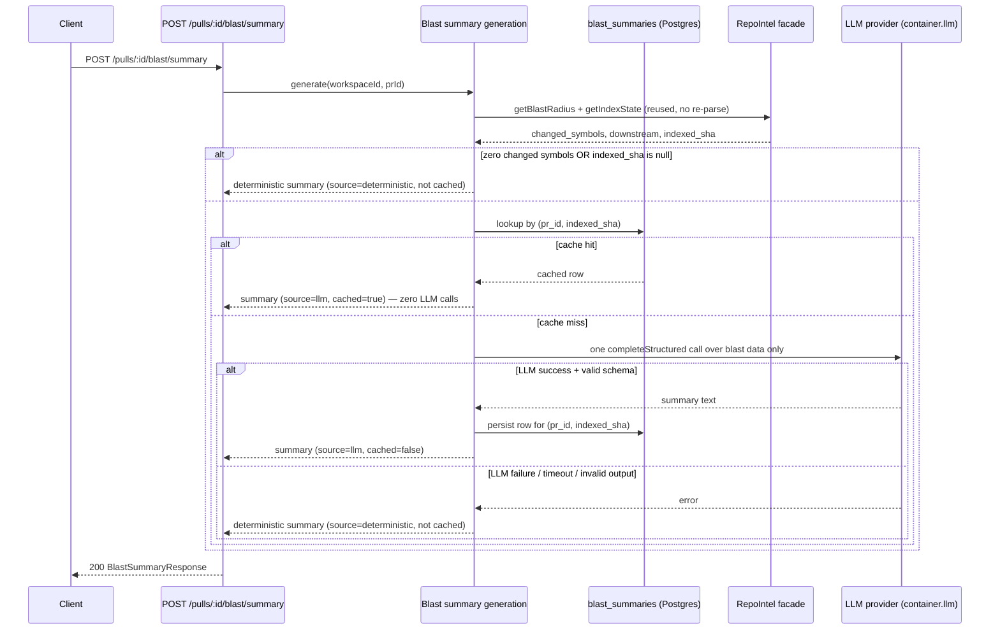

# Specification: Blast Radius — Optional LLM Summary Pass

## 0. Metadata
- Spec ID: SPEC-2026-08-19-blast-radius-llm-summary
- Status: clarifying — two non-blocking `[NEEDS CLARIFICATION]` items remain in §12 (rows 5–6); neither changes this spec's substance, both are safe to build against the stated defaults.
- Version: 0.1
- Owner: redfoxius@gmail.com
- Related: `docs/blast-radius-plan.md` (original plan; flags this pass as
  deferred, sets the "exactly one LLM call" constraint), 
  `server/src/modules/blast/service.ts` (existing deterministic
  `buildSummary`/`getBlastRadius`), `server/src/modules/intent/service.ts`
  (this repo's precedent shape for a best-effort, catch-log-fallback LLM
  integration), `server/src/modules/intent/routes.ts` (GET persisted +
  POST /derive precedent this spec's routes mirror), no implementation
  plan yet (`implementation-planner` consumes this spec next).

## 1. Overview & Problem

`GET /pulls/:id/blast` (`server/src/modules/blast/service.ts:19-83`) today
returns a `summary` field filled by `buildSummary` — a deterministic,
template-based sentence ("3 symbols changed, 5 callers, 2 endpoints
affected."). It is accurate but terse: it cannot explain *why* a change
matters, group related callers into a narrative, or call out the single
most consequential endpoint/cron in plain language the way a human
reviewer skimming the Blast tab would want.

This spec adds an **optional, explicitly-triggered** LLM pass that
produces a richer prose summary of the same already-computed blast data,
without touching the deterministic path `GET /pulls/:id/blast` already
serves on every page view. It resolves `docs/blast-radius-plan.md`'s
deferred follow-up under one hard constraint carried over unchanged from
that doc: **at most one LLM call per generation attempt.**

## 2. Glossary

| Term | Definition |
|---|---|
| Blast radius | The set of symbols a PR's diff changed, their callers, and the HTTP endpoints/cron jobs reachable from those callers (`BlastRadiusResponse`). |
| Deterministic summary | The existing template-string summary `buildSummary` produces — no LLM call, always available. |
| LLM summary | A model-generated prose paragraph over the same blast data, produced by this feature. |
| Cache key | `(pr_id, indexed_sha)` — the pull request plus the exact repo-intel commit its blast data was computed from. |
| `indexed_sha` | The commit repo-intel's data (symbols/callers/facts) was last (re)indexed from — already part of `BlastRadiusResponse` (`server/src/vendor/shared/contracts/review-api.ts:79-91`); not necessarily the PR's own head SHA. |
| `FeatureModelId` | The existing per-workspace, Settings-overridable provider/model registry key (`server/src/vendor/shared/contracts/platform.ts`). |

## 3. User Scenarios

### Scenario: Generate an AI summary for a freshly analyzed PR
A caller (the future client's "Generate AI summary" action, or any API/MCP
consumer) sends `POST /pulls/:id/blast/summary` for a PR whose blast
radius has at least one changed symbol and a resolvable `indexed_sha`, and
no summary has been generated for this PR yet. The system computes the
blast data (reusing the same facts the deterministic summary already
uses), makes exactly one LLM call, persists the result keyed to
`(pr_id, indexed_sha)`, and returns the prose summary with `source: "llm"`.

### Scenario: Revisit a PR whose summary was already generated
A caller sends `GET /pulls/:id/blast/summary` (e.g. on page load, before
any button is clicked) for a PR with a previously generated summary whose
`indexed_sha` still matches the PR's current blast data. The system
returns the cached summary immediately, with zero LLM calls.

### Scenario: Repo is reindexed after a summary was cached
The repo's index advances to a new `indexed_sha` (a resync happened)
after a PR's summary was cached against the old one. A `GET` for that PR
now returns `null` (the old cache entry no longer matches), and the next
`POST` regenerates a fresh summary against the new data — again exactly
one LLM call — and persists it under the new key, leaving the old row in
place.

### Scenario: LLM call fails or the provider is unavailable
A caller sends `POST /pulls/:id/blast/summary`; the configured LLM
provider errors, times out, or returns output that fails schema
validation. The system does not fail the request — it falls back to the
existing deterministic template summary, returns it with
`source: "deterministic"`, and does not persist a cache row (so the next
`POST` will genuinely retry generation rather than serving a stale
fallback forever).

## 4. Assumptions & Constraints

**Assumptions:**
- The blast data already computed for `GET /pulls/:id/blast`
  (`changed_symbols`, per-symbol `downstream` callers/endpoints/crons) is
  sufficient input for a meaningful prose summary — no additional data
  fetch (diff hunk content, a fresh repo-intel parse, file contents) is
  needed or permitted. This keeps the pass cheap and bounded regardless of
  PR size.
- A cached summary is considered valid for its `(pr_id, indexed_sha)` key
  regardless of a later change to the workspace's `blast_summary` model
  preference — a Settings model change only affects the *next*
  `indexed_sha`'s generation, never triggers retroactive regeneration of
  an already-cached one. This is a direct consequence of the cache key
  intentionally excluding provider/model (per the coordinator's decision
  to key by PR + `indexed_sha` only).
- Fastify's per-route rate-limit config (already used by
  `POST /pulls/:id/review` and `POST /pulls/:id/intent/derive`) is
  reusable as-is for the new POST route — no new rate-limiting
  infrastructure needed.

**Constraints:**
- **Hard constraint (carried over from `docs/blast-radius-plan.md`,
  non-negotiable): at most one LLM call per generation attempt.** This is
  scoped at the feature/business-logic layer — exactly one
  `llm.completeStructured`-shaped invocation initiated by this feature's
  own code per `POST` request that actually reaches generation (a cache
  hit or an early deterministic-fallback path makes zero calls). The
  existing LLM adapter layer's own transient-error retry
  (`server/src/platform/resilience.ts`'s `withRetry`, already used by
  every LLM integration in this codebase) is pre-existing platform
  behavior, not a second application-initiated call, and is not
  restricted by this constraint.
- **Non-default convention** (root `CLAUDE.md`): `@devdigest/shared` is
  hand-copied into both `server/src/vendor/shared` and
  `client/src/vendor/shared`. Any new `FeatureModelId` enum member or new
  response contract this feature adds must be edited in **both** copies
  together, or the two packages silently drift (`server/INSIGHTS.md`
  already documents this exact drift risk).
- No change to `repo-intel/service.ts`'s `getBlastRadius`/
  `tryPersistentBlast` or to the existing deterministic
  `GET /pulls/:id/blast` response shape — this pass is strictly additive
  (`docs/blast-radius-plan.md`'s existing "don't touch `service.ts`"
  constraint still applies).

## 5. Cross-Module Interactions

The new pass is invoked through a new route in the existing `blast/`
module, reuses `repoIntel`'s already-persistent facade (no new
AST/graph/DB read pattern), and calls out to the platform's existing LLM
port. Failure at the LLM boundary degrades to the deterministic path
already proven in `buildSummary` — never a 5xx.

**Failure contract at each boundary:**
- `RepoIntel` facade unreachable/degraded → identical to today's
  `GET /pulls/:id/blast` behavior (the facade's own `degraded` contract);
  this pass proceeds over whatever `BlastResult` it gets, and an empty
  `changed_symbols` short-circuits to the deterministic path (AC-11).
- LLM provider (OpenAI/Anthropic/OpenRouter) unreachable, rate-limited,
  times out, or returns schema-invalid output → caught, logged, falls
  back to the deterministic summary; the request still returns `200`
  (AC-10).
- Postgres unavailable at persist time → the generated summary is still
  returned to the caller for that one request (best-effort persistence);
  a subsequent request simply cache-misses and regenerates. Never fails
  the response over a persistence error alone.

## 6. Functional Requirements

### 6.1 Trigger & retrieval
- AC-1 (Event-driven): WHEN a client sends `POST /pulls/:id/blast/summary` for a PR whose blast radius has at least one changed symbol and a non-null `indexed_sha`, the system shall attempt to produce an LLM-generated summary paragraph. Verify: unit test with a non-empty `BlastResult` and a mocked LLM adapter confirms the adapter is invoked.
- AC-2 (Unwanted behavior): IF the `:id` in `GET` or `POST /pulls/:id/blast/summary` does not resolve to a pull request in the caller's workspace, THEN the system shall respond `404 not_found`. Verify: request with an unknown or foreign-workspace PR id returns 404 on both routes.
- AC-3 (Event-driven): WHEN a client sends `GET /pulls/:id/blast/summary` for a PR with no cached summary matching its current `indexed_sha`, the system shall respond `200` with a `null` body, without calling the LLM. Verify: GET with an empty cache table returns `null` and the mocked LLM adapter records zero calls.
- AC-4 (Event-driven): WHEN a client sends `GET /pulls/:id/blast/summary` for a PR with a cached summary whose `indexed_sha` matches the PR's current `indexed_sha`, the system shall respond `200` with that cached summary (`source: "llm"`, `cached: true`). Verify: seed a cache row, GET returns it verbatim.

### 6.2 Caching / idempotency
- AC-5 (Event-driven): WHEN `POST /pulls/:id/blast/summary` finds an existing cache row keyed by `(pr_id, indexed_sha)` matching the PR's current `indexed_sha`, the system shall return that cached row and shall not call the LLM. Verify: seed a cache row, POST returns `cached: true` and zero LLM adapter calls.
- AC-6 (Event-driven): WHEN `POST /pulls/:id/blast/summary` successfully generates a new LLM summary, the system shall persist exactly one cache row keyed by `(pr_id, indexed_sha)` before returning. Verify: POST against an empty cache, then confirm exactly one row exists for `(pr_id, indexed_sha)`.
- AC-7 (Unwanted behavior): IF two `POST` requests for the same `(pr_id, indexed_sha)` race before either has persisted a cache row, THEN the system shall persist at most one cache row for that key, and both requests shall return the same summary content. Verify: integration test firing two concurrent POSTs against a slow mocked LLM call, asserting one row and identical response bodies.
- AC-8 (State-driven): WHILE the repo's index has advanced to a new `indexed_sha` since a PR's summary was last cached, the system shall treat the previous cache row as a miss and generate a fresh summary on the next `POST`, leaving the stale row in place (no active cache eviction in this pass). Verify: seed a cache row for sha A, mock `indexed_sha` B on the next request, confirm `cached: false` and a new row for `(pr_id, B)` coexisting with the row for `(pr_id, A)`.

### 6.3 LLM generation scope & failure handling
- AC-9 (Ubiquitous): The system shall generate the summary strictly from the already-computed blast data (changed symbols, per-symbol callers, endpoints, crons) — never from raw diff hunk content, file contents, or a fresh repo-intel parse. Verify: unit test asserting the prompt payload passed to the LLM adapter contains none of the diff/patch fields present on `PrFile`.
- AC-10 (Unwanted behavior): IF the LLM call fails, times out, or returns output that fails schema validation, THEN the system shall respond `200` with the existing deterministic template summary (`source: "deterministic"`, `cached: false`), and shall not persist a cache row. Verify: mock the LLM adapter to throw/time out; confirm the fallback response and that no row is written.
- AC-11 (Unwanted behavior): IF the PR's blast radius has zero changed symbols, THEN the system shall return the deterministic summary directly without calling the LLM. Verify: a PR with an empty `changed_symbols` array → POST response has `source: "deterministic"` and zero LLM calls.
- AC-12 (Unwanted behavior): IF the PR's `indexed_sha` is null (the repo has never been indexed), THEN the system shall return the deterministic summary without calling the LLM or persisting a cache row. Verify: mock `getIndexState` to return an unset `lastIndexedSha` → POST falls back, no cache write.

### 6.4 Model selection
- AC-13 (Ubiquitous): The system shall resolve the LLM provider/model for this pass via a new `blast_summary` `FeatureModelId`, using the workspace's Settings override when present and the registry default otherwise. Verify: unit test with a workspace override set to a non-default provider confirms that provider is the one invoked.
- AC-14 (Ubiquitous): The registry default for `blast_summary` shall be `openrouter` / `deepseek/deepseek-v4-flash` — the same cheap tier as `onboarding` and `review_intent`. Verify: `FEATURE_MODELS` registry entry for `blast_summary` asserted in a unit test.

### 6.5 Rate limiting
- AC-15 (Ubiquitous): The system shall rate-limit `POST /pulls/:id/blast/summary` to at most 10 requests per minute per workspace, mirroring `POST /pulls/:id/intent/derive`'s existing config. Verify: an 11th POST within 60 seconds from the same workspace returns `429`.
- AC-16 (Ubiquitous): The system shall apply the default (unrestricted) rate limit to `GET /pulls/:id/blast/summary`, since it only reads already-persisted data. Verify: repeated GETs within the default global limit window all succeed.

## 7. Non-Functional Requirements

**Performance:**
- AC-17 (Ubiquitous): The system shall bound the LLM call issued by `POST /pulls/:id/blast/summary` by the platform's existing default LLM call timeout (`DEFAULT_TIMEOUT` = 300000 ms, `server/src/adapters/llm/openai.ts` / `anthropic.ts`) unless a tighter `timeoutMs` is explicitly configured for this feature. Verify: unit test confirms the call either omits `timeoutMs` (defers to the adapter default) or passes an explicitly configured value.

**Security:**
- AC-18 (Ubiquitous): The system shall scope every `GET`/`POST /pulls/:id/blast/summary` request to the requesting workspace via the same ownership check `GET /pulls/:id/blast` already uses, so a PR id from another workspace never resolves. Verify: covered by AC-2 (a cross-workspace PR id returns 404, never another workspace's cached summary).
- AC-19 (Ubiquitous): The system shall never include repository secrets, environment variables, or raw file contents in the LLM prompt — only symbol names, file paths, caller names, and endpoint/cron strings already present in the `BlastResult` this pass consumes. Verify: the prompt-assembly log event (mirroring `intent`'s `prompt_assembly` convention) lists only these section types, never a `content`/`patch` field.

**Availability:**
- Covered by AC-10: an LLM outage, timeout, or malformed response degrades to the deterministic summary rather than a failed request — the feature never makes `GET /pulls/:id/blast` (already zero-LLM) or the new routes' baseline availability worse than today's.

**Accessibility / localization:**
- N/A: this spec is server/API-only (§11); no UI is added or changed here, so there is no screen-reader labeling, locale, or rendering surface to specify. A future client-side follow-up that renders this summary (e.g. an "AI-generated" badge) owns that concern.

## 8. Edge Cases (index)

| AC-ID | Trigger/condition | Category (1–6) |
|---|---|---|
| AC-2 | PR id doesn't resolve in caller's workspace | 5 (Integration/Access) |
| AC-3 | GET with no matching cache row | 3 (Interaction/UX) |
| AC-7 | Concurrent POSTs racing for the same cache key | 6 (Edge Cases — concurrency) |
| AC-8 | Repo reindexed; old cache key no longer matches | 2 (Domain & Data Model — lifecycle) |
| AC-10 | LLM call fails/times out/invalid output | 6 (Edge Cases — failure handling) |
| AC-11 | Zero changed symbols in the blast radius | 6 (Edge Cases — empty input) |
| AC-12 | `indexed_sha` is null (repo never indexed) | 6 (Edge Cases — malformed/absent precondition) |
| AC-15 | POST rate-limit exceeded | 4 (Non-Functional — abuse prevention) |

## 9. Data Model

**New entity: blast summary cache row** (one row per `(pr_id, indexed_sha)` pair that successfully produced an LLM summary; never written for a deterministic-fallback result).

| Field | Type | Notes |
|---|---|---|
| `pr_id` | uuid, FK → pull request, part of composite key | `ON DELETE CASCADE` when the PR is deleted, mirroring every other repo-scoped cache table's cascade convention (e.g. `repo_map_cache`). |
| `indexed_sha` | string, part of composite key | The `indexed_sha` the summary was generated against — same semantics as `BlastRadiusResponse.indexed_sha`. |
| `summary` | string | The generated prose paragraph. |
| `provider` | string | Which provider produced it (audit/debugging). |
| `model` | string | Which model produced it. |
| `tokens_in` / `tokens_out` | integer | From the LLM call's usage, same fields every other LLM integration in this codebase already records. |
| `cost_usd` | number, nullable | Estimated cost of the one call, null when unknown — same nullability convention as `reviews.cost_usd`. |
| `created_at` | timestamp | When this row was written. |

**Lifecycle:** created only on a successful LLM generation (never on
fallback); read on every `GET` and as the cache-check on every `POST`;
never updated in place; superseded (not overwritten) by a new row when
`indexed_sha` advances; deleted only via the PR's own cascade delete. No
active eviction/GC of stale rows in this pass (flagged in §12).

**Registry addition:** one new entry in the existing `FeatureModelId`
enum/`FEATURE_MODELS` registry — `blast_summary`, default
`openrouter`/`deepseek/deepseek-v4-flash` — alongside the existing
`onboarding`, `review_intent`, `risk_brief`, `conformance`, `conventions`
entries. No new registry mechanism.

## 10. Interfaces (API / UI contracts)

Shapes only — fields, direction, optionality. No schema-library code.

**`GET /pulls/:id/blast/summary`**
- Request: path param `id` (PR uuid).
- Response `200`: `BlastSummaryResponse | null` — `null` when no cache
  entry matches the PR's current `indexed_sha`.
- Response `404`: PR not found in caller's workspace.
- Never triggers an LLM call.

**`POST /pulls/:id/blast/summary`**
- Request: path param `id` (PR uuid); no body.
- Response `200`: `BlastSummaryResponse` (always populated — falls back
  to the deterministic summary rather than erroring).
- Response `404`: PR not found in caller's workspace.
- Response `429`: rate limit exceeded (10/min/workspace).
- At most one LLM call per invocation (§4's hard constraint).

**`BlastSummaryResponse` shape:**

| Field | Type | Optionality | Notes |
|---|---|---|---|
| `summary` | string | required | The prose (LLM) or template (deterministic-fallback) summary. |
| `source` | `"llm" \| "deterministic"` | required | Which path produced this response. |
| `cached` | boolean | required | `true` only for a cache-hit LLM result (`GET` responses are always `true` when non-null; `POST` responses are `true` on cache-hit, `false` on fresh-generate or fallback). |
| `indexed_sha` | string \| null | required | The commit the underlying blast data (and, when `source: "llm"`, the cached summary) was computed against — mirrors `BlastRadiusResponse.indexed_sha`. |
| `generated_at` | string (ISO datetime) \| null | required, null only when `source: "deterministic"` | When the cached/fresh LLM summary was produced. |
| `provider` / `model` | string \| null | required, null only when `source: "deterministic"` | Which provider/model produced an LLM summary. |

**Registry contract addition (shape only):** `FeatureModelId` gains one
new literal, `"blast_summary"`, in the existing enum; `FEATURE_MODELS`
gains one new entry of the existing `FeatureModelDef` shape (`id`,
`label`, `description`, `defaultProvider`, `defaultModel`) — no new
fields on that shape.

## 11. Out of Scope

- Any client (`client/`) UI change — a "Generate AI summary" button,
  loading state, or an "AI-generated" badge. This spec defines the API
  contract a future client-focused follow-up would consume.
- Exposing this pass through the `mcp-server/` `get_blast_radius` tool or
  a new MCP tool. The existing tool continues to return only the
  deterministic `BlastRadiusResponse`.
- Wiring the generated summary into the `PrBrief` aggregate
  (`server/src/vendor/shared/contracts/brief.ts:141`'s `blast: BlastRadius`
  field, not yet populated in `server/src/modules/pulls/routes.ts`'s
  `prBrief` object today). If/when that aggregation is built, it must
  reuse this pass's cache rather than trigger its own LLM call — noted as
  a constraint for that future work, not built here.
- Active cache eviction/garbage-collection of stale `(pr_id, old_sha)`
  rows after a reindex (§9's lifecycle) — they remain harmless but
  unused; a cleanup job is a possible future optimization, not required
  for correctness here.
- Any change to `GET /pulls/:id/blast`'s existing deterministic
  `summary` field or response shape — unchanged by this spec.

## 12. Clarifications Log

| # | Category (1–6) | Question | Answer / [NEEDS CLARIFICATION] | Impacted AC-ID(s) |
|---|---|---|---|---|
| 1 | 1 (Functional Scope) | How is the LLM summary pass triggered? | Separate endpoint, `POST /pulls/:id/blast/summary`, explicitly invoked — `GET /pulls/:id/blast` stays deterministic and free on every page view. | AC-1, AC-3, AC-4, AC-5 |
| 2 | 2 (Domain & Data Model) | Should the generated summary be persisted/cached, or regenerated fresh every request? | Cached, keyed by `(pr_id, indexed_sha)` — diverges from the agent's own recommended default (no persistence); recorded here as a real decision. | AC-5, AC-6, AC-7, AC-8, §9 |
| 3 | 6 (Edge Cases & Failure Handling) | What happens on LLM failure/timeout? | Silent fallback to the existing deterministic `buildSummary` string, matching `IntentDeriverService.derive`'s catch-log-fallback pattern. | AC-10, AC-11, AC-12 |
| 4 | 5 (Integration & External Dependencies) | Is the model/provider workspace-configurable or hardcoded? | New `FEATURE_MODELS` registry entry (`blast_summary`), Settings-overridable, cheap default tier (`openrouter`/`deepseek-v4-flash`) like `onboarding`/`review_intent`. | AC-13, AC-14 |
| 5 | 4 (Non-Functional) | Should `POST /pulls/:id/blast/summary`'s LLM call use a tighter timeout than the platform's existing 300000 ms `DEFAULT_TIMEOUT`, given it's a synchronous, button-triggered call rather than a background review pass? | [NEEDS CLARIFICATION: no answer yet — implementation-planner/implementer should confirm with the requester before hardcoding a value; defaulting to the existing platform timeout is safe but may feel slow in the UI.] | AC-17 |
| 6 | 2 (Domain & Data Model) | Should stale `(pr_id, old_sha)` cache rows ever be purged, or accumulate indefinitely (bounded only by the PR's own cascade delete)? | [NEEDS CLARIFICATION: left unbounded in this spec (§11); revisit if row growth becomes a real operational concern.] | AC-8, §9, §11 |

## 13. Acceptance Criteria Summary (Definition of Done)

- [ ] AC-1 — POST triggers LLM-summary generation attempt when preconditions are met.
- [ ] AC-2 — 404 on unknown/foreign-workspace PR id (GET and POST).
- [ ] AC-3 — GET with no matching cache row returns `null`, zero LLM calls.
- [ ] AC-4 — GET with a matching cache row returns it verbatim.
- [ ] AC-5 — POST cache-hit returns cached row, zero LLM calls.
- [ ] AC-6 — POST cache-miss success persists exactly one row.
- [ ] AC-7 — Concurrent POST race persists at most one row, consistent responses.
- [ ] AC-8 — Reindex invalidates the old cache key via mismatch, not deletion.
- [ ] AC-9 — Prompt scope is blast data only, never diff/file content.
- [ ] AC-10 — LLM failure/timeout/invalid output falls back, not persisted.
- [ ] AC-11 — Zero changed symbols skips the LLM call entirely.
- [ ] AC-12 — Null `indexed_sha` skips the LLM call entirely.
- [ ] AC-13 — Provider/model resolved via Settings override or registry default.
- [ ] AC-14 — Registry default is `openrouter`/`deepseek/deepseek-v4-flash`.
- [ ] AC-15 — POST rate-limited to 10/min/workspace.
- [ ] AC-16 — GET uses the default (unrestricted) rate limit.
- [ ] AC-17 — LLM call bounded by the platform's default timeout unless overridden.
- [ ] AC-18 — Workspace scoping enforced on both routes.
- [ ] AC-19 — No secrets/env/file content ever enters the prompt.
