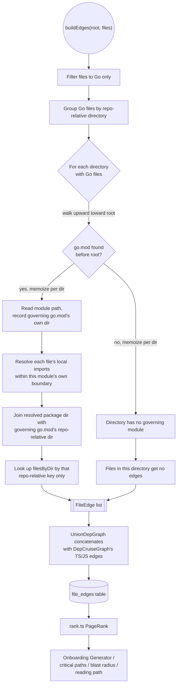

# Specification: Go Multi-Module Import Graph Discovery

## 0. Metadata
- Spec ID: SPEC-2026-08-20-go-multi-module-depgraph
- Status: clarifying
- Version: 0.1
- Owner: okolomoiets@competo.io
- Supersedes: none
- Related: `docs/go-language-support-plan.md` (Phase 3 — original single-root-`go.mod` design), `server/src/adapters/depgraph/go.ts`, `server/src/adapters/depgraph/union.ts`, `server/src/adapters/depgraph/index.ts`, `server/src/modules/repo-intel/pipeline/rank.ts`, `server/test/depgraph-go.test.ts`, `.claude/skills/add-language-support/SKILL.md`

## 1. Overview & Problem

`GoDepGraph` (`server/src/adapters/depgraph/go.ts`), repo-intel's Go
import-graph builder, only ever reads `go.mod` from the repository root
(`readModulePath(root)`, `go.ts:81-88`). If no `go.mod` exists there —
true for any multi-module monorepo, or any single-module repo whose
`go.mod` simply lives in a subdirectory — `buildEdges()` returns `[]` for
**every** Go file in the repo, not just the files under the missing
module. `docs/go-language-support-plan.md:255-260` documents this as a
deliberate v1 limitation, not an accidental defect.

The consequence reaches beyond the import graph itself: `rank.ts`'s
`computeFileRank` (`server/src/modules/repo-intel/pipeline/rank.ts:39-47`)
falls back to PageRank's uniform floor for an edgeless graph, so every Go
file in the repo gets an identical flat rank. Every feature that reads
`file_rank`/`file_edges` to prioritize or explain "what matters in this
repo" — critical paths, blast radius, reading-path ordering, and (per this
session's finding) the Onboarding Generator's tour — loses all Go-specific
signal. Empirically confirmed against two real local repos this session:

- `redfoxius/zbc-wtf`: three `go.mod` files (`gameserver/go.mod`,
  `platform/go.mod`, `shared/go.mod`), none at root. 76 Go files, 0 edges,
  all flat rank `0.006688177647068012` (`file_rank`/`file_edges` tables,
  inspected directly).
- `redfoxius/layering-skill-testbed`: single `go.mod` at `go-service/go.mod`
  (not root). 5 Go files, 0 edges, same flat-rank symptom.
- Real downstream effect: the Onboarding Generator, run against
  `zbc-wtf`, produced a tour calling it a "TypeScript monorepo" and
  claiming the Go backend was "not in this repo" — `getTopFilesByRank`/
  `getCriticalPaths` never surfaced a single Go file because there were no
  edges to rank on.

This spec extends `GoDepGraph` to discover a `go.mod` per Go-file
directory by walking upward toward `root`, so a subdirectory-rooted or
multi-module Go tree gets real edges (and real PageRank signal) instead of
a silent, repo-wide zero.

## 2. Glossary
| Term | Definition |
|---|---|
| Governing `go.mod` | The `go.mod` file that determines a given directory's Go module membership: the file found by walking upward from that directory toward `root`, stopping at the first `go.mod` encountered. |
| Module boundary | The directory subtree rooted at a `go.mod`'s own directory; every file under it (until a nested `go.mod` starts a new boundary) belongs to that module. |
| Multi-module monorepo | A repository containing more than one `go.mod`, each governing a disjoint (or nested) subtree — no single `go.mod` at the repo root. |
| Local import | An import path prefixed by its governing module's `module` directive value — resolves to an in-repo package directory, as opposed to stdlib/third-party. |
| Cross-module import | A local import in one Go module that resolves to a package published by a *different* `go.mod` in the same repo (typically wired via a `replace` directive or a `go.work` workspace file). Out of scope — see §12. |

## 3. User Scenarios

### Scenario: Multi-module monorepo gets real import-graph signal
Actor: repo-intel's indexing pipeline (`pipeline/full.ts`/
`pipeline/incremental.ts`), on behalf of any feature reading
`file_rank`/`file_edges` (Onboarding Generator, critical paths, blast
radius, reading path). Goal: rank Go files by real import fan-in even when
`go.mod` isn't at the repo root.
- A repo like `zbc-wtf` is indexed: three `go.mod` files under
  `gameserver/`, `platform/`, `shared/`, none at root.
- `UnionDepGraph.buildEdges(root, files)` calls `GoDepGraph.buildEdges`
  with the full walked file list (already vendor/node_modules-excluded by
  `walk.ts`).
- `GoDepGraph` discovers each Go file's governing `go.mod` by walking
  upward from its directory, groups files by their governing module, and
  resolves local imports within each module's own boundary.
- Result: `gameserver/`'s internal fan-in files get real, non-flat
  PageRank; `platform/` and `shared/` do too, independently. The
  Onboarding Generator and other rank-reading features can now see Go
  files with meaningful relative importance instead of one flat score.

### Scenario: Subdirectory-only single module (no monorepo)
Actor: same pipeline, on a repo like `layering-skill-testbed` (single
`go.mod` at `go-service/go.mod`, nothing at root).
- `GoDepGraph` discovers `go-service/go.mod` as the governing module for
  every Go file under `go-service/`.
- Local imports inside `go-service/` resolve to repo-relative package
  directories (e.g. `go-service/internal/foo`), matching `filesByDir`'s
  repo-root-relative keys — not `internal/foo` alone (today's bug once a
  non-root `go.mod` is read at all, see AC-5).

### Scenario: Directory with no governing `go.mod` anywhere in its ancestry
Actor: same pipeline, on a repo mixing a proper Go module with stray Go
files outside any module boundary (e.g. a scratch script never added to a
module).
- The stray file's directory has no `go.mod` between it and `root`.
- `GoDepGraph` omits edges for that file only; sibling files elsewhere in
  the repo that do have a governing `go.mod` are unaffected.

## 4. Assumptions & Constraints

- Assumptions:
  - `walk.ts`'s `EXCLUDED_DIRS` (`node_modules`, `dist`, `build`,
    `coverage`, `.next`, `out`, `vendor`, `.git`) already excludes
    `vendor/` and similar from the `files` list `GoDepGraph.buildEdges`
    receives, so the upward walk never needs its own vendor-awareness —
    confirmed by reading `pipeline/walk.ts:6,93`.
  - The upward `go.mod` discovery walk is pure string/path manipulation
    (`dirname()` repeated toward `root`, checking file existence at each
    level) — it never calls `readdir`/follows a symlinked directory entry,
    so directory-symlink loops are not a risk this algorithm can hit.
  - `go.mod`'s `module` directive is always a single line (unlike `require`,
    which can use a parenthesized block) — the existing `MODULE_DIRECTIVE`
    regex (`go.ts:28`) needs no change to keep matching it per-module.
  - `GoDepGraph` does not use `dependency-cruiser`'s `cruise()` (that's
    `DepCruiseGraph`-only), so it is unaffected by the macOS `/tmp` →
    `/private/tmp` realpath-canonicalization gap already recorded in
    `server/INSIGHTS.md:666-688` for `DepCruiseGraph`; test fixtures under
    `os.tmpdir()` remain a safe, already-proven pattern here
    (`depgraph-go.test.ts` already does this).
- Constraints:
  - No new external dependency; extends `go.ts`'s existing regex-based
    `go.mod` parsing (module directive only — no `require`/`replace`/`go`
    directive parsing).
  - `DepGraph` port signature (`buildEdges(root, files): Promise<FileEdge[]>`)
    is unchanged — this is an internal algorithm change inside
    `GoDepGraph`, not a new port or a new call-site contract.
  - Must preserve `go.ts`'s stated "degrade that piece, don't fail the
    whole build" contract (module docstring, `go.ts:18-20`) at the new,
    finer per-directory grain instead of the old whole-repo grain.

## 5. Cross-Module Interactions

No new external module boundary is introduced — `GoDepGraph` remains
internal to `UnionDepGraph`, called exactly as today by
`pipeline/full.ts:216` and `pipeline/incremental.ts:219` with the same
`(root, files)` shape. What changes is internal: discovery becomes
per-directory instead of once-per-build. The diagram shows the discovery
algorithm and the downstream chain that made the bug user-visible.

Failure contract: a `go.mod` read failure, an unparsable `go.mod`, a
source-file read failure, or an import-parse failure at any point degrades
only the directory/file it belongs to (empty edges for that piece) — never
throws, never empties the whole build's edge list unless literally no
directory in the repo has a governing `go.mod` (§8, AC-8).

## 6. Functional Requirements

### 6.1 Multi-`go.mod` Discovery
- AC-1 (Event-driven): WHEN `buildEdges` processes a directory containing at least one Go file, the system shall discover that directory's governing `go.mod` by walking upward from the directory toward `root`, stopping at the first `go.mod` file found. Verify: `depgraph-go.test.ts` subdirectory-only fixture (`go.mod` one level below `root`, e.g. `gameserver/go.mod`) produces edges among Go files under `gameserver/`.
- AC-2 (Event-driven): WHEN a repository contains multiple sibling directories each rooted at their own `go.mod` (a multi-module monorepo), the system shall resolve local import edges for each module independently, using only that module's own `module` directive value and its own file set. Verify: three-sibling-`go.mod` fixture (`gameserver/go.mod`, `platform/go.mod`, `shared/go.mod`) each produce edges among their own files, and zero edges crossing between modules.
- AC-3 (State-driven): WHILE a directory's nearest ancestor `go.mod` is nested more deeply than another `go.mod` further up the same path (a nested-module boundary), the system shall treat the nearer (deepest) `go.mod` as that directory's sole governing module. Verify: nested-module fixture (outer `go.mod` at `a/go.mod`, inner at `a/b/go.mod`) — files under `a/b/` resolve local imports against `a/b/go.mod`'s module path, not `a/go.mod`'s, and don't fan out to files under `a/` that aren't also under `a/b/`.
- AC-4 (Ubiquitous): The system shall discover a directory's governing `go.mod` at most once per `buildEdges` call, memoizing the result — including a "not found" result — per directory, so Go files sharing a directory never trigger duplicate upward-walk reads for that directory. Verify: unit test with 3+ Go files in one directory and a spied/counted `readFile`, asserting the directory's `go.mod` candidate paths are each read at most once across the whole `buildEdges` call.

### 6.2 Repo-Relative Path Resolution Fix
- AC-5 (Event-driven): WHEN resolving a local import to its package directory for a module whose governing `go.mod` is not at `root`, the system shall produce a repo-root-relative directory path by joining the import's module-relative resolution with the governing `go.mod`'s own repo-relative directory, not the module-relative path alone. Verify: subdirectory-only fixture — an import inside `gameserver/` (module `example.com/gameserver`) resolving to `example.com/gameserver/internal/foo` produces the lookup key `gameserver/internal/foo`, matching `filesByDir`'s repo-root-relative keys, not bare `internal/foo`.
- AC-6 (Ubiquitous): WHERE a module's governing `go.mod` sits at `root` itself, the system shall resolve local imports exactly as before this change (module-relative path equals repo-relative path, since the governing `go.mod`'s own repo-relative directory is `.`). Verify: existing `depgraph-go.test.ts` root-`go.mod` fixture (module `example.com/greeter`) continues to pass unmodified.

### 6.3 Per-File / Per-Module Graceful Degradation
- AC-7 (Unwanted behavior): IF a Go file's directory has no governing `go.mod` anywhere in its ancestry up to and including `root`, THEN the system shall omit edges for that file only, without throwing, and without affecting edge resolution for other Go files elsewhere in the repo that do have a governing `go.mod`. Verify: mixed fixture with one directory under a real `go.mod` and a second, unrelated directory with no `go.mod` anywhere above it up to `root` — edges present for files in the first directory, absent for files in the second, `buildEdges` resolves without throwing.
- AC-8 (Unwanted behavior): IF no directory in the entire file set has any governing `go.mod` (the pre-existing "no `go.mod` anywhere" case), THEN the system shall return an empty edge array for the whole build, matching today's behavior. Verify: existing `depgraph-go.test.ts` "returns [] when go.mod is missing" test continues to pass unmodified.

### 6.4 Path-Traversal / Filesystem Safety Boundary
- AC-9 (Unwanted behavior): IF the upward `go.mod`-discovery walk for any directory would require inspecting a path above `root`, THEN the system shall stop the walk at `root` and never read or stat any path outside `root`. Verify: fixture where a Go file sits directly at `root` with no `go.mod` anywhere — discovery walk terminates after checking `root` itself, no filesystem call is made for any ancestor of `root`.
- AC-10 (Unwanted behavior): IF a local import's resolved package directory contains path-traversal segments (e.g. an import string engineered to resolve to a `../`-prefixed or otherwise out-of-boundary directory), THEN the system shall use that resolved value only as a `filesByDir` map-lookup key — never as a direct filesystem path to read — so the lookup fails closed (no matching entry, no edges) rather than escaping `root`. Verify: adversarial fixture — a Go file importing a crafted path shaped to resolve to a directory outside the module (e.g. `example.com/gameserver/../../../etc`) — `buildEdges` returns edges with zero entries touching that import, and no `readFile`/`stat` call is made for any path outside `root` during resolution.

## 7. Non-Functional Requirements

- Performance: AC-11 (Ubiquitous): The system shall bound each directory's `go.mod`-discovery walk to at most the number of path segments between that directory and `root` (no unbounded loop, no re-entry past `root`), so discovery cost scales with repo directory depth, not with an unrelated factor. Verify: fixture with a deeply nested Go file directory (5+ segments) and no `go.mod` anywhere — `buildEdges` completes and returns `[]` for those files without hanging or throwing.
- Security: satisfied by AC-9 and AC-10 above (the upward walk never reads above `root`; a resolved package directory is only ever used as an in-memory map key, never as a direct filesystem path) — no separate NFR-only requirement needed.
- Availability / failure recovery: satisfied by AC-7 and AC-8 (per-file/per-module degrade-not-fail contract) — no separate NFR-only requirement needed.
- Accessibility / localization: N/A — this is a backend indexing algorithm with no UI or user-facing text surface.

## 8. Edge Cases (index)
| AC-ID or `accepted: no handling` | Trigger/condition | Category (1–6 above) |
|---|---|---|
| AC-2 | Multi-module monorepo: 2+ sibling `go.mod` files, none at root | 1 (Functional Scope) |
| AC-3 | Nested `go.mod` (a module inside another module's subtree) | 2 (Domain & Data Model — module boundary) |
| AC-5 | Non-root `go.mod` whose module-relative resolution needs joining with its own repo-relative dir | 2 (Domain & Data Model) |
| AC-7 | Go file directory with no governing `go.mod` anywhere in its ancestry | 6 (Edge Cases & Failure Handling) |
| AC-8 | Whole repo has no `go.mod` anywhere (pre-existing case, preserved) | 6 (Edge Cases & Failure Handling) |
| AC-9, AC-10 | Adversarial/crafted import path attempting path traversal outside `root` | 6 (Edge Cases & Failure Handling) |
| AC-4 | Many Go files sharing one directory — discovery must not re-walk per file | 6 (Edge Cases & Failure Handling) |
| `accepted: no handling` | Cross-module import resolved via a `replace` directive between two `go.mod`s in the same repo | 5 (Integration & External Dependencies) — see §12 |
| `accepted: no handling` | `go.work` workspace file coordinating multiple modules | 5 (Integration & External Dependencies) — see §12 |
| `accepted: no handling` | Malformed/unreadable `go.mod` at some ancestor level, or a `go.mod` with no `module` line | 6 — already covered by the existing per-directory `readModulePath` try/catch → treated identically to "no governing `go.mod`" (AC-7); not a new gap, no new AC needed |

## 9. Data Model

No persisted schema change — `file_edges`/`file_rank` (Postgres) are
already generic, language-agnostic edge/rank tables and need no migration.

The only new "data model" is an ephemeral, in-memory discovery cache
scoped to a single `buildEdges` call:

- `governingGoMod: Map<directory, { modulePath: string; moduleDir: string } | null>`
  — keyed by repo-relative directory, memoizing AC-4's per-directory
  discovery result (`null` meaning "no governing `go.mod` found"). Not
  persisted; rebuilt on every `buildEdges` call, discarded after.

## 10. Interfaces (API / UI contracts)

N/A — no external API/UI surface changes. The `DepGraph` port
(`buildEdges(root: string, files: string[]): Promise<FileEdge[]>`,
`depgraph/index.ts:27-33`) is unchanged; `GoDepGraph` remains one
implementation of it, composed unchanged by `UnionDepGraph`. This spec is
entirely an internal-algorithm change behind that existing contract.

## 11. Untrusted Inputs

None. `go.mod` contents and Go import strings originate from the indexed
repository's own source tree (already cloned/trusted at the point
`GoDepGraph` runs — same trust boundary as every other `repo-intel`
parser), not from third-party or end-user-supplied text, and none of this
data is routed into an LLM call. AC-10's path-traversal handling is a
filesystem-safety boundary (never read outside `root`), not an
LLM-prompt-injection concern — no `groundFindings()`/`wrapUntrusted()`
applies here.

## 12. Out of Scope

- **Cross-module imports are explicitly deferred.** Each discovered
  `go.mod` resolves its own local edges completely independently (its own
  `modulePath`, its own file set within its own module boundary). No
  `replace`-directive parsing, no `go.work` workspace-file handling, no
  cross-module edge resolution, no shared module registry across `go.mod`
  files in the same repo. Mirrors `UnionDepGraph`'s existing precedent for
  TS↔Go: cross-language edges aren't resolved either, and PageRank
  handles the resulting separate graph components fine
  (`union.ts:1-9`). No `AC-N` in this spec implies or requires
  cross-module resolution — a directory belonging to `gameserver`'s module
  importing a path published by `platform`'s module resolves to nothing
  (no local match), exactly as an external/third-party import would.
- Parsing `go.mod` directives other than `module` (`require`, `replace`,
  `go`, `toolchain`) — out of scope, unchanged from today.
- Any change to `DepCruiseGraph`, `UnionDepGraph`'s composition, or
  `rank.ts`'s PageRank computation itself — this spec only changes what
  edges `GoDepGraph` produces, not how they're combined or ranked.
- Any change to the Onboarding Generator or other rank-reading features —
  they benefit automatically once real edges exist, but their own
  behavior is unchanged by this spec.
- Symlinked directories/`go.mod` files — not handled specially; per §4's
  Assumptions, the discovery walk is pure path-string manipulation and
  never follows a directory symlink, so this isn't a gap this spec needs
  to close, just a boundary worth stating explicitly.

## 13. Clarifications Log
| # | Category (1–6) | Question | Answer / [NEEDS CLARIFICATION] | Impacted AC-ID(s) |
|---|---|---|---|---|
| 1 | 1 (Functional Scope) | Are cross-module imports (e.g. `gameserver` importing a package published by sibling module `platform`, typically wired via a `replace` directive) in scope for v1 of this fix? | Answered directly by the user (outside `AskUserQuestion`, relayed by the orchestrating session): **No — deferred.** Each `go.mod` resolves its own local edges independently; no `replace`/`go.work` handling. See §12. | AC-2, AC-3 (scoped to exclude cross-module resolution); §12 |
| 2 | 6 (Edge Cases) | Should the discovery walk have an explicit maximum-depth cap independent of `root`, in case of a pathological directory structure? | [NEEDS CLARIFICATION: no evidence of a real repo needing this — AC-11 already bounds the walk by actual path depth to `root`, which is inherently finite for any real filesystem tree. Left as an inline marker rather than inventing an arbitrary cap; `implementation-planner`/`implementer` should treat AC-11's existing bound as sufficient unless a concrete counter-example surfaces.] | AC-11 |

## 14. Acceptance Criteria Summary (Definition of Done)
- [ ] AC-1 — Upward-walk discovery of a directory's governing `go.mod`, stopping at the first found.
- [ ] AC-2 — Independent resolution per sibling module in a multi-module monorepo, no cross-module edges.
- [ ] AC-3 — Deepest-`go.mod`-wins semantics for nested module boundaries.
- [ ] AC-4 — Per-directory discovery memoization within a single `buildEdges` call.
- [ ] AC-5 — Repo-relative path-join fix: module-relative resolution joined with governing `go.mod`'s own repo-relative directory.
- [ ] AC-6 — Backward-compatible root-`go.mod` resolution (module dir `.`) unchanged.
- [ ] AC-7 — Per-file graceful degradation when no governing `go.mod` exists in a file's ancestry.
- [ ] AC-8 — Whole-repo empty-edges regression preserved when no `go.mod` exists anywhere.
- [ ] AC-9 — Discovery walk never reads/stats above `root`.
- [ ] AC-10 — Resolved package directory used only as a map-lookup key, never a direct filesystem path; fails closed on a traversal-shaped import.
- [ ] AC-11 — Discovery walk cost bounded by actual path depth to `root`.
